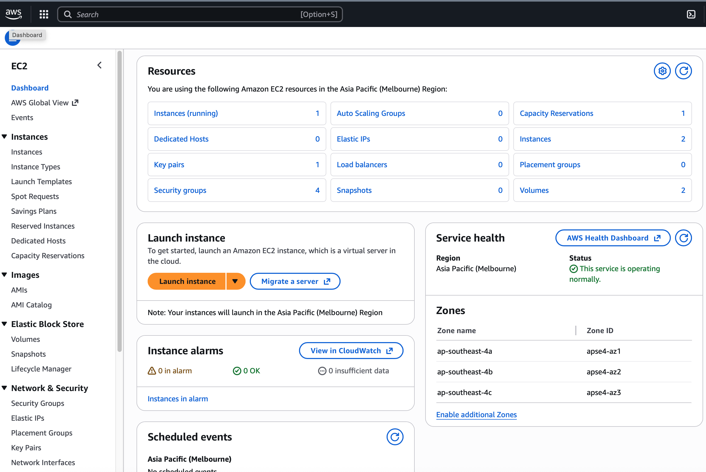
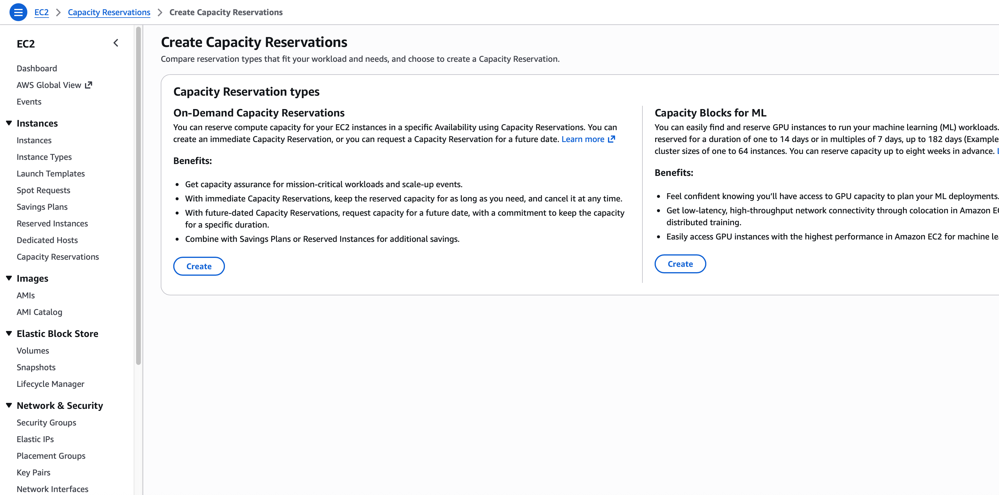
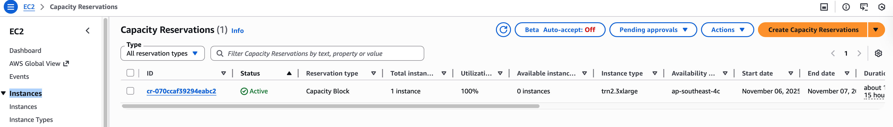
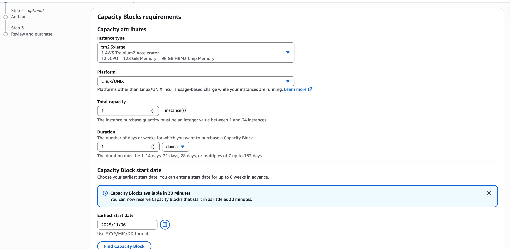
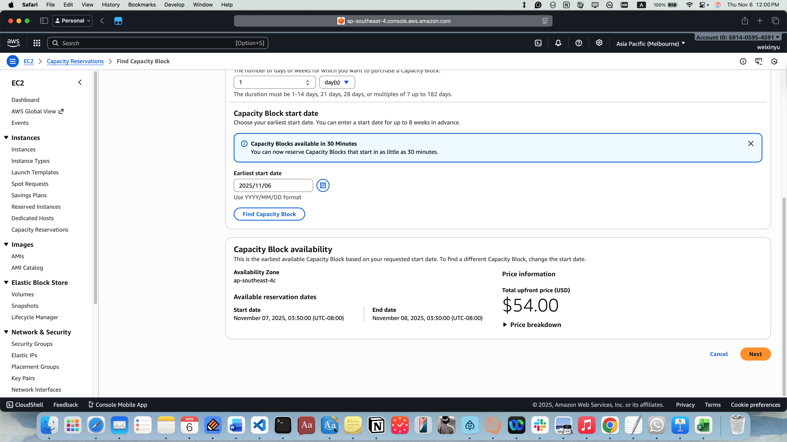
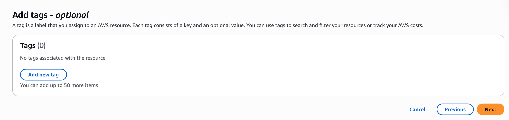
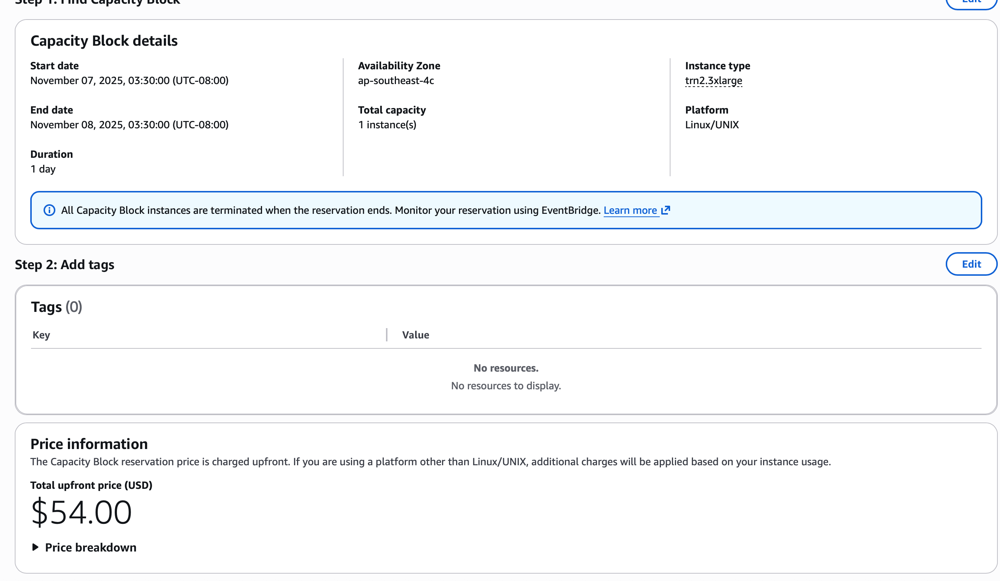
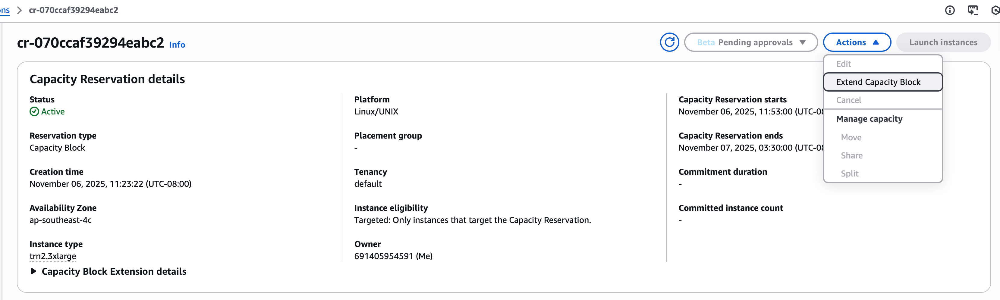
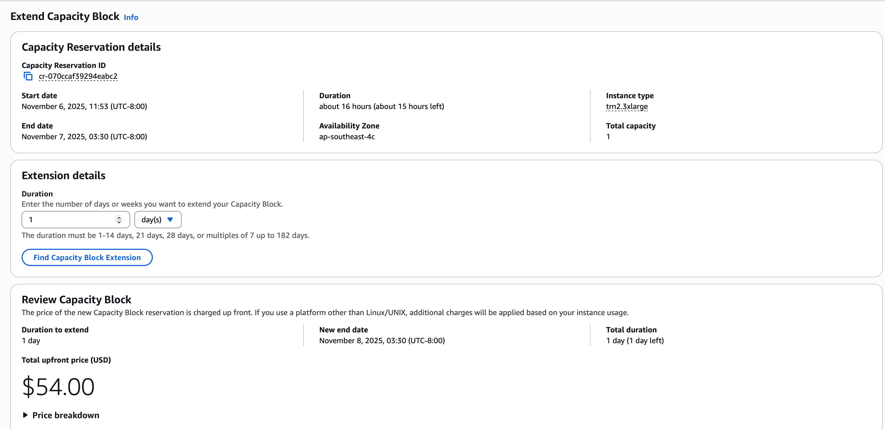

# Capacity Block Reservation Instructions #
This year, you wil need to purchase capacity blocks before launching the Trainium 2 instances used in PA4. Below is step-by-step guides to purchase capacity blocks ahead of time and extend capacity blocks.

## Purchase Capacity Blocks
You could specify the capacity blocks when you launch an instance from a private AMI, as described in [cloud_readme.md](https://github.com/stanford-cs149/asst4-trainium2/blob/main/cloud_readme.md). However, it is recommended to purchase capacity blocks ahead of time. Here is a step-by-step guide. Note: the guide follows from the [public doc](https://docs.aws.amazon.com/AWSEC2/latest/UserGuide/capacity-blocks-purchase.html).

1. Log into the EC2 dashboard, click __"Capacity Reservations"__ under __Instances__ dropdown from the left panel.

  

2. You will see a page showing two options, "On-Demand Capacity Reservations" and "Capacity Blocks for ML". Select __"Capacity Blocks for ML"__. The page layout can be different from below, depending on whether you have ever made a capacity reservation.

  

If you have made a capacity reservation before, you will see the page below. Click __"Create Capacity Reservations"__ at the top right.

  

3. Select __trn2.3xlarge__ as the instance type. The other options should be default, although it's better to check with the configuration shown in the figure below. Select your desired duration and start date. Then, click __"Find Capacity Block"__.

  

4. Confirm your start date, end date, and total upfront price for the capacity block. Click __next__.

  

5. You don't need to specify any tags.

  

6. Confirm again on all settings, then click __Create__.

  

## Extend Capacity Blocks
To avoid creating a new instance every time your capacity block ends, you can [extend](https://docs.aws.amazon.com/AWSEC2/latest/UserGuide/capacity-blocks-extend.html) an existing, __non-expired__ capacity block.

1. Go to the __Capacity Reservations__ page. Click on an __active__ capacity block that you would like to extend.

  

2. On the top right, click __Actions__, and then __Extend Capacity Block__. 

  

3. Select your desired duration and click __Find Capacity Block Extension__. After confirming the detials, click the __Extend__ button at the bottom right.

  

