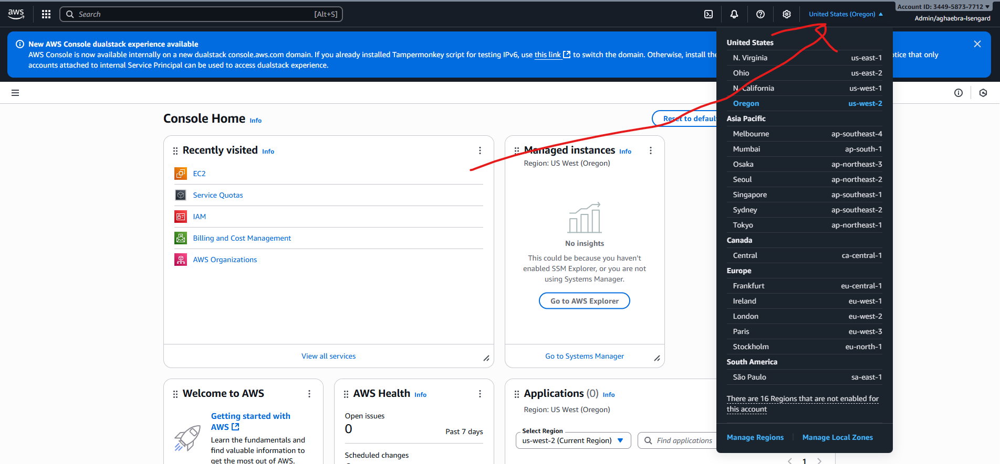
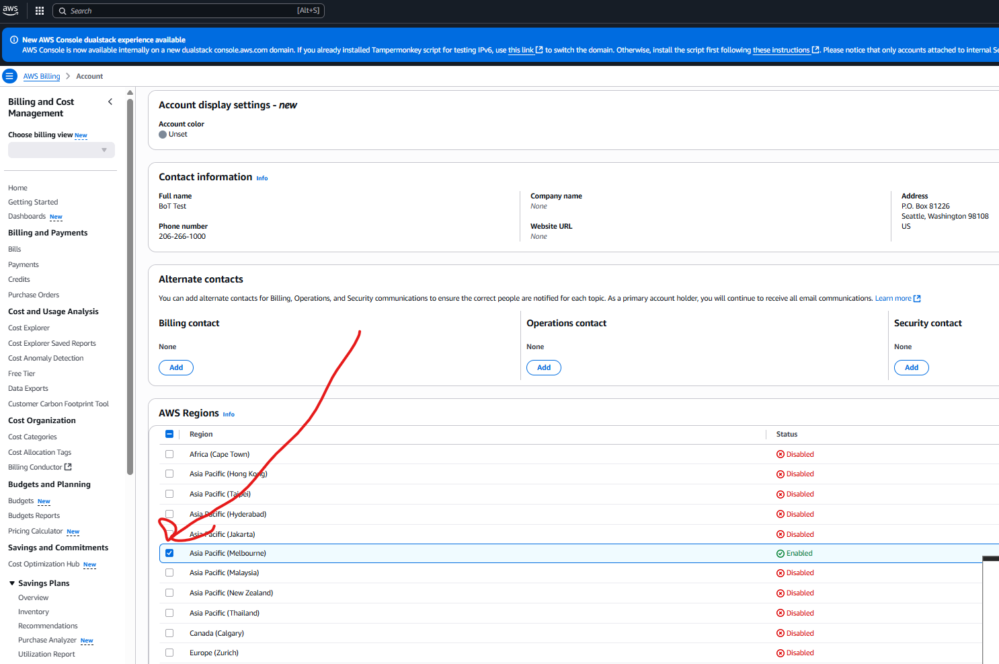
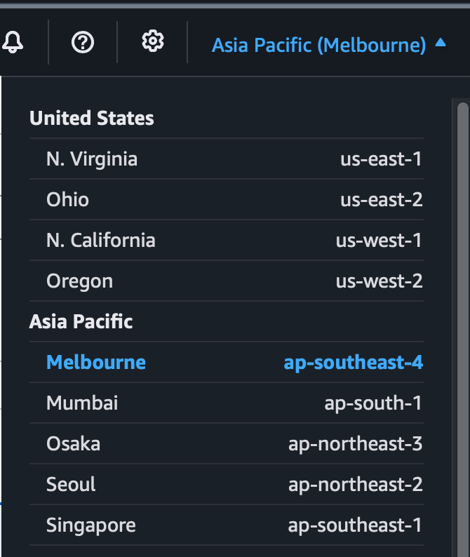
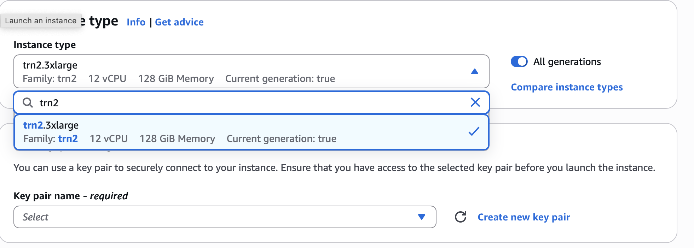
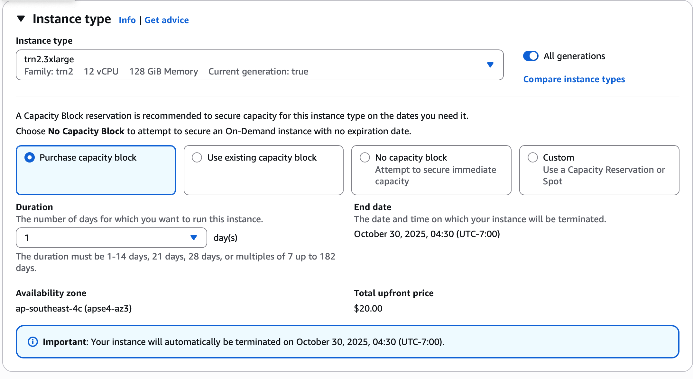
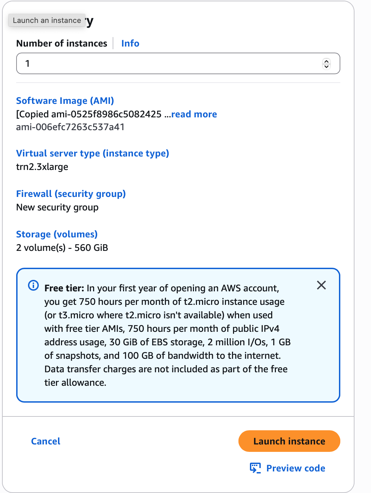

# AWS Setup Instructions #

You will need to run this assignment on a VM instance on Amazon Web Services (AWS). We'll be providing (or have already sent) you student coupons that you can use for billing purposes. Here are the steps for how to get setup for running on AWS.

> [!NOTE]
> Please don't forget to SHUT DOWN your instances when you're done for the day to avoid burning through credits overnight!

## Enable the Asia Pacific (Melbourne) Region ##
The Trainium 2 instances we will use for this assignment in the Asia Pacific region, which is __not enabled by default__. You will need to enable the region before you can successfully your Trainium 2 instance. Below is a quick step-by-step guide to enable the Melbourne region.

__Step 1:__ Click the region drop-down menu at the top right of the AWS console (it should look similar to the example below).

  

__Step 2:__ Select __“Manage Regions”__ at the bottom of the drop-down menu — this will open a new landing page.

  

__Step 3:__ Check the box next to __“Asia Pacific (Melbourne)”__ and then click __“Enable”__ on the right-hand side.

  

## Creating a VM ##

1. Log in to the [AWS EC2 dashboard](https://ap-southeast-4.console.aws.amazon.com/console/home?region=ap-southeast-4). On the top right of the page, make sure you are on the `ap-southeast-4 (Melbourne)` region.

  

2. Select **All services** on the left panel.

  

3. Click on **EC2** from the list of services.

  

4. Within the EC2 dashboard, select **AMIs** under **Images** on the left panel.

  

5. You should expect to see the following page. In the selection menu, switch to **Private images**.

  

6. All students in CS149 should have access to the first two images listed below. Select the **Ubuntu** version (this is the version we will use to test your solution), and click **“Launch Instance from AMI.”**

  

7. Choose the `trn2.3xlarge` instance type.

  

8. You will have the option to purchase **capacity blocks** for the trn2 instance. This step is **required** to successfully launch the instance. As of October 31, 2025, the upfront cost is $2.25 per hour, or approximately $300 for a 7-day capacity block.

* Unfortunately, it is currently not possible to purchase the blocks at granularity of less than a day. Currently, it is set up so that, every student can specify the duration as __1-day increments up to 14 days__. However, the time actually assigned to you is determined by the closest AWS can get. A rough estimate is that a minimum capacity block has 6 hours, and every block has a end time of 11:30 am (UTC-07:00). The price calculated for you as the upfront cost, is linear in time.

* In addition, if you would like to work in separate periods (e.g., Nov 1-3 and Nov 10-13), you will need to purchase separate capacity blocks and must set up new instances again on November 10. You can do your setup using `Git` (__make sure to save your code before the capacity block ends!__), or you can make use of [__AWS's EFS system__](EFS_guide.pdf) (a network file system!) to automatically track your progress. 

* Before your capacity block ends, you can [extend](https://docs.aws.amazon.com/AWSEC2/latest/UserGuide/capacity-blocks-extend.html) your block.

* Once purchased, usage time doesn't affect cost -- it is prepaid, so no need to stop instances when idle.

* You are advised to __reserve capacity blocks in advance__; buying right before use isn’t guaranteed and may cost more

* We recommend purchasing capacity blocks for only a few days at a time and repeating the setup if you need additional time to complete the assignment.

* There is also [public documentation](https://docs.aws.amazon.com/AWSEC2/latest/UserGuide/capacity-blocks-purchase.html) describing everything about capacity blocks. Feel free to check it out for more advanced usages.

* To help offset the cost, an additional $400 in AWS credits has been added to your account. **Please don’t hesitate to reach out if you have not received the additional credit.**

* If you run out of your AWS credit during the assignment, feel free to reach out. We are going to cover any additional cost (given it is reasonable).

  

9. You will need a key pair to access your instance. In `Key pair (login)` section, click `Create a new key pair` and give it whatever name you'd like. This will download a keyfile to your computer called `<key_name>.pem` which you will use to login to the VM instance you are about to create. Finally, you can launch your instance.

  
  

10. Confirm all details and launch instance  

  

11. Now that you've created your VM, you should be able to __SSH__ into it. You need the public IPv4 DNS name to SSH into it, which you can find by navigating to your instance's page and then clicking the `Connect` button, followed by selecting the SSH tab (note, it may take a moment for the instance to startup and be assigned an IP address):

  

Make sure you follow the instructions to change the permissions of your key file by running `chmod 400 path/to/key_name.pem`.
Once you have the IP address, you can login to the instance. We are going to be using `neuron-profile` in this assignment, which uses InfluxDB to store profiler metrics. As a result, you will need to forward ports 3001 (the default neuron-profile HTTP server port) and 8086 (the default InfluxDB port) in order to view `neuron-profile` statistics in your browser. You can login to the instance while also forwarding the needed ports by running this command:
~~~~
ssh -i path/to/key_name.pem ubuntu@<public_dns_name> -L 3001:localhost:3001 -L 8086:localhost:8086
~~~~

> [!NOTE]
> Make sure you login as the user "ubuntu" rather than the user "root".

> [!WARNING]
> If you need to step away during setup after creating your instance, be sure to shut it down. Leaving it running could deplete your credits, and you may incur additional costs.

## Fetching your code from AWS ##

We recommend that you create a private git repository and develop your assignment in there. It reduces the risk of losing your code and helps you keep track of old versions.

Alternatively, you can also use `scp` command like following in your local machine to fetch code from a remote machine.
~~~~
scp -i <path-to-your-pem-file> ubuntu@<instance-IP-addr>:/path/to/file /path/to/local_file
~~~~

## Shutting down VM ##
When you're done using the VM, you can shut it down by clicking "stop computer" in the web page, or using the command below in the terminal.
~~~~
sudo shutdown -h now
~~~~
