# Assignment 1: Performance Analysis on a Quad-Core CPU #

**作业原址**：[stanford-cs149/asst1: Stanford CS149 -- Assignment 1](https://github.com/stanford-cs149/asst1)
非常感谢老师的付出和开源，以下是作业介绍和我的实现(特别感谢 Google AI Studio 提供远程指导😝)

## Overview ##

This assignment is intended to help you develop an understanding of the two primary forms of parallel execution present in a modern multi-core CPU:

1. SIMD execution within a single processing core
2. Parallel execution using multiple cores (You'll see effects of Intel Hyper-threading as well.)

You will also gain experience measuring(测试) and reasoning(分析) about the
performance of parallel programs (a challenging, but important, skill you will
use throughout this class). This assignment involves only a small amount of
programming, but a lot of analysis!

## Environment Setup ##

myth machines(斯坦福大学计算机科学系（Stanford CS）提供的专供学生使用的公共 Linux 计算集群)
由于用不了 myth machines，只能在自己电脑跑，先搭建本地Linux开发环境
电脑配置：
处理器	Intel(R) Core(TM) i5-10300H CPU @ 2.50GHz   2.50 GHz	内核：4	逻辑处理器：8
显卡	NVIDIA GeForce GTX 1660 Ti (6 GB)

**安装WSL2(Windows Subsystem for Linux)**
1.以管理员权限打开PowerShell，运行: wsl --install
2.在Microsoft Store下载 Ubuntu 22.04 LTS
3.优点:你可以在Ubuntu里写C++/CUDA 代码，但依然能用Windows的浏览器看视频、查文档
[Windows 安装 WSL2 并运行 Ubuntu 22.04 指南本文为 Windows 10 和 Windows - 掘金](https://juejin.cn/post/7503438116234625075)
[安装 WSL | Microsoft Learn](https://learn.microsoft.com/zh-cn/windows/wsl/install)
如果显示正在安装: Ubuntu 这时候卡住在0%(微软商店抽风)，那么我们执行如下指令,从GitHub下载

```bash
wsl --install -d Ubuntu --web-download
```

**配置 CUDA Toolkit**
1.在 Windows主机安装最新的NVIDIA 驱动
2.在 WSL2(Ubuntu)里安装 CUDA Toolkit(注意要选Linux-WSL 版本)
3.安装完成后，输入nvcc -V, 看到版本号即表示成功
[WLS2安装CUDA保姆级教程_wsl2 cuda-CSDN博客](https://blog.csdn.net/qq_46472656/article/details/138624468)

**IDE选择**
使用Vs Code，并安装"Remote - WSL"扩展
这样你可以在 Windows界面操作，但所有的编译和运行都在WSL2的Linux环境下进行
[开始将 VS Code 与 WSL 配合使用 | Microsoft Learn](https://learn.microsoft.com/zh-cn/windows/wsl/tutorials/wsl-vscode)

To get started:

1. ISPC is needed to compile many of the programs used in this assignment. ISPC can be easily installed on the myth machines through the following steps:  

From a myth machine, download the linux binary into a local directory of your choice.  You can get ISPC compiler binaries for Linux from the ISPC [downloads page](https://ispc.github.io/downloads.html).  From `myth`, we recommend you use `wget` to directly download the binary from the downloads page. As of Fall 2025 Week 1, the `wget` line below works:

```bash
wget https://github.com/ispc/ispc/releases/download/v1.28.1/ispc-v1.28.1-linux.tar.gz
```

Untar the downloaded file: `tar -xvf ispc-v1.28.1-linux.tar.gz`

Add the ISPC `bin` directory to your system path.  For example, if untarring the downloaded file produces the directory `~/Downloads/ispc-v1.28.1-linux`, in bash you'd update your path variable with:

    export PATH=$PATH:${HOME}/Downloads/ispc-v1.28.1-linux/bin
    sudo cp /root/Downloads/ispc-v1.28.1-linux/bin/ispc /usr/local/bin/

The above line can be added to your `.bashrc` file for permanence(永久性).

If you are using csh, you'll update your `PATH` using `setenv`.  A quick Google search will teach you how. 

2. The assignment starter code is available on <https://github.com/stanford-cs149/asst1>. Please clone the Assignment 1 starter code using:

    `git clone https://github.com/stanford-cs149/asst1.git`

## Program 1: Parallel Fractal(分形) Generation Using Threads (20 points) ##

Build and run the code in the `prog1_mandelbrot_threads/` directory of the code base. (Type `make` to build, and `./mandelbrot` to run it.)
This program produces the image file `mandelbrot-serial.ppm`, which is a visualization of a famous set of complex numbers called the Mandelbrot set. Most platforms have a .ppm view. To view the resulting images remotely, first make sure that you have _X server_. No downloads are needed for Linux systems. However, for Mac you can use [Xquartz](https://www.xquartz.org/) and for Windows you can use [VcXsrv](https://sourceforge.net/projects/vcxsrv/).
After you have SSH X-Forwarding support, make sure you `ssh -Y` onto a myth machine and you can then view the images using the `display mandelbrot-serial.ppm` command.
使用 display 指令要下载 imagemagick

```bash
apt install graphicsmagick-imagemagick-compat
```

As you can see in the images below, the result is a familiar and beautiful fractal. Each pixel in the image corresponds to a value in the complex plane(复平面), and the brightness of each pixel is proportional(成比例的) to the computational cost of determining whether the value is contained in the Mandelbrot set. To get image 2, use the command option `./mandelbrot --view 2`.  (See function `mandelbrotSerial()` defined in `mandelbrotSerial.cpp`). You can learn more about the definition of the Mandelbrot set at
<http://en.wikipedia.org/wiki/Mandelbrot_set>.


Your job is to parallelize the computation of the images using [std::thread](https://en.cppreference.com/w/cpp/thread/thread). Starter code that spawns one additional thread is provided in the function `mandelbrotThread()` located in `mandelbrotThread.cpp`. In this function, the main application thread creates another additional thread using the constructor `std::thread(function, args...)`. It waits for this thread to complete by calling `join` on the thread object.
Currently the launched thread does not do any computation and returns immediately.
You should add code to `workerThreadStart` function to accomplish this task.
You will not need to make use of any other std::thread API calls in this assignment.

**What you need to do:**

1. Modify the starter code to parallelize the Mandelbrot generation using two processors. Specifically, compute the top half of the image in thread 0, and the bottom half of the image in thread 1. This type of problem decomposition(分解) is referred to as _spatial decomposition_ since different spatial regions of the image are computed by different processors.

   ```C++
   void workerThreadStart(WorkerArgs * const args) {
       
       // TODO FOR CS149 STUDENTS: Implement the body of the worker
       // thread here. Each thread should make a call to mandelbrotSerial()
       // to compute a part of the output image.  For example, in a
       // program that uses two threads, thread 0 could compute the top
       // half of the image and thread 1 could compute the bottom half.
       mandelbrotSerial(args->x0, args->y0, args->x1, args->y1
                       , args->width, args->height
                       , 0+args->threadId*args->height/2, args->height/2, args->maxIterations, args->output);
       printf("Hello world from thread %d\n", args->threadId);
   }
   ```

   ```bash
   # ./mandelbrot -t 1
   [mandelbrot serial]:            [412.773] ms
   Wrote image file mandelbrot-serial.ppm
   1
   Hello world from thread 0
   1
   Hello world from thread 0
   1
   Hello world from thread 0
   1
   Hello world from thread 0
   1
   Hello world from thread 0
   [mandelbrot thread]:            [206.671] ms
   Wrote image file mandelbrot-thread.ppm
   Mismatch : [600][0], Expected : 256, Actual : 0
   Error : Output from threads does not match serial output
   ```

   

   ```bash
   # ./mandelbrot -t 2
   [mandelbrot serial]:            [403.054] ms
   Wrote image file mandelbrot-serial.ppm
   2
   Hello world from thread 1
   Hello world from thread 0
   2
   Hello world from thread 0
   Hello world from thread 1
   2
   Hello world from thread 0
   Hello world from thread 1
   2
   Hello world from thread 0
   Hello world from thread 1
   2
   Hello world from thread 1
   Hello world from thread 0
   [mandelbrot thread]:            [208.641] ms
   Wrote image file mandelbrot-thread.ppm
                                   (1.93x speedup from 2 threads)
   ```

   

2. Extend your code to use 2, 3, 4, 5, 6, 7, and 8 threads, partitioning(分割) the image generation work accordingly (threads should get blocks of the image). Note that the processor only has four cores but each core supports two hyper-threads, so it can execute a total of eight threads interleaved on its execution contents.
   In your write-up(报告), produce a graph of __speedup compared to the reference sequential implementation__ as a function of the number of threads used __FOR VIEW 1__. Is speedup linear in the number of threads used? In your writeup hypothesize(假设) why this is (or is not) the case? (you may also wish to produce a graph for VIEW 2 to help you come up with a good answer. Hint: take a careful look at the three-thread datapoint.)

   ```C++
   void workerThreadStart(WorkerArgs * const args) {
   
       // TODO FOR CS149 STUDENTS: Implement the body of the worker
       // thread here. Each thread should make a call to mandelbrotSerial()
       // to compute a part of the output image.  For example, in a
       // program that uses two threads, thread 0 could compute the top
       // half of the image and thread 1 could compute the bottom half.
       mandelbrotSerial(args->x0, args->y0, args->x1, args->y1
                       , args->width, args->height
                       , 0+args->threadId*(args->height/args->numThreads)
                       , ((args->threadId+1)==args->numThreads?args->height%args->numThreads:0)+args->height/args->numThreads
                       , args->maxIterations, args->output);
       printf("Hello world from thread %d\n", args->threadId);
   }
   ```

   ```bash
   # ./mandelbrot -t 2
   [mandelbrot serial]:            [412.100] ms
   Wrote image file mandelbrot-serial.ppm
   Hello world from thread 0
   Hello world from thread 1
   Hello world from thread 0
   Hello world from thread 1
   Hello world from thread 0
   Hello world from thread 1
   Hello world from thread 0
   Hello world from thread 1
   Hello world from thread 0
   Hello world from thread 1
   [mandelbrot thread]:            [213.821] ms
   Wrote image file mandelbrot-thread.ppm
                                   (1.93x speedup from 2 threads)
   ```

   ```bash
   # ./mandelbrot -t 3
   [mandelbrot serial]:            [414.065] ms
   Wrote image file mandelbrot-serial.ppm
   Hello world from thread 0
   Hello world from thread 2
   Hello world from thread 1
   Hello world from thread 0
   Hello world from thread 2
   Hello world from thread 1
   Hello world from thread 0
   Hello world from thread 2
   Hello world from thread 1
   Hello world from thread 2
   Hello world from thread 0
   Hello world from thread 1
   Hello world from thread 2
   Hello world from thread 0
   Hello world from thread 1
   [mandelbrot thread]:            [259.167] ms
   Wrote image file mandelbrot-thread.ppm
                                   (1.60x speedup from 3 threads)
   ```

   ```bash
   # ./mandelbrot -t 4
   [mandelbrot serial]:            [409.003] ms
   Wrote image file mandelbrot-serial.ppm
   Hello world from thread 0
   Hello world from thread 3
   Hello world from thread 2
   Hello world from thread 1
   Hello world from thread 0
   Hello world from thread 3
   Hello world from thread 1
   Hello world from thread 2
   Hello world from thread 0
   Hello world from thread 3
   Hello world from thread 2
   Hello world from thread 1
   Hello world from thread 0
   Hello world from thread 3
   Hello world from thread 2
   Hello world from thread 1
   Hello world from thread 3
   Hello world from thread 0
   Hello world from thread 1
   Hello world from thread 2
   [mandelbrot thread]:            [180.170] ms
   Wrote image file mandelbrot-thread.ppm
                                   (2.27x speedup from 4 threads)
   ```

   ```bash
   # ./mandelbrot -t 5
   [mandelbrot serial]:            [412.496] ms
   Wrote image file mandelbrot-serial.ppm
   Hello world from thread 4
   Hello world from thread 0
   Hello world from thread 3
   Hello world from thread 1
   Hello world from thread 2
   Hello world from thread 4
   Hello world from thread 0
   Hello world from thread 3
   Hello world from thread 1
   Hello world from thread 2
   Hello world from thread 4
   Hello world from thread 0
   Hello world from thread 1
   Hello world from thread 3
   Hello world from thread 2
   Hello world from thread 0
   Hello world from thread 4
   Hello world from thread 1
   Hello world from thread 3
   Hello world from thread 2
   Hello world from thread 4
   Hello world from thread 0
   Hello world from thread 3
   Hello world from thread 1
   Hello world from thread 2
   [mandelbrot thread]:            [178.564] ms
   Wrote image file mandelbrot-thread.ppm
                                   (2.31x speedup from 5 threads)
   ```

   ```bash
   # ./mandelbrot -t 6
   [mandelbrot serial]:            [411.238] ms
   Wrote image file mandelbrot-serial.ppm
   Hello world from thread 5
   Hello world from thread 0
   Hello world from thread 1
   Hello world from thread 4
   Hello world from thread 2
   Hello world from thread 3
   Hello world from thread 5
   Hello world from thread 0
   Hello world from thread 1
   Hello world from thread 4
   Hello world from thread 3
   Hello world from thread 2
   Hello world from thread 0
   Hello world from thread 5
   Hello world from thread 1
   Hello world from thread 4
   Hello world from thread 2
   Hello world from thread 3
   Hello world from thread 5
   Hello world from thread 0
   Hello world from thread 1
   Hello world from thread 4
   Hello world from thread 2
   Hello world from thread 3
   Hello world from thread 5
   Hello world from thread 0
   Hello world from thread 1
   Hello world from thread 4
   Hello world from thread 2
   Hello world from thread 3
   [mandelbrot thread]:            [136.742] ms
   Wrote image file mandelbrot-thread.ppm
                                   (3.01x speedup from 6 threads)
   ```

   ```bash
   # ./mandelbrot -t 7
   [mandelbrot serial]:            [410.672] ms
   Wrote image file mandelbrot-serial.ppm
   Hello world from thread 6
   Hello world from thread 0
   Hello world from thread 5
   Hello world from thread 1
   Hello world from thread 2
   Hello world from thread 4
   Hello world from thread 3
   Hello world from thread 6
   Hello world from thread 0
   Hello world from thread 1
   Hello world from thread 5
   Hello world from thread 2
   Hello world from thread 4
   Hello world from thread 3
   Hello world from thread 6
   Hello world from thread 0
   Hello world from thread 1
   Hello world from thread 5
   Hello world from thread 4
   Hello world from thread 2
   Hello world from thread 3
   Hello world from thread 0
   Hello world from thread 6
   Hello world from thread 1
   Hello world from thread 5
   Hello world from thread 4
   Hello world from thread 2
   Hello world from thread 3
   Hello world from thread 0
   Hello world from thread 6
   Hello world from thread 1
   Hello world from thread 5
   Hello world from thread 4
   Hello world from thread 2
   Hello world from thread 3
   [mandelbrot thread]:            [135.195] ms
   Wrote image file mandelbrot-thread.ppm
                                   (3.04x speedup from 7 threads)
   ```

   ```bash
   # ./mandelbrot -t 8
   [mandelbrot serial]:            [414.446] ms
   Wrote image file mandelbrot-serial.ppm
   Hello world from thread 0
   Hello world from thread 7
   Hello world from thread 1
   Hello world from thread 6
   Hello world from thread 2
   Hello world from thread 5
   Hello world from thread 4
   Hello world from thread 3
   Hello world from thread 0
   Hello world from thread 7
   Hello world from thread 1
   Hello world from thread 6
   Hello world from thread 2
   Hello world from thread 5
   Hello world from thread 3
   Hello world from thread 4
   Hello world from thread 0
   Hello world from thread 7
   Hello world from thread 1
   Hello world from thread 6
   Hello world from thread 2
   Hello world from thread 5
   Hello world from thread 3
   Hello world from thread 4
   Hello world from thread 7
   Hello world from thread 0
   Hello world from thread 1
   Hello world from thread 6
   Hello world from thread 2
   Hello world from thread 5
   Hello world from thread 3
   Hello world from thread 4
   Hello world from thread 0
   Hello world from thread 7
   Hello world from thread 1
   Hello world from thread 6
   Hello world from thread 5
   Hello world from thread 2
   Hello world from thread 4
   Hello world from thread 3
   [mandelbrot thread]:            [113.313] ms
   Wrote image file mandelbrot-thread.ppm
                                   (3.66x speedup from 8 threads)
   ```

   ```bash
   # ./mandelbrot -t 2 -v 2
   [mandelbrot serial]:            [260.106] ms
   Wrote image file mandelbrot-serial.ppm
   Hello world from thread 1
   Hello world from thread 0
   Hello world from thread 1
   Hello world from thread 0
   Hello world from thread 1
   Hello world from thread 0
   Hello world from thread 1
   Hello world from thread 0
   Hello world from thread 1
   Hello world from thread 0
   [mandelbrot thread]:            [156.176] ms
   Wrote image file mandelbrot-thread.ppm
                                   (1.67x speedup from 2 threads)
   ```

   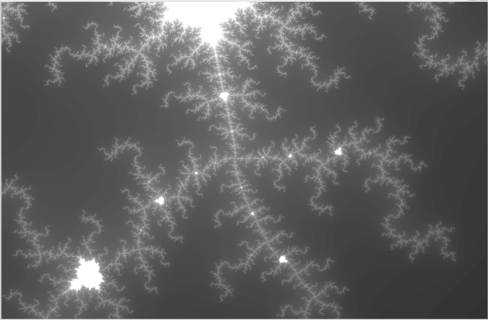

   ```bash
   # ./mandelbrot -t 3 -v 2
   [mandelbrot serial]:            [260.780] ms
   Wrote image file mandelbrot-serial.ppm
   Hello world from thread 2
   Hello world from thread 1
   Hello world from thread 0
   Hello world from thread 2
   Hello world from thread 1
   Hello world from thread 0
   Hello world from thread 2
   Hello world from thread 1
   Hello world from thread 0
   Hello world from thread 2
   Hello world from thread 1
   Hello world from thread 0
   Hello world from thread 2
   Hello world from thread 1
   Hello world from thread 0
   [mandelbrot thread]:            [119.673] ms
   Wrote image file mandelbrot-thread.ppm
                                   (2.18x speedup from 3 threads)
   ```

   ```bash
   # ./mandelbrot -t 4 -v 2
   [mandelbrot serial]:            [259.755] ms
   Wrote image file mandelbrot-serial.ppm
   Hello world from thread 3
   Hello world from thread 2
   Hello world from thread 1
   Hello world from thread 0
   Hello world from thread 3
   Hello world from thread 2
   Hello world from thread 1
   Hello world from thread 0
   Hello world from thread 3
   Hello world from thread 2
   Hello world from thread 1
   Hello world from thread 0
   Hello world from thread 3
   Hello world from thread 2
   Hello world from thread 1
   Hello world from thread 0
   Hello world from thread 3
   Hello world from thread 2
   Hello world from thread 1
   Hello world from thread 0
   [mandelbrot thread]:            [100.585] ms
   Wrote image file mandelbrot-thread.ppm
                                   (2.58x speedup from 4 threads)
   ```

   ```bash
   # ./mandelbrot -t 5 -v 2
   [mandelbrot serial]:            [260.615] ms
   Wrote image file mandelbrot-serial.ppm
   Hello world from thread 4
   Hello world from thread 3
   Hello world from thread 1
   Hello world from thread 2
   Hello world from thread 0
   Hello world from thread 4
   Hello world from thread 3
   Hello world from thread 1
   Hello world from thread 2
   Hello world from thread 0
   Hello world from thread 4
   Hello world from thread 3
   Hello world from thread 1
   Hello world from thread 2
   Hello world from thread 0
   Hello world from thread 4
   Hello world from thread 3
   Hello world from thread 1
   Hello world from thread 2
   Hello world from thread 0
   Hello world from thread 4
   Hello world from thread 3
   Hello world from thread 1
   Hello world from thread 2
   Hello world from thread 0
   [mandelbrot thread]:            [87.801] ms
   Wrote image file mandelbrot-thread.ppm
                                   (2.97x speedup from 5 threads)
   ```

   ```bash
   # ./mandelbrot -t 6 -v 2
   [mandelbrot serial]:            [259.429] ms
   Wrote image file mandelbrot-serial.ppm
   Hello world from thread 5
   Hello world from thread 4
   Hello world from thread 2
   Hello world from thread 3
   Hello world from thread 1
   Hello world from thread 0
   Hello world from thread 5
   Hello world from thread 4
   Hello world from thread 2
   Hello world from thread 3
   Hello world from thread 1
   Hello world from thread 0
   Hello world from thread 5
   Hello world from thread 4
   Hello world from thread 2
   Hello world from thread 3
   Hello world from thread 1
   Hello world from thread 0
   Hello world from thread 5
   Hello world from thread 4
   Hello world from thread 2
   Hello world from thread 3
   Hello world from thread 1
   Hello world from thread 0
   Hello world from thread 5
   Hello world from thread 4
   Hello world from thread 2
   Hello world from thread 3
   Hello world from thread 1
   Hello world from thread 0
   [mandelbrot thread]:            [79.555] ms
   Wrote image file mandelbrot-thread.ppm
                                   (3.26x speedup from 6 threads)
   ```

   ```bash
   # ./mandelbrot -t 7 -v 2
   [mandelbrot serial]:            [259.854] ms
   Wrote image file mandelbrot-serial.ppm
   Hello world from thread 6
   Hello world from thread 2
   Hello world from thread 4
   Hello world from thread 5
   Hello world from thread 3
   Hello world from thread 1
   Hello world from thread 0
   Hello world from thread 6
   Hello world from thread 2
   Hello world from thread 4
   Hello world from thread 5
   Hello world from thread 3
   Hello world from thread 1
   Hello world from thread 0
   Hello world from thread 6
   Hello world from thread 2
   Hello world from thread 4
   Hello world from thread 5
   Hello world from thread 3
   Hello world from thread 1
   Hello world from thread 0
   Hello world from thread 6
   Hello world from thread 2
   Hello world from thread 4
   Hello world from thread 5
   Hello world from thread 3
   Hello world from thread 1
   Hello world from thread 0
   Hello world from thread 6
   Hello world from thread 2
   Hello world from thread 4
   Hello world from thread 5
   Hello world from thread 3
   Hello world from thread 1
   Hello world from thread 0
   [mandelbrot thread]:            [70.617] ms
   Wrote image file mandelbrot-thread.ppm
                                   (3.68x speedup from 7 threads)
   ```

   ```bash
   # ./mandelbrot -t 8 -v 2
   [mandelbrot serial]:            [260.465] ms
   Wrote image file mandelbrot-serial.ppm
   Hello world from thread 5
   Hello world from thread 3
   Hello world from thread 2
   Hello world from thread 6
   Hello world from thread 7
   Hello world from thread 4
   Hello world from thread 1
   Hello world from thread 0
   Hello world from thread 7
   Hello world from thread 5
   Hello world from thread 2
   Hello world from thread 4
   Hello world from thread 3
   Hello world from thread 6
   Hello world from thread 1
   Hello world from thread 0
   Hello world from thread 5
   Hello world from thread 7
   Hello world from thread 2
   Hello world from thread 4
   Hello world from thread 6
   Hello world from thread 3
   Hello world from thread 1
   Hello world from thread 0
   Hello world from thread 7
   Hello world from thread 5
   Hello world from thread 2
   Hello world from thread 3
   Hello world from thread 4
   Hello world from thread 6
   Hello world from thread 1
   Hello world from thread 0
   Hello world from thread 7
   Hello world from thread 2
   Hello world from thread 5
   Hello world from thread 4
   Hello world from thread 3
   Hello world from thread 6
   Hello world from thread 1
   Hello world from thread 0
   [mandelbrot thread]:            [65.676] ms
   Wrote image file mandelbrot-thread.ppm
                                   (3.97x speedup from 8 threads)
   ```

   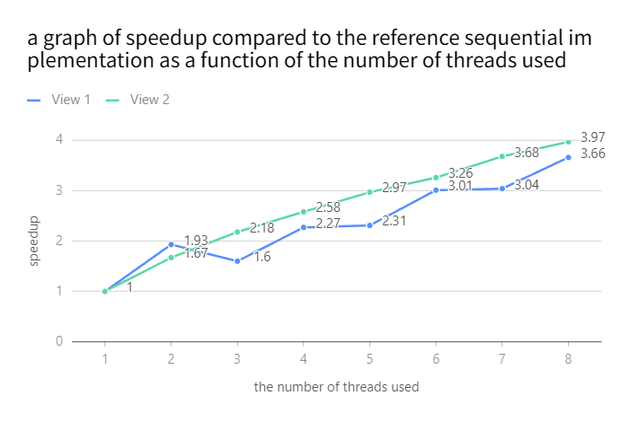

   **1.速度提升（Speedup）是否为线性？**
   **结论：** 不，View 1 的速度提升显著非线性。
   虽然随着线程数增加，性能整体呈上升趋势，但在 3 线程处出现了明显的性能倒退，且在 6 到 7 线程之间几乎没有提升。最终在 8 个线程下的加速比（3.66x）远低于 8x 的理论线性增长，甚至低于物理核心数（4核）

   **2.为什么是非线性的？**
   **A. 软件维度：静态分块导致的负载不均衡 (Load Imbalance)**
   由于实验采用静态分块策略（将图像水平切分成 N 个连续的行块），性能高度依赖于每一块中“白色区域”的分布
   	白色区域 = 极高计算量：在 Mandelbrot 算法中，白色区域的点必须跑满最大迭代次数（Max Iterations），而黑色区域很快就发散退出
   	View 1 的“中心瓶颈”效应：
   		观察 View 1，图像正中间有一颗巨大的白色“心脏”。这意味着图像中间行的计算量远超边缘行
   		3 线程的性能倒退 (1.6x)：
   			当 N=3 时，图像被切成顶、中、底三份。线程 1 独自承包了整颗白色心脏最宽、最重的中心部分
   			线程 0 和 2 因为负责边缘黑色区域，会极速完成并进入空转。程序总时长取决于最慢的线程 1。此时 4 个物理核心中只有 1 个在满载工作，导致其性能甚至不如 2 线程（2 线程时，中间的重负载由两人平分）
   	5-6-7 线程的“锯齿”波动：
   		6 线程 (偶数)：中心线成为切块边界，最重的中心负载被**平分**给了中间的两个线程，瓶颈被打破，因此出现陡增
   		7 线程 (奇数)：中心又出现了一个独立的重负载切块，再次成为全队必须等待的“最短板”，导致多加一个线程也几乎没有性能收益
   **B. 硬件维度：物理核心 vs. 超线程 (Hyper-threading)**
   	i5-10300H 拥有 4 个物理核心
   	1 至 4 线程：操作系统优先将线程分配给不同的物理核心。每个线程拥有独立的执行单元（ALU），因此在避开 3 线程这种极端不平衡的情况下，提速较为明显
   	5 至 8 线程：开始利用逻辑处理器（超线程）
   	资源竞争：Mandelbrot 是典型的计算密集型（Compute-bound）任务。在 i5-10300H 中，同一物理核心的两个逻辑线程必须共享同一套算术逻辑单元（ALU）
   	收益递减：由于物理核心的计算资源已被前 4 个线程填满，后 4 个逻辑线程无法提供实质性的额外算力。超线程主要用于隐藏内存延迟，但在这种满负荷数学运算中效果甚微，因此 4 线程后的曲线明显变平

   **3.View 2 的对比**

   **View 2 的表现**：曲线比 View 1 平滑且高效得多（8 线程达到 3.97x，接近 4 核物理极限）
   **原因**：View 2 是 66 倍缩放后的局部。图像中白色和黑色区域呈交错的“树叉状”分布
   **结论**：即使使用简单的水平分块，View 2 每一块分配到的黑白比例也相对均衡。这证明了 View 1 的性能问题根源在于工作量分布的极端不均

3. To confirm (or disprove(推翻)) your hypothesis, measure the amount of time each thread requires to complete its work by inserting timing code at the beginning and end of `workerThreadStart()`. How do your measurements explain the speedup graph you previously created?

   ```c++
   void workerThreadStart(WorkerArgs * const args) {
   
       // TODO FOR CS149 STUDENTS: Implement the body of the worker
       // thread here. Each thread should make a call to mandelbrotSerial()
       // to compute a part of the output image.  For example, in a
       // program that uses two threads, thread 0 could compute the top
       // half of the image and thread 1 could compute the bottom half.
       double startTime = CycleTimer::currentSeconds();
       mandelbrotSerial(args->x0, args->y0, args->x1, args->y1
                       , args->width, args->height
                       , 0+args->threadId*(args->height/args->numThreads)
                       , ((args->threadId+1)==args->numThreads?args->height%args->numThreads:0)+args->height/args->numThreads
                       , args->maxIterations, args->output);
       double endTime = CycleTimer::currentSeconds();
       printf("Hello world from thread %d, time: %lf\n", args->threadId, endTime - startTime);
   }
   ```

   ```bash
   # ./mandelbrot -t 1
   [mandelbrot serial]:            [413.281] ms
   Wrote image file mandelbrot-serial.ppm
   Hello world from thread 0, time: 0.413939
   Hello world from thread 0, time: 0.414848
   Hello world from thread 0, time: 0.411907
   Hello world from thread 0, time: 0.417941
   Hello world from thread 0, time: 0.411178
   [mandelbrot thread]:            [411.210] ms
   Wrote image file mandelbrot-thread.ppm
                                   (1.01x speedup from 1 threads)
   ```

   ```bash
   # ./mandelbrot -t 2
   [mandelbrot serial]:            [414.679] ms
   Wrote image file mandelbrot-serial.ppm
   Hello world from thread 0, time: 0.214845
   Hello world from thread 1, time: 0.215504
   Hello world from thread 0, time: 0.217724
   Hello world from thread 1, time: 0.217993
   Hello world from thread 0, time: 0.215102
   Hello world from thread 1, time: 0.216740
   Hello world from thread 0, time: 0.215810
   Hello world from thread 1, time: 0.216640
   Hello world from thread 0, time: 0.212336
   Hello world from thread 1, time: 0.214394
   [mandelbrot thread]:            [214.633] ms
   Wrote image file mandelbrot-thread.ppm
                                   (1.93x speedup from 2 threads)
   ```

   ```bash
   # ./mandelbrot -t 3
   [mandelbrot serial]:            [411.690] ms
   Wrote image file mandelbrot-serial.ppm
   Hello world from thread 0, time: 0.089315
   Hello world from thread 2, time: 0.091256
   Hello world from thread 1, time: 0.268086
   Hello world from thread 0, time: 0.088139
   Hello world from thread 2, time: 0.088856
   Hello world from thread 1, time: 0.260704
   Hello world from thread 0, time: 0.084161
   Hello world from thread 2, time: 0.086161
   Hello world from thread 1, time: 0.255342
   Hello world from thread 0, time: 0.086725
   Hello world from thread 2, time: 0.087800
   Hello world from thread 1, time: 0.255758
   Hello world from thread 2, time: 0.090426
   Hello world from thread 0, time: 0.090863
   Hello world from thread 1, time: 0.260152
   [mandelbrot thread]:            [255.601] ms
   Wrote image file mandelbrot-thread.ppm
                                   (1.61x speedup from 3 threads)
   ```

   ```bash
   # ./mandelbrot -t 4
   [mandelbrot serial]:            [410.757] ms
   Wrote image file mandelbrot-serial.ppm
   Hello world from thread 0, time: 0.043194
   Hello world from thread 3, time: 0.043356
   Hello world from thread 1, time: 0.175927
   Hello world from thread 2, time: 0.176282
   Hello world from thread 0, time: 0.043857
   Hello world from thread 3, time: 0.045030
   Hello world from thread 1, time: 0.176479
   Hello world from thread 2, time: 0.177548
   Hello world from thread 0, time: 0.043586
   Hello world from thread 3, time: 0.046435
   Hello world from thread 1, time: 0.186369
   Hello world from thread 2, time: 0.188734
   Hello world from thread 3, time: 0.042961
   Hello world from thread 0, time: 0.045786
   Hello world from thread 1, time: 0.176177
   Hello world from thread 2, time: 0.176891
   Hello world from thread 3, time: 0.041642
   Hello world from thread 0, time: 0.044379
   Hello world from thread 2, time: 0.185100
   Hello world from thread 1, time: 0.185693
   [mandelbrot thread]:            [176.518] ms
   Wrote image file mandelbrot-thread.ppm
                                   (2.33x speedup from 4 threads)
   ```

   ```bash
   # ./mandelbrot -t 5
   [mandelbrot serial]:            [418.219] ms
   Wrote image file mandelbrot-serial.ppm
   Hello world from thread 0, time: 0.018694
   Hello world from thread 4, time: 0.019559
   Hello world from thread 3, time: 0.111966
   Hello world from thread 1, time: 0.112409
   Hello world from thread 2, time: 0.171241
   Hello world from thread 0, time: 0.018099
   Hello world from thread 4, time: 0.018782
   Hello world from thread 3, time: 0.108944
   Hello world from thread 1, time: 0.111465
   Hello world from thread 2, time: 0.171213
   Hello world from thread 0, time: 0.018773
   Hello world from thread 4, time: 0.019297
   Hello world from thread 1, time: 0.114419
   Hello world from thread 3, time: 0.115880
   Hello world from thread 2, time: 0.172381
   Hello world from thread 0, time: 0.019434
   Hello world from thread 4, time: 0.019750
   Hello world from thread 1, time: 0.119729
   Hello world from thread 3, time: 0.121482
   Hello world from thread 2, time: 0.179755
   Hello world from thread 0, time: 0.018829
   Hello world from thread 4, time: 0.019676
   Hello world from thread 1, time: 0.116076
   Hello world from thread 3, time: 0.116934
   Hello world from thread 2, time: 0.174983
   [mandelbrot thread]:            [171.498] ms
   Wrote image file mandelbrot-thread.ppm
                                   (2.44x speedup from 5 threads)
   ```

   ```bash
   # ./mandelbrot -t 6
   [mandelbrot serial]:            [411.649] ms
   Wrote image file mandelbrot-serial.ppm
   Hello world from thread 5, time: 0.013374
   Hello world from thread 0, time: 0.014230
   Hello world from thread 4, time: 0.078544
   Hello world from thread 1, time: 0.080528
   Hello world from thread 2, time: 0.134871
   Hello world from thread 3, time: 0.136166
   Hello world from thread 5, time: 0.012748
   Hello world from thread 0, time: 0.013872
   Hello world from thread 1, time: 0.082538
   Hello world from thread 4, time: 0.083526
   Hello world from thread 2, time: 0.139586
   Hello world from thread 3, time: 0.142431
   Hello world from thread 5, time: 0.012056
   Hello world from thread 0, time: 0.013354
   Hello world from thread 1, time: 0.076681
   Hello world from thread 4, time: 0.079387
   Hello world from thread 2, time: 0.134024
   Hello world from thread 3, time: 0.134760
   Hello world from thread 5, time: 0.013786
   Hello world from thread 0, time: 0.014814
   Hello world from thread 4, time: 0.082430
   Hello world from thread 1, time: 0.083320
   Hello world from thread 3, time: 0.141258
   Hello world from thread 2, time: 0.141946
   Hello world from thread 5, time: 0.013558
   Hello world from thread 0, time: 0.013829
   Hello world from thread 1, time: 0.079907
   Hello world from thread 4, time: 0.080945
   Hello world from thread 2, time: 0.136026
   Hello world from thread 3, time: 0.138997
   [mandelbrot thread]:            [135.068] ms
   Wrote image file mandelbrot-thread.ppm
                                   (3.05x speedup from 6 threads)
   ```

   ```bash
   # ./mandelbrot -t 7
   [mandelbrot serial]:            [410.946] ms
   Wrote image file mandelbrot-serial.ppm
   Hello world from thread 6, time: 0.010609
   Hello world from thread 0, time: 0.011859
   Hello world from thread 1, time: 0.053413
   Hello world from thread 5, time: 0.056558
   Hello world from thread 2, time: 0.100594
   Hello world from thread 4, time: 0.102274
   Hello world from thread 3, time: 0.130334
   Hello world from thread 0, time: 0.010044
   Hello world from thread 6, time: 0.010364
   Hello world from thread 1, time: 0.052904
   Hello world from thread 5, time: 0.055115
   Hello world from thread 2, time: 0.102088
   Hello world from thread 4, time: 0.104768
   Hello world from thread 3, time: 0.133744
   Hello world from thread 0, time: 0.009936
   Hello world from thread 6, time: 0.010550
   Hello world from thread 5, time: 0.053786
   Hello world from thread 1, time: 0.054900
   Hello world from thread 4, time: 0.101016
   Hello world from thread 2, time: 0.102054
   Hello world from thread 3, time: 0.131359
   Hello world from thread 6, time: 0.009035
   Hello world from thread 0, time: 0.010126
   Hello world from thread 5, time: 0.055082
   Hello world from thread 1, time: 0.055583
   Hello world from thread 4, time: 0.103242
   Hello world from thread 2, time: 0.103496
   Hello world from thread 3, time: 0.134419
   Hello world from thread 0, time: 0.011518
   Hello world from thread 6, time: 0.011893
   Hello world from thread 1, time: 0.054450
   Hello world from thread 5, time: 0.057545
   Hello world from thread 2, time: 0.102737
   Hello world from thread 4, time: 0.106500
   Hello world from thread 3, time: 0.136069
   [mandelbrot thread]:            [130.756] ms
   Wrote image file mandelbrot-thread.ppm
                                   (3.14x speedup from 7 threads)
   ```

   ```bash
   # ./mandelbrot -t 8
   [mandelbrot serial]:            [411.310] ms
   Wrote image file mandelbrot-serial.ppm
   Hello world from thread 7, time: 0.007920
   Hello world from thread 0, time: 0.015433
   Hello world from thread 6, time: 0.038100
   Hello world from thread 1, time: 0.039311
   Hello world from thread 5, time: 0.075682
   Hello world from thread 2, time: 0.077233
   Hello world from thread 3, time: 0.110579
   Hello world from thread 4, time: 0.111260
   Hello world from thread 0, time: 0.016216
   Hello world from thread 7, time: 0.014471
   Hello world from thread 1, time: 0.039607
   Hello world from thread 6, time: 0.040755
   Hello world from thread 2, time: 0.078374
   Hello world from thread 5, time: 0.078773
   Hello world from thread 3, time: 0.112905
   Hello world from thread 4, time: 0.114066
   Hello world from thread 0, time: 0.016029
   Hello world from thread 7, time: 0.013517
   Hello world from thread 1, time: 0.038748
   Hello world from thread 6, time: 0.038783
   Hello world from thread 2, time: 0.078333
   Hello world from thread 5, time: 0.078780
   Hello world from thread 3, time: 0.112191
   Hello world from thread 4, time: 0.112234
   Hello world from thread 0, time: 0.016495
   Hello world from thread 7, time: 0.014126
   Hello world from thread 1, time: 0.040323
   Hello world from thread 6, time: 0.042871
   Hello world from thread 2, time: 0.079307
   Hello world from thread 5, time: 0.080631
   Hello world from thread 4, time: 0.115830
   Hello world from thread 3, time: 0.116266
   Hello world from thread 7, time: 0.007702
   Hello world from thread 0, time: 0.015013
   Hello world from thread 1, time: 0.039078
   Hello world from thread 6, time: 0.038870
   Hello world from thread 5, time: 0.078430
   Hello world from thread 2, time: 0.078645
   Hello world from thread 3, time: 0.115162
   Hello world from thread 4, time: 0.115188
   [mandelbrot thread]:            [111.655] ms
   Wrote image file mandelbrot-thread.ppm
                                   (3.68x speedup from 8 threads)
   ```

   ```bash
   # ./mandelbrot -t 1 -v 2
   [mandelbrot serial]:            [259.103] ms
   Wrote image file mandelbrot-serial.ppm
   Hello world from thread 0, time: 0.264316
   Hello world from thread 0, time: 0.260710
   Hello world from thread 0, time: 0.264515
   Hello world from thread 0, time: 0.260675
   Hello world from thread 0, time: 0.262872
   [mandelbrot thread]:            [260.708] ms
   Wrote image file mandelbrot-thread.ppm
                                   (0.99x speedup from 1 threads)
   ```

   ```bash
   # ./mandelbrot -t 2 -v 2
   [mandelbrot serial]:            [258.329] ms
   Wrote image file mandelbrot-serial.ppm
   Hello world from thread 1, time: 0.109183
   Hello world from thread 0, time: 0.154347
   Hello world from thread 1, time: 0.109970
   Hello world from thread 0, time: 0.154544
   Hello world from thread 1, time: 0.113328
   Hello world from thread 0, time: 0.157974
   Hello world from thread 1, time: 0.109210
   Hello world from thread 0, time: 0.153810
   Hello world from thread 1, time: 0.109523
   Hello world from thread 0, time: 0.155502
   [mandelbrot thread]:            [153.927] ms
   Wrote image file mandelbrot-thread.ppm
                                   (1.68x speedup from 2 threads)
   ```

   ```bash
   # ./mandelbrot -t 3 -v 2
   [mandelbrot serial]:            [260.952] ms
   Wrote image file mandelbrot-serial.ppm
   Hello world from thread 2, time: 0.075530
   Hello world from thread 1, time: 0.084240
   Hello world from thread 0, time: 0.122561
   Hello world from thread 2, time: 0.072589
   Hello world from thread 1, time: 0.079892
   Hello world from thread 0, time: 0.120176
   Hello world from thread 2, time: 0.075163
   Hello world from thread 1, time: 0.078270
   Hello world from thread 0, time: 0.120710
   Hello world from thread 2, time: 0.074241
   Hello world from thread 1, time: 0.080356
   Hello world from thread 0, time: 0.121643
   Hello world from thread 2, time: 0.071944
   Hello world from thread 1, time: 0.078993
   Hello world from thread 0, time: 0.119649
   [mandelbrot thread]:            [119.897] ms
   Wrote image file mandelbrot-thread.ppm
                                   (2.18x speedup from 3 threads)
   ```

   ```bash
   # ./mandelbrot -t 4 -v 2
   [mandelbrot serial]:            [259.377] ms
   Wrote image file mandelbrot-serial.ppm
   Hello world from thread 3, time: 0.054991
   Hello world from thread 2, time: 0.060465
   Hello world from thread 1, time: 0.061731
   Hello world from thread 0, time: 0.102082
   Hello world from thread 3, time: 0.057419
   Hello world from thread 2, time: 0.058737
   Hello world from thread 1, time: 0.059756
   Hello world from thread 0, time: 0.100795
   Hello world from thread 3, time: 0.056271
   Hello world from thread 2, time: 0.058201
   Hello world from thread 1, time: 0.059736
   Hello world from thread 0, time: 0.100131
   Hello world from thread 2, time: 0.061408
   Hello world from thread 3, time: 0.061574
   Hello world from thread 1, time: 0.063052
   Hello world from thread 0, time: 0.104232
   Hello world from thread 3, time: 0.057746
   Hello world from thread 1, time: 0.059832
   Hello world from thread 2, time: 0.060819
   Hello world from thread 0, time: 0.102576
   [mandelbrot thread]:            [100.341] ms
   Wrote image file mandelbrot-thread.ppm
                                   (2.58x speedup from 4 threads)
   ```

   ```bash
   # ./mandelbrot -t 5 -v 2
   [mandelbrot serial]:            [259.242] ms
   Wrote image file mandelbrot-serial.ppm
   Hello world from thread 4, time: 0.045888
   Hello world from thread 3, time: 0.046438
   Hello world from thread 1, time: 0.049044
   Hello world from thread 2, time: 0.051064
   Hello world from thread 0, time: 0.089711
   Hello world from thread 3, time: 0.046291
   Hello world from thread 4, time: 0.047070
   Hello world from thread 1, time: 0.048683
   Hello world from thread 2, time: 0.052744
   Hello world from thread 0, time: 0.088040
   Hello world from thread 4, time: 0.044179
   Hello world from thread 3, time: 0.045847
   Hello world from thread 1, time: 0.047104
   Hello world from thread 2, time: 0.051280
   Hello world from thread 0, time: 0.086705
   Hello world from thread 3, time: 0.044683
   Hello world from thread 4, time: 0.046063
   Hello world from thread 1, time: 0.047128
   Hello world from thread 2, time: 0.051838
   Hello world from thread 0, time: 0.086983
   Hello world from thread 4, time: 0.043906
   Hello world from thread 3, time: 0.045531
   Hello world from thread 1, time: 0.049488
   Hello world from thread 2, time: 0.051885
   Hello world from thread 0, time: 0.086904
   [mandelbrot thread]:            [87.011] ms
   Wrote image file mandelbrot-thread.ppm
                                   (2.98x speedup from 5 threads)
   ```

   ```bash
   # ./mandelbrot -t 6 -v 2
   [mandelbrot serial]:            [257.942] ms
   Wrote image file mandelbrot-serial.ppm
   Hello world from thread 5, time: 0.037496
   Hello world from thread 4, time: 0.040736
   Hello world from thread 2, time: 0.041543
   Hello world from thread 3, time: 0.042948
   Hello world from thread 1, time: 0.048306
   Hello world from thread 0, time: 0.080504
   Hello world from thread 5, time: 0.039832
   Hello world from thread 4, time: 0.040987
   Hello world from thread 2, time: 0.042935
   Hello world from thread 3, time: 0.044629
   Hello world from thread 1, time: 0.048630
   Hello world from thread 0, time: 0.080038
   Hello world from thread 5, time: 0.037041
   Hello world from thread 4, time: 0.039308
   Hello world from thread 2, time: 0.040562
   Hello world from thread 3, time: 0.041442
   Hello world from thread 1, time: 0.046189
   Hello world from thread 0, time: 0.078232
   Hello world from thread 5, time: 0.038848
   Hello world from thread 4, time: 0.042943
   Hello world from thread 2, time: 0.044309
   Hello world from thread 3, time: 0.046876
   Hello world from thread 1, time: 0.048576
   Hello world from thread 0, time: 0.082587
   Hello world from thread 5, time: 0.040801
   Hello world from thread 4, time: 0.042575
   Hello world from thread 2, time: 0.044651
   Hello world from thread 3, time: 0.046385
   Hello world from thread 1, time: 0.049680
   Hello world from thread 0, time: 0.082272
   [mandelbrot thread]:            [78.618] ms
   Wrote image file mandelbrot-thread.ppm
                                   (3.28x speedup from 6 threads)
   ```

   ```bash
   # ./mandelbrot -t 7 -v 2
   [mandelbrot serial]:            [258.532] ms
   Wrote image file mandelbrot-serial.ppm
   Hello world from thread 6, time: 0.030768
   Hello world from thread 2, time: 0.033253
   Hello world from thread 4, time: 0.034173
   Hello world from thread 5, time: 0.035534
   Hello world from thread 3, time: 0.038757
   Hello world from thread 1, time: 0.043110
   Hello world from thread 0, time: 0.071744
   Hello world from thread 6, time: 0.030666
   Hello world from thread 2, time: 0.032548
   Hello world from thread 4, time: 0.033881
   Hello world from thread 5, time: 0.034349
   Hello world from thread 3, time: 0.038694
   Hello world from thread 1, time: 0.042781
   Hello world from thread 0, time: 0.068923
   Hello world from thread 6, time: 0.030975
   Hello world from thread 2, time: 0.033512
   Hello world from thread 4, time: 0.033691
   Hello world from thread 5, time: 0.036259
   Hello world from thread 3, time: 0.039220
   Hello world from thread 1, time: 0.044782
   Hello world from thread 0, time: 0.070802
   Hello world from thread 6, time: 0.034203
   Hello world from thread 2, time: 0.038154
   Hello world from thread 4, time: 0.039542
   Hello world from thread 5, time: 0.040119
   Hello world from thread 3, time: 0.043826
   Hello world from thread 1, time: 0.048341
   Hello world from thread 0, time: 0.077695
   Hello world from thread 6, time: 0.032983
   Hello world from thread 2, time: 0.035513
   Hello world from thread 4, time: 0.037153
   Hello world from thread 5, time: 0.038863
   Hello world from thread 3, time: 0.041695
   Hello world from thread 1, time: 0.046729
   Hello world from thread 0, time: 0.072946
   [mandelbrot thread]:            [69.390] ms
   Wrote image file mandelbrot-thread.ppm
                                   (3.73x speedup from 7 threads)
   ```

   ```bash
   # ./mandelbrot -t 8 -v 2
   [mandelbrot serial]:            [258.740] ms
   Wrote image file mandelbrot-serial.ppm
   Hello world from thread 5, time: 0.028502
   Hello world from thread 2, time: 0.029614
   Hello world from thread 4, time: 0.030940
   Hello world from thread 3, time: 0.031312
   Hello world from thread 6, time: 0.032028
   Hello world from thread 1, time: 0.040995
   Hello world from thread 7, time: 0.038807
   Hello world from thread 0, time: 0.077965
   Hello world from thread 7, time: 0.026998
   Hello world from thread 2, time: 0.033924
   Hello world from thread 3, time: 0.035132
   Hello world from thread 5, time: 0.037116
   Hello world from thread 6, time: 0.037458
   Hello world from thread 4, time: 0.038000
   Hello world from thread 1, time: 0.046258
   Hello world from thread 0, time: 0.065646
   Hello world from thread 5, time: 0.031521
   Hello world from thread 2, time: 0.031962
   Hello world from thread 7, time: 0.028044
   Hello world from thread 6, time: 0.034243
   Hello world from thread 4, time: 0.034593
   Hello world from thread 3, time: 0.036200
   Hello world from thread 1, time: 0.044346
   Hello world from thread 0, time: 0.064904
   Hello world from thread 7, time: 0.027272
   Hello world from thread 5, time: 0.031769
   Hello world from thread 2, time: 0.032440
   Hello world from thread 3, time: 0.034088
   Hello world from thread 4, time: 0.034752
   Hello world from thread 6, time: 0.034884
   Hello world from thread 1, time: 0.045086
   Hello world from thread 0, time: 0.065778
   Hello world from thread 7, time: 0.027404
   Hello world from thread 5, time: 0.031174
   Hello world from thread 2, time: 0.033441
   Hello world from thread 3, time: 0.035554
   Hello world from thread 4, time: 0.035586
   Hello world from thread 6, time: 0.035650
   Hello world from thread 1, time: 0.045072
   Hello world from thread 0, time: 0.066608
   [mandelbrot thread]:            [65.445] ms
   Wrote image file mandelbrot-thread.ppm
                                   (3.95x speedup from 8 threads)
   ```

   符合问题二中假设

4. Modify the mapping of work to threads to achieve to improve speedup to at __about 7-8x on both views__ of the Mandelbrot set (if you're above 7x that's fine, don't sweat it). You may not use any synchronization between threads in your solution. We are expecting you to come up with a single work decomposition policy that will work well for all thread counts---hard coding a solution specific to each configuration is not allowed! (Hint: There is a very simple static assignment that will achieve this goal, and no communication/synchronization among threads is necessary.). In your writeup, describe your approach to parallelization
   and report the final 8-thread speedup obtained. 

   **交替行分配**

   ```C++
   void workerThreadStart(WorkerArgs * const args) {
   
       // TODO FOR CS149 STUDENTS: Implement the body of the worker
       // thread here. Each thread should make a call to mandelbrotSerial()
       // to compute a part of the output image.  For example, in a
       // program that uses two threads, thread 0 could compute the top
       // half of the image and thread 1 could compute the bottom half.
       double startTime = CycleTimer::currentSeconds();
       for(unsigned int i=args->threadId;i<args->height;i+=args->numThreads)
       {
           mandelbrotSerial(args->x0, args->y0, args->x1, args->y1
                       , args->width, args->height
                       , i
                       , 1
                       , args->maxIterations, args->output);
       }
       double endTime = CycleTimer::currentSeconds();
       printf("Hello world from thread %d, time: %lf\n", args->threadId, endTime - startTime);
   }
   ```

   ```bash
   # ./mandelbrot -t 8
   [mandelbrot serial]:            [411.334] ms
   Wrote image file mandelbrot-serial.ppm
   Hello world from thread 5, time: 0.064081
   Hello world from thread 7, time: 0.064172
   Hello world from thread 2, time: 0.065001
   Hello world from thread 6, time: 0.066506
   Hello world from thread 1, time: 0.067713
   Hello world from thread 3, time: 0.067974
   Hello world from thread 4, time: 0.074076
   Hello world from thread 0, time: 0.078501
   Hello world from thread 4, time: 0.065090
   Hello world from thread 6, time: 0.065131
   Hello world from thread 1, time: 0.065537
   Hello world from thread 2, time: 0.066238
   Hello world from thread 3, time: 0.066265
   Hello world from thread 5, time: 0.066533
   Hello world from thread 0, time: 0.083669
   Hello world from thread 7, time: 0.082060
   Hello world from thread 2, time: 0.066242
   Hello world from thread 4, time: 0.066279
   Hello world from thread 1, time: 0.066803
   Hello world from thread 7, time: 0.066678
   Hello world from thread 6, time: 0.067017
   Hello world from thread 3, time: 0.067257
   Hello world from thread 5, time: 0.067164
   Hello world from thread 0, time: 0.067100
   Hello world from thread 1, time: 0.071468
   Hello world from thread 4, time: 0.072275
   Hello world from thread 0, time: 0.074299
   Hello world from thread 2, time: 0.075274
   Hello world from thread 5, time: 0.075776
   Hello world from thread 6, time: 0.076899
   Hello world from thread 7, time: 0.078926
   Hello world from thread 3, time: 0.087714
   Hello world from thread 4, time: 0.066514
   Hello world from thread 7, time: 0.066568
   Hello world from thread 5, time: 0.066828
   Hello world from thread 3, time: 0.067136
   Hello world from thread 2, time: 0.067583
   Hello world from thread 1, time: 0.067652
   Hello world from thread 6, time: 0.067479
   Hello world from thread 0, time: 0.068461
   [mandelbrot thread]:            [67.645] ms
   Wrote image file mandelbrot-thread.ppm
                                   (6.08x speedup from 8 threads)
   ```

   ```bash
   # ./mandelbrot -t 8 -v 2
   [mandelbrot serial]:            [258.813] ms
   Wrote image file mandelbrot-serial.ppm
   Hello world from thread 5, time: 0.037323
   Hello world from thread 2, time: 0.037637
   Hello world from thread 1, time: 0.037762
   Hello world from thread 3, time: 0.037789
   Hello world from thread 4, time: 0.038124
   Hello world from thread 6, time: 0.038144
   Hello world from thread 7, time: 0.048773
   Hello world from thread 0, time: 0.056608
   Hello world from thread 3, time: 0.040132
   Hello world from thread 7, time: 0.040058
   Hello world from thread 6, time: 0.040311
   Hello world from thread 2, time: 0.040545
   Hello world from thread 1, time: 0.041421
   Hello world from thread 0, time: 0.041120
   Hello world from thread 5, time: 0.044211
   Hello world from thread 4, time: 0.045402
   Hello world from thread 1, time: 0.041240
   Hello world from thread 4, time: 0.041278
   Hello world from thread 5, time: 0.041270
   Hello world from thread 3, time: 0.041430
   Hello world from thread 6, time: 0.041345
   Hello world from thread 2, time: 0.042306
   Hello world from thread 0, time: 0.057047
   Hello world from thread 7, time: 0.055263
   Hello world from thread 4, time: 0.039519
   Hello world from thread 5, time: 0.039883
   Hello world from thread 0, time: 0.039954
   Hello world from thread 6, time: 0.040089
   Hello world from thread 7, time: 0.040099
   Hello world from thread 1, time: 0.040551
   Hello world from thread 2, time: 0.040707
   Hello world from thread 3, time: 0.041214
   Hello world from thread 4, time: 0.041969
   Hello world from thread 6, time: 0.041831
   Hello world from thread 5, time: 0.042077
   Hello world from thread 3, time: 0.042335
   Hello world from thread 1, time: 0.043313
   Hello world from thread 2, time: 0.044450
   Hello world from thread 0, time: 0.059450
   Hello world from thread 7, time: 0.055500
   [mandelbrot thread]:            [41.494] ms
   Wrote image file mandelbrot-thread.ppm
                                   (6.24x speedup from 8 threads)
   ```

   只能达到6x，达不到7-8x，可能是硬件原因

   **另外一个方法按小块划分(需要知道Cache块大小)**

5. Now run your improved code with 16 threads. Is performance noticably greater than when running with eight threads? Why or why not? 

   ```bash
   ./mandelbrot -t 16
   [mandelbrot serial]:            [453.562] ms
   Wrote image file mandelbrot-serial.ppm
   Hello world from thread 6, time: 0.038159
   Hello world from thread 1, time: 0.039412
   Hello world from thread 4, time: 0.039925
   Hello world from thread 5, time: 0.058548
   Hello world from thread 2, time: 0.061041
   Hello world from thread 14, time: 0.054738
   Hello world from thread 13, time: 0.054780
   Hello world from thread 12, time: 0.056481
   Hello world from thread 15, time: 0.057511
   Hello world from thread 3, time: 0.081471
   Hello world from thread 10, time: 0.076599
   Hello world from thread 0, time: 0.083248
   Hello world from thread 11, time: 0.076154
   Hello world from thread 7, time: 0.081151
   Hello world from thread 8, time: 0.078567
   Hello world from thread 9, time: 0.074927
   Hello world from thread 4, time: 0.038959
   Hello world from thread 2, time: 0.040479
   Hello world from thread 1, time: 0.041875
   Hello world from thread 9, time: 0.041632
   Hello world from thread 14, time: 0.055017
   Hello world from thread 5, time: 0.061980
   Hello world from thread 6, time: 0.062614
   Hello world from thread 15, time: 0.058969
   Hello world from thread 12, time: 0.055606
   Hello world from thread 3, time: 0.075891
   Hello world from thread 8, time: 0.073911
   Hello world from thread 7, time: 0.080454
   Hello world from thread 0, time: 0.084293
   Hello world from thread 11, time: 0.077748
   Hello world from thread 10, time: 0.082398
   Hello world from thread 13, time: 0.068308
   Hello world from thread 1, time: 0.038938
   Hello world from thread 8, time: 0.038250
   Hello world from thread 6, time: 0.044437
   Hello world from thread 14, time: 0.054418
   Hello world from thread 4, time: 0.063552
   Hello world from thread 0, time: 0.068441
   Hello world from thread 7, time: 0.068078
   Hello world from thread 10, time: 0.063374
   Hello world from thread 12, time: 0.056590
   Hello world from thread 5, time: 0.076873
   Hello world from thread 2, time: 0.077368
   Hello world from thread 13, time: 0.071504
   Hello world from thread 15, time: 0.072826
   Hello world from thread 3, time: 0.088914
   Hello world from thread 11, time: 0.075271
   Hello world from thread 9, time: 0.085499
   Hello world from thread 5, time: 0.035857
   Hello world from thread 1, time: 0.041914
   Hello world from thread 12, time: 0.053834
   Hello world from thread 6, time: 0.060485
   Hello world from thread 14, time: 0.055516
   Hello world from thread 2, time: 0.066731
   Hello world from thread 13, time: 0.066960
   Hello world from thread 4, time: 0.072490
   Hello world from thread 15, time: 0.067485
   Hello world from thread 7, time: 0.073526
   Hello world from thread 11, time: 0.072458
   Hello world from thread 8, time: 0.077046
   Hello world from thread 0, time: 0.082781
   Hello world from thread 10, time: 0.078050
   Hello world from thread 3, time: 0.084119
   Hello world from thread 9, time: 0.075798
   Hello world from thread 2, time: 0.038591
   Hello world from thread 5, time: 0.041709
   Hello world from thread 12, time: 0.042205
   Hello world from thread 15, time: 0.051893
   Hello world from thread 6, time: 0.061807
   Hello world from thread 4, time: 0.063093
   Hello world from thread 13, time: 0.057226
   Hello world from thread 1, time: 0.065924
   Hello world from thread 14, time: 0.065930
   Hello world from thread 7, time: 0.079409
   Hello world from thread 0, time: 0.085106
   Hello world from thread 11, time: 0.080816
   Hello world from thread 8, time: 0.081117
   Hello world from thread 10, time: 0.073164
   Hello world from thread 3, time: 0.088723
   Hello world from thread 9, time: 0.079615
   [mandelbrot thread]:            [86.253] ms
   Wrote image file mandelbrot-thread.ppm
                                   (5.26x speedup from 16 threads)
   ```

   ```bash
   # ./mandelbrot -t 16 -v 2
   [mandelbrot serial]:            [281.538] ms
   Wrote image file mandelbrot-serial.ppm
   Hello world from thread 1, time: 0.019836
   Hello world from thread 4, time: 0.024757
   Hello world from thread 2, time: 0.027926
   Hello world from thread 14, time: 0.024623
   Hello world from thread 5, time: 0.030438
   Hello world from thread 15, time: 0.031226
   Hello world from thread 6, time: 0.037774
   Hello world from thread 12, time: 0.033040
   Hello world from thread 13, time: 0.033109
   Hello world from thread 7, time: 0.038052
   Hello world from thread 9, time: 0.031319
   Hello world from thread 10, time: 0.040351
   Hello world from thread 11, time: 0.038417
   Hello world from thread 0, time: 0.049278
   Hello world from thread 3, time: 0.050078
   Hello world from thread 8, time: 0.041339
   Hello world from thread 1, time: 0.021454
   Hello world from thread 2, time: 0.021708
   Hello world from thread 9, time: 0.024644
   Hello world from thread 5, time: 0.027895
   Hello world from thread 14, time: 0.028908
   Hello world from thread 15, time: 0.031326
   Hello world from thread 4, time: 0.037562
   Hello world from thread 6, time: 0.036777
   Hello world from thread 3, time: 0.045121
   Hello world from thread 7, time: 0.041946
   Hello world from thread 0, time: 0.048714
   Hello world from thread 11, time: 0.041678
   Hello world from thread 8, time: 0.043078
   Hello world from thread 13, time: 0.035892
   Hello world from thread 12, time: 0.040937
   Hello world from thread 10, time: 0.048352
   Hello world from thread 4, time: 0.023901
   Hello world from thread 1, time: 0.024520
   Hello world from thread 12, time: 0.026240
   Hello world from thread 6, time: 0.035068
   Hello world from thread 2, time: 0.036100
   Hello world from thread 13, time: 0.030982
   Hello world from thread 15, time: 0.035111
   Hello world from thread 14, time: 0.035455
   Hello world from thread 7, time: 0.039037
   Hello world from thread 5, time: 0.050501
   Hello world from thread 10, time: 0.037873
   Hello world from thread 11, time: 0.034722
   Hello world from thread 0, time: 0.055393
   Hello world from thread 3, time: 0.057887
   Hello world from thread 9, time: 0.048333
   Hello world from thread 8, time: 0.054123
   Hello world from thread 12, time: 0.021326
   Hello world from thread 2, time: 0.029594
   Hello world from thread 15, time: 0.025918
   Hello world from thread 4, time: 0.034174
   Hello world from thread 1, time: 0.035478
   Hello world from thread 6, time: 0.040327
   Hello world from thread 13, time: 0.033463
   Hello world from thread 5, time: 0.044003
   Hello world from thread 8, time: 0.041459
   Hello world from thread 10, time: 0.036467
   Hello world from thread 7, time: 0.045253
   Hello world from thread 14, time: 0.046070
   Hello world from thread 9, time: 0.043417
   Hello world from thread 11, time: 0.043681
   Hello world from thread 0, time: 0.052385
   Hello world from thread 3, time: 0.055958
   Hello world from thread 4, time: 0.022175
   Hello world from thread 2, time: 0.030605
   Hello world from thread 5, time: 0.031368
   Hello world from thread 1, time: 0.032143
   Hello world from thread 15, time: 0.035686
   Hello world from thread 14, time: 0.038562
   Hello world from thread 7, time: 0.042946
   Hello world from thread 13, time: 0.041469
   Hello world from thread 6, time: 0.048787
   Hello world from thread 11, time: 0.045996
   Hello world from thread 10, time: 0.039119
   Hello world from thread 12, time: 0.044723
   Hello world from thread 9, time: 0.045033
   Hello world from thread 8, time: 0.050674
   Hello world from thread 3, time: 0.055073
   Hello world from thread 0, time: 0.057849
   [mandelbrot thread]:            [51.591] ms
   Wrote image file mandelbrot-thread.ppm
                                   (5.46x speedup from 16 threads)
   ```

   性能无任何提升，甚至下降
   因为一个时刻内最多装配8个线程，4 个物理核心中的每一个都通过超线程技术同时处理 2 个线程，当运行 16 个线程时，操作系统必须进行上下文切换（Context Switching）。它会让前 8 个线程跑一会，然后强行把它们切下来，换后 8 个线程上去，操作系统上下文切换显著慢于硬件线程上下文切换

## Program 2: Vectorizing Code Using SIMD Intrinsics (20 points) ##

Take a look at the function `clampedExpSerial` in `prog2_vecintrin/main.cpp` of the Assignment 1 code base.  The `clampedExp()` function raises `values[i]` to the power(幂) given by `exponents[i]` for all elements of the input array and clamps(限制) the resulting values at 9.999999.  In program 2, your job is to vectorize this piece of code so it can be run on a machine with SIMD vector instructions.

However, rather than craft(制定) an implementation using SSE or AVX2 vector intrinsics(内在函数) that map to real SIMD vector instructions on modern CPUs, to make things a little easier, we're asking you to implement your version using CS149's "fake vector intrinsics" defined in `CS149intrin.h`.   The `CS149intrin.h` library provides you with a set of vector instructions that operate
on vector values and/or vector masks. (These functions don't translate to real CPU vector instructions, instead we simulate(模拟) these operations for you in our library, and provide feedback that makes for easier debugging.)  As an example of using the CS149 intrinsics, a vectorized version of the `abs()` function is given in `main.cpp`. This example contains some basic vector loads and stores and manipulates(操作) mask registers.  Note that the `abs()` example is only a simple example, and in fact the code does not correctly handle all inputs! (We will let you figure out why!) You may wish to read through all the comments(注释) and function definitions in `CS149intrin.h` to know what operations are available to you. 

Here are few hints to help you in your implementation:

-  Every vector instruction is subject to(受制于) an optional mask parameter.  The mask parameter defines which lanes whose output is "masked" for this operation. A 0 in the mask indicates a lane is masked, and so its value will not be overwritten(被覆盖) by the results of the vector operation. If no mask is specified(指定的) in the operation, no lanes are masked. (Note this equivalent to providing a mask of all ones.) 
   *Hint:* Your solution will need to use multiple mask registers and various mask operations provided in the library.
-  *Hint:* Use `_cs149_cntbits` function helpful in this problem.
-  Consider what might happen if the total number of loop iterations is not a multiple of(倍数) SIMD vector width. We suggest you test 
your code with `./myexp -s 3`. *Hint:* You might find `_cs149_init_ones` helpful.
-  *Hint:* Use `./myexp -l` to print a log of executed vector instruction at the end. 
Use function `addUserLog()` to add customized(自定义的) debug information in log. Feel free to add additional 
`CS149Logger.printLog()` to help you debug.

The output of the program will tell you if your implementation generates correct output. If there
are incorrect results, the program will print the first one it finds and print out a table of
function inputs and outputs. Your function's output is after "output = ", which should match with 
the results after "gold = ". The program also prints out a list of statistics describing utilization of the CS149 fake(模拟) vector
units. You should consider the performance of your implementation to be the value "Total Vector 
Instructions". (You can assume every CS149 fake vector instruction takes one cycle on the CS149 fake SIMD CPU.) "Vector Utilization" 
shows the percentage of vector lanes that are enabled. 

**What you need to do:**

1. Implement a vectorized version of `clampedExpSerial` in `clampedExpVector` . Your implementation 
   should work with any combination of input array size (`N`) and vector width (`VECTOR_WIDTH`). 

   ```C++
   void clampedExpVector(float* values, int* exponents, float* output, int N) {
   
     //
     // CS149 STUDENTS TODO: Implement your vectorized version of
     // clampedExpSerial() here.
     //
     // Your solution should work for any value of
     // N and VECTOR_WIDTH, not just when VECTOR_WIDTH divides N
     //
     __cs149_vec_float x;
     __cs149_vec_int y, z;
     __cs149_vec_float result;
     __cs149_vec_int zero = _cs149_vset_int(0);
     __cs149_vec_int one = _cs149_vset_int(1);
     __cs149_vec_float clamp = _cs149_vset_float(9.999999f);
     __cs149_mask maskAll, maskIsNegative, mask;
     for (int i=0; i<N; i+=VECTOR_WIDTH){
       // All ones
       maskAll = _cs149_init_ones(min(VECTOR_WIDTH,N-i));
   
       // All zeros
       maskIsNegative = _cs149_init_ones(0);
   
       // ALL ones
       result = _cs149_vset_float(1.f);
   
       // Load vector of values from contiguous memory addresses
       _cs149_vload_float(x, values+i, maskAll);               // x = values[i];
   
       // Load vector of values from contiguous memory addresses
       _cs149_vload_int(y, exponents+i, maskAll);               // y = exponents[i];
   
       _cs149_veq_int(mask, y, zero, maskAll);
       mask = _cs149_mask_not(mask);
   
       while(_cs149_cntbits(mask))
       {
         _cs149_vmult_float(result, result, x, mask);
         _cs149_vsub_int(y, y, one, mask);
         _cs149_veq_int(mask, y, zero, maskAll);
         mask = _cs149_mask_not(mask);
       }
   
       _cs149_vgt_float(mask, result, clamp, maskAll);
   
       _cs149_vset_float(result, 9.999999f, mask);
   
       _cs149_vstore_float(output+i, result, maskAll);
     }
   }
   ```

2. Run `./myexp -s 10000` and sweep the vector width from 2, 4, 8, to 16. Record the resulting vector 
   utilization. You can do this by changing the `#define VECTOR_WIDTH` value in `CS149intrin.h`. 
   Does the vector utilization increase, decrease or stay the same as `VECTOR_WIDTH` changes? Why?

   **VECTOR_WIDTH = 2**

   ```bash
   # ./myexp -s 10000
   CLAMPED EXPONENT (required)
   Results matched with answer!
   ****************** Printing Vector Unit Statistics *******************
   Vector Width:              2
   Total Vector Instructions: 198143
   Vector Utilization:        89.8%
   Utilized Vector Lanes:     355878
   Total Vector Lanes:        396286
   ************************ Result Verification *************************
   Passed!!!
   
   ARRAY SUM (bonus)
   Expected 9825.218750, got 0.000000
   .@@@ Failed!!!
   ```

   **VECTOR_WIDTH = 4**

   ```bash
   # ./myexp -s 10000
   CLAMPED EXPONENT (required)
   Results matched with answer!
   ****************** Printing Vector Unit Statistics *******************
   Vector Width:              4
   Total Vector Instructions: 115713
   Vector Utilization:        85.5%
   Utilized Vector Lanes:     395820
   Total Vector Lanes:        462852
   ************************ Result Verification *************************
   Passed!!!
   
   ARRAY SUM (bonus)
   Expected 9825.218750, got 0.000000
   .@@@ Failed!!!
   ```

   **VECTOR_WIDTH = 8**

   ```bash
   # ./myexp -s 10000
   CLAMPED EXPONENT (required)
   Results matched with answer!
   ****************** Printing Vector Unit Statistics *******************
   Vector Width:              8
   Total Vector Instructions: 63283
   Vector Utilization:        83.3%
   Utilized Vector Lanes:     421872
   Total Vector Lanes:        506264
   ************************ Result Verification *************************
   Passed!!!
   
   ARRAY SUM (bonus)
   Expected 9825.218750, got 0.000000
   .@@@ Failed!!!
   ```

   **VECTOR_WIDTH = 16**

   ```bash
   # ./myexp -s 10000
   CLAMPED EXPONENT (required)
   Results matched with answer!
   ****************** Printing Vector Unit Statistics *******************
   Vector Width:              16
   Total Vector Instructions: 33083
   Vector Utilization:        82.3%
   Utilized Vector Lanes:     435720
   Total Vector Lanes:        529328
   ************************ Result Verification *************************
   Passed!!!
   
   ARRAY SUM (bonus)
   Expected 9825.218750, got 0.000000
   .@@@ Failed!!!
   ```

   随着 VECTOR_WIDTH 增加，Vector Utilization 下降
   因为 VECTOR_WIDTH 越大，向量操作的掩码中包含的禁用通道可能越多

3. _Extra credit: (1 point)_ Implement a vectorized version of `arraySumSerial` in `arraySumVector`. Your implementation may assume that `VECTOR_WIDTH` is a factor(因数) of the input array size `N`. Whereas the(而) serial implementation runs in `O(N)` time, your implementation should aim for runtime of `(N / VECTOR_WIDTH + VECTOR_WIDTH)` or even `(N / VECTOR_WIDTH + log2(VECTOR_WIDTH))`  You may find the `hadd` and `interleave` operations useful.

   ```C++
   // returns the sum of all elements in values
   // You can assume N is a multiple of VECTOR_WIDTH
   // You can assume VECTOR_WIDTH is a power of 2
   float arraySumVector(float* values, int N) {
     
     //
     // CS149 STUDENTS TODO: Implement your vectorized version of arraySumSerial here
     //
     __cs149_vec_float result = _cs149_vset_float(0.f);
     __cs149_vec_float x;
     __cs149_mask maskAll = _cs149_init_ones();
     for (int i=0; i<N; i+=VECTOR_WIDTH) {
       // Load vector of values from contiguous memory addresses
       _cs149_vload_float(x, values+i, maskAll);               // x = values[i];
       _cs149_vadd_float(result, result, x, maskAll);
     }
     // ***star***
     _cs149_hadd_float(result, result);
     int i = VECTOR_WIDTH / 2;
     while(i/=2){
       _cs149_interleave_float(result, result);
       _cs149_hadd_float(result, result);
     }
     _cs149_vstore_float(values, result, maskAll);
     return values[0];
   }
   ```

   ```bash
   # ./myexp -s 10000
   CLAMPED EXPONENT (required)
   Results matched with answer!
   ****************** Printing Vector Unit Statistics *******************
   Vector Width:              4
   Total Vector Instructions: 115713
   Vector Utilization:        85.5%
   Utilized Vector Lanes:     395820
   Total Vector Lanes:        462852
   ************************ Result Verification *************************
   Passed!!!
   
   ARRAY SUM (bonus)
   Passed!!!
   ```

## Program 3: Parallel Fractal Generation Using ISPC (20 points) ##

Now that you're comfortable with(熟悉) SIMD execution, we'll return to parallel Mandelbrot fractal generation (like in program 1). Like Program 1, Program 3 computes a mandelbrot fractal image, but it achieves even greater speedups by utilizing both the CPU's four cores and the SIMD execution units within each core.

In Program 1, you parallelized image generation by creating one thread
for each processing core in the system. Then, you assigned parts of
the computation to each of these concurrently executing
threads. (Since threads were one-to-one with processing cores in
Program 1, you effectively(有效地) assigned work explicitly to cores.) Instead
of specifying(指定) a specific(具体的) mapping of computations to concurrently
executing threads, Program 3 uses ISPC language constructs to describe
*independent computations*. These computations may be executed in
parallel without violating(违反) program correctness (and indeed they
will!). In the case of(以...为例) the Mandelbrot image, computing the value of
each pixel is an independent computation. With this information, the
ISPC compiler and runtime system take on the responsibility of
generating a program that utilizes the CPU's collection of parallel
execution resources as efficiently as possible.

You will make a simple fix to Program 3 which is written in a combination of
C++ and ISPC (the error causes a performance problem, not a correctness one).
With the correct fix, you should observe performance that is over 32 times
greater than that of the original sequential Mandelbrot implementation from
`mandelbrotSerial()`.


### Program 3, Part 1. A Few ISPC Basics (10 of 20 points) ###

When reading ISPC code, you must keep in mind that although the code appears
much like C/C++ code, the ISPC execution model differs from that of standard
C/C++. In contrast to C, multiple program instances of an ISPC program are
always executed in parallel on the CPU's SIMD execution units. The number of
program instances executed simultaneously is determined by the compiler (and
chosen specifically for the underlying machine). This number of concurrent
instances is available to the ISPC programmer via the built-in variable
`programCount`. ISPC code can reference its own program instance identifier(标识符) via
the built-in `programIndex`. Thus, a call from C code to an ISPC function can
be thought of as spawning a group of concurrent ISPC program instances
(referred to in the ISPC documentation as a gang). The gang of instances
runs to completion, then control returns back to the calling C code.

__Stop. This is your friendly instructor. Please read the preceding paragraph again. Trust me.__

As an example, the following program uses a combination of regular C code and ISPC
code to add two 1024-element vectors. As we discussed in class, since each
instance in a gang is independent and performing the exact
same program logic, execution can be accelerated via
implementation using SIMD instructions.

A simple ISPC program is given below. The following C code will call the
following ISPC code:

```c
------------------------------------------------------------------------
C program code: myprogram.cpp
------------------------------------------------------------------------
const int TOTAL_VALUES = 1024;
float a[TOTAL_VALUES];
float b[TOTAL_VALUES];
float c[TOTAL_VALUES]
 
// Initialize arrays a and b here.
 
sum(TOTAL_VALUES, a, b, c);
 
// Upon return from sum, result of a + b is stored in c.
```

The corresponding ISPC code:

```c
------------------------------------------------------------------------
ISPC code: myprogram.ispc
------------------------------------------------------------------------
export sum(uniform int N, uniform float* a, uniform float* b, uniform float* c)
{
  // Assumption(假设) programCount divides N evenly(均匀地).
  for (int i=0; i<N; i+=programCount)
  {
    c[programIndex + i] = a[programIndex + i] + b[programIndex + i];
  }
}
```

The ISPC program code above interleaves the processing of array elements among
program instances. Note the similarity to Program 1, where you statically
assigned parts of the image to threads.

However, rather than thinking about how to divide work among program instances
(that is, how work is mapped to execution units), it is often more convenient,
and more powerful, to instead focus only on the partitioning of a problem into
independent parts. ISPCs `foreach` construct provides a mechanism to express
problem decomposition. Below, the `foreach` loop in the ISPC function `sum2`
defines an iteration space where all iterations are independent and therefore
can be carried out in any order. ISPC handles the assignment of loop iterations
to concurrent program instances. The difference between `sum` and `sum2` below
is subtle(微妙的), but very important. `sum` is imperative(命令式): it describes how to
map work to concurrent instances. The example below is declarative(声明式): it
specifies only the set of work to be performed.

```c
-------------------------------------------------------------------------
ISPC code:
-------------------------------------------------------------------------
export sum2(uniform int N, uniform float* a, uniform float* b, uniform float* c)
{
  foreach (i = 0 ... N)
  {
    c[i] = a[i] + b[i];
  }
}
```

Before proceeding(继续), you are encouraged to familiarize yourself with ISPC
language constructs by reading through the ISPC walkthrough(教程) available at
<http://ispc.github.io/example.html>. The example program in the walkthrough
is almost exactly the same as Program 3's implementation of `mandelbrot_ispc()`
in `mandelbrot.ispc`. In the assignment code, we have changed the bounds(边界) of
the foreach loop to yield(实现) a more straightforward(简洁的) implementation.

**What you need to do:**

1. Compile and run the program mandelbrot ispc. __The ISPC compiler is currently configured to emit 8-wide AVX2 vector instructions.__  What is the maximum
   speedup you expect given what you know about these CPUs?
   Why might the number you observe be less than this ideal? (Hint:
   Consider the characteristics of the computation you are performing?
   Describe the parts of the image that present challenges for SIMD
   execution? Comparing the performance of rendering(渲染) the different views
   of the Mandelbrot set may help confirm your hypothesis.).  

   ```bash
   # ./mandelbrot_ispc
   [mandelbrot serial]:            [203.858] ms
   Wrote image file mandelbrot-serial.ppm
   [mandelbrot ispc]:              [42.225] ms
   Wrote image file mandelbrot-ispc.ppm
                                   (4.83x speedup from ISPC)
   ```

   ```bash
   # ./mandelbrot_ispc -v 2
   [mandelbrot serial]:            [135.679] ms
   Wrote image file mandelbrot-serial.ppm
   [mandelbrot ispc]:              [32.279] ms
   Wrote image file mandelbrot-ispc.ppm
                                   (4.20x speedup from ISPC)
   ```

   **理论极限**：受限于 8-wide vector execution unit，理论上限为 8x

   **瓶颈**：Mandelbrot 的工作量（迭代次数）具有数据依赖性，导致 SIMD 单元出现 **分歧 (Divergence)**，只有 4.83x

   **计算特性**：Mandelbrot 算法是一个**条件依赖**的循环。每个像素点何时停止计算（跳出循环）取决于该点的坐标值是否发散
   **挑战区域：分形集合的边界（Edges / Boundaries）**
   内部区域（白色）：所有像素都要运行满最大迭代次数（Max Iterations），步调一致，SIMD 效率极高
   远外区域（纯黑）：所有像素都很快发散退出，步调也一致，效率同样很高
   边界区域（灰度/彩色边缘）：这是最难处理的地方。在分形集的边缘，相邻像素的计算量可能差异巨大。一个 8 像素的向量块中很可能既包含“秒出”的像素，也包含“死磕”的像素。这种迭代次数的高度不一致导致了严重的分歧，大幅拉低了加速比

   **视图差异**：View 2 因为拥有更密集的“非均匀计算区域”（分形边界），导致硬件资源浪费比 View 1 更严重

  We remind you that for the code described in this subsection(小节), the ISPC
  compiler maps gangs of program instances to SIMD instructions executed
  on a single core. This parallelization scheme differs from that of
  Program 1, where speedup was achieved by running threads on multiple
  cores.

If you look into detailed technical material about the CPUs in the myth machines, you will find there are a complicated set of rules about how many scalar and vector instructions can be run per clock.  For the purposes of this assignment, you can assume that there are about as many 8-wide vector execution units as there are scalar execution units for floating point math.   

### Program 3, Part 2: ISPC Tasks (10 of 20 points) ###

ISPCs SPMD execution model and mechanisms(机制) like `foreach` facilitate(促进) the creation
of programs that utilize SIMD processing. The language also provides an additional
mechanism utilizing multiple cores in an ISPC computation. This mechanism is
launching _ISPC tasks_.

See the `launch[2]` command in the function `mandelbrot_ispc_withtasks`. This
command launches two tasks. Each task defines a computation that will be
executed by a gang of ISPC program instances. As given by the function
`mandelbrot_ispc_task`, each task computes a region of the final image. Similar
to how the `foreach` construct defines loop iterations that can be carried out
in any order (and in parallel by ISPC program instances, the tasks created by
this launch operation can be processed in any order (and in parallel on
different CPU cores).

**What you need to do:**

1.  Run `mandelbrot_ispc` with the parameter `--tasks`. What speedup do you
    observe on view 1? What is the speedup over the version of `mandelbrot_ispc` that
    does not partition that computation into tasks?
    
    ```bash
    # ./mandelbrot_ispc --tasks
    [mandelbrot serial]:            [212.800] ms
    Wrote image file mandelbrot-serial.ppm
    [mandelbrot ispc]:              [44.094] ms
    Wrote image file mandelbrot-ispc.ppm
    [mandelbrot multicore ispc]:    [22.384] ms
    Wrote image file mandelbrot-task-ispc.ppm
                                    (4.83x speedup from ISPC)
                                    (9.51x speedup from task ISPC)
    ```
    
    **ISPC Speedup (4.83x)**：这是**单核**上的并行收益（由于分支分歧，未达到理论 8x）
    **Task ISPC Speedup (9.51x)**：这是**多核 + 单核 SIMD** 的总收益
    **Relative Speedup (1.97x)**：任务系统成功将工作分发到了两个 CPU 核心
    
2. There is a simple way to improve the performance of
   `mandelbrot_ispc --tasks` by changing the number of tasks the code
   creates. By only changing code in the function
   `mandelbrot_ispc_withtasks()`, you should be able to achieve
   performance that exceeds the sequential version of the code by over 32 times!
   How did you determine how many tasks to create? Why does the
   number you chose work best?

   ```C++
   export void mandelbrot_ispc_withtasks(uniform float x0, uniform float y0,
                                         uniform float x1, uniform float y1,
                                         uniform int width, uniform int height,
                                         uniform int maxIterations,
                                         uniform int output[])
   {
   
       // uniform int rowsPerTask = height / 2;
   
       // // create 2 tasks
       // launch[2] mandelbrot_ispc_task(x0, y0, x1, y1,
       //                                  width, height,
       //                                  rowsPerTask,
       //                                  maxIterations,
       //                                  output);
       
       uniform int rowsPerTask = height / 16;
       
       // create 16 tasks
       launch[16] mandelbrot_ispc_task(x0, y0, x1, y1,
                                        width, height,
                                        rowsPerTask,
                                        maxIterations,
                                        output);
   }
   ```

   ```bash
   # ./mandelbrot_ispc --tasks
   [mandelbrot serial]:            [211.204] ms
   Wrote image file mandelbrot-serial.ppm
   [mandelbrot ispc]:              [43.733] ms
   Wrote image file mandelbrot-ispc.ppm
   [mandelbrot multicore ispc]:    [7.116] ms
   Wrote image file mandelbrot-task-ispc.ppm
                                   (4.83x speedup from ISPC)
                                   (29.68x speedup from task ISPC)
   ```

   the number of tasks 是16时，speedup 达到最大，32的话和16相等，继续增加开始下降

   任务数量（Number of Tasks）的确定方法
   **基准参考**：由于拥有 **8 个逻辑线程**，并行的起点通常设为 8
   **超额认购（Oversubscription）策略**：在并行计算中，为了隐藏负载不均衡，通常会创建多于核心数的任务。我先后测试了 8、16、32、64 及 128 个任务，最终选择 **16** 作为最优任务数

   **负载均衡（Load Balancing） vs. 调度开销（Scheduling Overhead）**

3. _Extra Credit: (2 points)_ What are differences between the thread
   abstraction (used in Program 1) and the ISPC task abstraction? There
   are some obvious differences in semantics between the (create/join
   and (launch/sync) mechanisms, but the implications(影响) of these differences
   are more subtle. Here's a thought experiment to guide your answer: what
   happens when you launch 10,000 ISPC tasks? What happens when you launch
   10,000 threads? (For this thought experiment, please discuss in the general case - 
   i.e. don't tie your discussion to this given mandelbrot program.)

   |   **特性**   |    **线程抽象 (OS Thread)**    |         **ISPC 任务抽象 (Task)**         |
   | :----------: | :----------------------------: | :--------------------------------------: |
   | **管理主体** | **操作系统内核** (Heavyweight) |     **用户态运行时库** (Lightweight)     |
   | **映射关系** |     1个抽象对应1个系统资源     |      `M` 个任务对应 `N` 个工作线程       |
   | **开销来源** |  系统调用、内存分配、内核调度  |       队列维护、极小的任务分发损耗       |
   | **负载均衡** |   较差，由 OS 强制抢占式调度   | **极佳**，线程主动领取任务（类似自助餐） |
   |   **语义**   |     "帮我运行这个**线程**"     |         "帮我完成这部分**工作**"         |

   **A. 启动 10,000 个线程（OS Threads）—— 灾难性的**

   - **内存开销**：每个操作系统线程都需要独立的**栈空间（Stack Space）**，通常默认为 1MB 到 8MB。启动 10,000 个线程仅栈内存就可能占用 10GB 到 80GB，极易导致内存耗尽（OOM）
   - **调度开销（上下文切换）**：操作系统必须在 10,000 个线程之间进行切换。由于线程数远超 CPU 核心数，CPU 会花费大量时间在“保存现场”和“恢复现场”（Context Switching）上，而不是在做实际计算。这被称为**线程抖动（Thrashing）**
   - **结论**：系统会变得极慢，甚至崩溃

   **B. 启动 10,000 个 ISPC 任务（Tasks）—— 高效且轻松**

   - **内存开销**：任务是非常轻量级的。ISPC 运行时（Runtime）只是在内存中维护一个**任务队列（Task Queue）**。每个任务只需记录一些元数据（如参数和函数指针），占用空间极小。
   - **调度机制（工作线程池）**：ISPC 会预先创建一组**工作线程池（Worker Thread Pool）**，数量通常等于 CPU 的逻辑核心数（例如你的机器上是 8 个）。
   - **运行表现**：这 8 个工作线程会不断地从队列中“领取”任务运行。一旦一个任务完成，线程立刻运行下一个，直到 10,000 个任务全部做完。**这里几乎没有上下文切换开销**，因为硬件线程始终在运行，只是换了代码片段。
   - **结论**：能够实现极佳的负载均衡，核心利用率极高

_The smart-thinking student's question_: Hey wait! Why are there two different
mechanisms (`foreach` and `launch`) for expressing independent, parallelizable
work to the ISPC system? Couldn't the system just partition the many iterations
of `foreach` across all cores and also emit the appropriate SIMD code for the
cores?

_Answer_: Great question! And there are a lot of possible answers. Come to
office hours.
**将“单核内的向量并行”与“多核间的任务并行”显式地分开**

1. **映射到不同的硬件层次（Hierarchical Parallelism）**
   现代 CPU 是分层并行的，ISPC 的设计精确地对应了这种硬件结构：
   	**foreach 对应 SIMD 单元**：它利用单核内部的向量寄存器（如 AVX2 的 8 路宽度）。它的目标是实现**数据级并行**
   	**launch 对应 物理核心（Cores）**：它利用主板上的多个独立 CPU 核心。它的目标是实现**任务级并行**
   如果将两者合并，程序员将失去对这种层次结构的控制，导致无法针对具体的硬件布局进行优化
2. **开销（Overhead）的差异极大**
   **foreach 是几乎零开销的**：它只是让编译器生成不同的指令（用向量指令代替标量指令）。它不涉及操作系统调度、不涉及线程同步，也不涉及任务队列
   **launch 是有开销的**：启动一个任务涉及到将任务放入队列、可能的上下文切换、以及工作线程的调度
   **结论**：如果你有一个循环只迭代 100 次，使用 foreach 会由于 SIMD 而提速；但如果系统自动将其 launch 到多个核心，**任务调度的开销会远超计算本身的收益**，程序反而会变慢。显式的 launch 迫使程序员思考“这个任务是否足够重，值得分发到另一个核心？”
3. **内存局部性与缓存（Memory Locality）**
   **foreach 在同一个缓存层级工作**：同一核心内的所有 SIMD 通道共享 L1/L2 缓存。数据通常是连续的，缓存命中率极高
   **launch 涉及跨核心数据移动**：将工作分发到另一个核心意味着数据可能需要从一个核心的缓存移动到另一个核心，或者从内存中重新读取
   如果系统自动分发 foreach，可能会在程序员不经意间造成大量的**缓存失效（Cache Miss）**和总线流量，导致性能不可预测
4. **粒度控制（Granularity Control）与负载均衡**
   foreach 的粒度非常细（指令级）
   launch 的粒度通常较粗（任务级）
   **ISPC 的哲学是：** 程序员最清楚如何平衡“任务数量”和“每个任务的工作量”
   	如果你有 10,000 个 foreach 迭代，你可以选择 launch 16 个任务，每个任务跑约 600 个 foreach
   	这种**混合模式**（多核运行多个任务，每个任务内部使用 SIMD）是压榨现代 CPU 性能的最优解

让 foreach 专注于**“单核内如何跑得快”**（向量化）
让 launch 专注于**“如何用满所有核心”**（多核化）

## Program 4: Iterative `sqrt` (15 points) ##

Program 4 is an ISPC program that computes the square root(平方根) of 20 million
random numbers between 0 and 3. It uses a fast, iterative implementation of
square root that uses Newton's method to solve the equation(方程) ${\frac{1}{x^2}} - S = 0$.
The value 1.0 is used as the initial guess in this implementation. The graph below shows the 
number of iterations required for `sqrt` to converge(收敛) to an accurate solution 
for values in the (0-3) range. (The implementation does not converge for 
inputs outside this range). Notice that the speed of convergence depends on the 
accuracy of the initial guess.	

Note: This problem is a review to double-check(巩固) your understanding, as it covers similar concepts as programs 2 and 3.

.")

**What you need to do:**

1.  Build and run `sqrt`. Report the ISPC implementation speedup for 
    single CPU core (no tasks) and when using all cores (with tasks). What 
    is the speedup due to SIMD parallelization? What is the speedup due to 
    multi-core parallelization?
    
    ```bash
    # ./sqrt
    [sqrt serial]:          [746.658] ms
    [sqrt ispc]:            [181.508] ms
    [sqrt task ispc]:       [32.812] ms
                                    (4.11x speedup from ISPC)
                                    (22.76x speedup from task ISPC)
    ```
    
2.  Modify the contents of the array values to improve the relative(相对的) speedup 
    of the ISPC implementations. Construct a specifc input that __maximizes speedup over the sequential version of the code__ and report the resulting speedup achieved (for both the with- and without-tasks ISPC implementations). Does your modification improve SIMD speedup?
    Does it improve multi-core speedup (i.e., the benefit of moving from ISPC without-tasks to ISPC with tasks)? Please explain why.
    
    ```C++
    for (unsigned int i=0; i<N; i++)
        {
            // TODO: CS149 students.  Attempt to change the values in the
            // array here to meet the instructions in the handout: we want
            // to you generate best and worse-case speedups
            
            // starter code populates array with random input values
            // values[i] = .001f + 2.998f * static_cast<float>(rand()) / RAND_MAX;
    
            values[i] = 2.999999f;
        }
    ```
    
    ```bash
    # ./sqrt
    [sqrt serial]:          [4205.928] ms
    [sqrt ispc]:            [625.113] ms
    [sqrt task ispc]:       [108.493] ms
                                    (6.73x speedup from ISPC)
                                    (38.77x speedup from task ISPC)
    ```
    
    **SIMD 层面**：消除了向量通道间的分歧，确保所有 8 个 AVX2 通道始终满载，从而将 SIMD 加速比推向极致
    **多核层面**：消除了任务间的负载不均衡。由于每个任务的执行时间完全一致，彻底解决了“木桶效应”，使得多核并行效率（Task Speedup）达到了硬件物理极限
    **最终成效**：这种“最重且最整齐”的负载让程序从单核标量执行的 4.2 秒大幅缩减至多核向量执行的 0.1 秒，实现了近 39 倍的综合加速
    
3. Construct a specific input for `sqrt` that __minimizes speedup for ISPC (without-tasks) over the sequential version of the code__. Describe this input, describe why you chose it, and report the resulting relative performance of the ISPC implementations. What is the reason for the loss in efficiency? 
   __(keep in mind we are using the `--target=avx2` option for ISPC, which generates 8-wide SIMD instructions)__. 

   ```C++
   for (unsigned int i=0; i<N; i++)
       {
           // TODO: CS149 students.  Attempt to change the values in the
           // array here to meet the instructions in the handout: we want
           // to you generate best and worse-case speedups
           
           // starter code populates array with random input values
           // values[i] = .001f + 2.998f * static_cast<float>(rand()) / RAND_MAX;
   
           // values[i] = 2.999999f;
   
           if(i%8!=0) values[i] = 1.0f;
           else values[i] = 2.999999f;
       }
   ```

   ```bash
   # ./sqrt --target=avx2
   [sqrt serial]:          [547.444] ms
   [sqrt ispc]:            [627.156] ms
   [sqrt task ispc]:       [102.545] ms
                                   (0.87x speedup from ISPC)
                                   (5.34x speedup from task ISPC)
   ```

   将数组中的元素每 8 个分为一组。在每一组中，将其中 7 个通道设为极易收敛的值（如 1.0f），而将剩下的 1 个通道设为需要大量迭代才能收敛的繁重值（如 2.999999f）
   **原因：最大化 SIMD 通道分歧（Lane Divergence）**
   **硬件背景**：由于 ISPC 被配置为生成 **8 路 AVX2 向量指令**，它会强行将 8 个连续的数据点打包进一个 SIMD 寄存器中同时处理**SIMD 执行特性**：在 SIMD 架构下，一个向量内的 8 个通道必须步调一致地执行相同的指令
   **制造冲突**：牛顿迭代法是一个基于条件的循环。通过这种设置，我们确保每一组 8 路运算中都包含了一个“害群之马”

   **效率损失（性能下降）的原因**
   极端的通道分歧（Lane Divergence）
   	在每一组 8 路向量计算中，7 个处理 1.0f 的通道在进行第 1 次迭代后就已经算完了，但它们不能退出
   	由于 SIMD 必须同步执行，这 7 个通道会被硬件“掩码（Masking）”掉并原地**空转等待**，直到那 1 个处理 2.999999f 的通道完成所有成百上千次的迭代
   	**对比串行版**：串行 CPU 可以极速处理完那 7 个简单任务，然后只在那 1 个重任务上花时间。而 ISPC 则是为**每一组** 8 个元素都付出了执行最重任务的时间成本
   管理开销超过并行收益
   	ISPC 在处理向量化时需要额外的开销来管理掩码状态（Masking）、维护向量上下文以及处理分支逻辑
   	在这种极端情况下，SIMD 带来的并行增益几乎为零（因为 8 个通道里只有 1 个在干有效活），而这些**额外的硬件/软件管理开销**反而拖累了速度，导致最终性能甚至不如最原始的标量循环

4. _Extra Credit: (up to 2 points)_ Write your own version of the `sqrt` 
    function manually(手动) using AVX2 intrinsics. To get credit your 
   implementation should be nearly as fast (or faster) than the binary 
   produced using ISPC. You may find the [Intel Intrinsics Guide](https://software.intel.com/sites/landingpage/IntrinsicsGuide/) 
   very helpful.

   查看CPU是否支持 AVX2 intrinsics
   [英特尔® 酷睿™ i5-10300H 处理器](https://www.intel.cn/content/www/cn/zh/products/sku/201839/intel-core-i510300h-processor-8m-cache-up-to-4-50-ghz/specifications.html)
   AVX2指令
   [AVX2指令-CSDN博客](https://blog.csdn.net/fyire/article/details/120826881)
   支持 AVX2 的处理器向后兼容 AVX

   ```C++
   // 增加 sqrt_intrinsics.cpp
   #include <immintrin.h>
   
   void sqrt_intrinsics(int N,
                       float initialGuess,
                       float values[],
                       float output[])
   {
       __m256 vkThreshold = _mm256_set1_ps(0.00001f);
       __m256 vone = _mm256_set1_ps(1.f);
       __m256 vhalf = _mm256_set1_ps(0.5f);
       __m256 vthree = _mm256_set1_ps(3.f);
       // 定义一个掩码：除符号位外全为 1， IEEE 754 浮点数标准，单精度浮点数的最高位（第 31 位）是符号位
       __m256 vAbsMask = _mm256_castsi256_ps(_mm256_set1_epi32(0x7FFFFFFF));
   
       for(int i=0; i<N; i+=8)
       {
           // 带 u 的版本支持非对齐内存
           __m256 vx = _mm256_loadu_ps(values+i);
           __m256 vguess = _mm256_set1_ps(initialGuess);
   
           __m256 verror = _mm256_and_ps(_mm256_sub_ps(_mm256_mul_ps(_mm256_mul_ps(vguess, vguess), vx), vone), vAbsMask);
   
           __m256 vmask = _mm256_cmp_ps(verror, vkThreshold, _CMP_GT_OS);
   
            int iter = 0;
           // 增加最大迭代次数限制(如100次)，防止遇到 0.0f 时死循环
           while(_mm256_movemask_ps(vmask)!=0 && iter < 100) 
           {
               vguess = _mm256_mul_ps(_mm256_sub_ps(_mm256_mul_ps(vthree, vguess),_mm256_mul_ps(vx, _mm256_mul_ps(vguess, _mm256_mul_ps(vguess, vguess)))), vhalf);
               verror = _mm256_and_ps(_mm256_sub_ps(_mm256_mul_ps(_mm256_mul_ps(vguess, vguess), vx), vone), vAbsMask);
               vmask = _mm256_cmp_ps(verror, vkThreshold, _CMP_GT_OS);
               
               iter++;
           }
   
           _mm256_storeu_ps(output+i, _mm256_mul_ps(vx, vguess));
       }
   }
   ```

   ```C++
   // main.cpp
   // 加入
   extern void sqrt_intrinsics(int N, float initialGuess, float values[], float output[]);
   
   //
   // Compute the image using the intrinsics implementation; report the minimum
   // time of three runs.
   //
   double minIntrinsics = 1e30;
   for (int i = 0; i < 3; ++i) {
   	double startTime = CycleTimer::currentSeconds();
   	sqrt_intrinsics(N, initialGuess, values, output);
   	double endTime = CycleTimer::currentSeconds();
   	minIntrinsics = std::min(minIntrinsics, endTime - startTime);
   }
   
   printf("[sqrt intrinsics]:\t\t[%.3f] ms\n", minIntrinsics * 1000);
   
   printf("\t\t\t\t(%.2fx speedup from intrinsics)\n", minSerial/minIntrinsics);
   ```

   ```makefile
   # makefile
   # 修改
   OBJS=$(OBJDIR)/main.o $(OBJDIR)/sqrtSerial.o $(OBJDIR)/sqrt_ispc.o $(OBJDIR)/sqrt_intrinsics.o $(PPM_OBJ) $(TASKSYS_OBJ)
   ```

   ```bash
   # ./sqrt --target=avx2
   [sqrt serial]:          [703.692] ms
   [sqrt ispc]:            [174.461] ms
   [sqrt task ispc]:       [28.331] ms
   [sqrt intrinsics]:              [129.670] ms
                                   (4.03x speedup from ISPC)
                                   (24.84x speedup from task ISPC)
                                   (5.43x speedup from intrinsics)
   ```

   **Intel® Intrinsics（内联函数）只会分配到“单个核心”上的“单个线程”执行**
   它们提供的是**数据级并行（SIMD）**，而不是**任务级并行（多核并行）**

## Program 5: BLAS `saxpy` (10 points) ##

Program 5 is an implementation of the saxpy routine(例行程序) in the BLAS (Basic Linear
Algebra Subproblems) library that is widely used (and heavily optimized) on 
many systems. `saxpy` computes the simple operation `result = scale*X+Y`, where `X`, `Y`, 
and `result` are vectors of `N` elements (in Program 5, `N` = 20 million) and `scale` is a scalar. Note that 
`saxpy` performs two math operations (one multiply, one add) for every three 
elements used. `saxpy` is a *trivially(微不足道地) parallelizable computation* and features predictable, regular data access and predictable execution cost.

**What you need to do:**

1.  Compile and run `saxpy`. The program will report the performance of
    ISPC (without tasks) and ISPC (with tasks) implementations of saxpy. What 
    speedup from using ISPC with tasks do you observe? Explain the performance of this program.
    Do you think it can be substantially(显著) improved? (For example, could you rewrite the code to achieve near linear speedup? Yes or No? Please justify your answer.)
    
    ```bash
    # ./saxpy
    [saxpy ispc]:           [12.155] ms     [24.519] GB/s   [3.291] GFLOPS
    [saxpy task ispc]:      [11.480] ms     [25.960] GB/s   [3.484] GFLOPS
                                    (1.06x speedup from use of tasks)
    ```
    
    **“内存受限”（Memory-bound）状态** 
    **计算强度极低**：SAXPY 对每 3 个内存操作（加载 `X`、加载 `Y`、存储结果）只进行 2 次浮点运算（一次乘法、一次加法）。这意味着 CPU 处理数据的速度远快于内存供应数据的速度
    程序已经达到了约 **26 GB/s** 的内存带宽，这接近了硬件的极限。在这种情况下，瓶颈在于数据从内存移动到 CPU 的速度，而非 CPU 的计算能力
    
    **改进潜力**：**不能**显著提高。由于受限于物理内存带宽，增加更多任务（Task）无法提供线性加速。SAXPY 的性能取决于内存系统的性能，而非核心数量
    
2. __Extra Credit:__ (1 point) Note that the total memory bandwidth consumed computation in `main.cpp` is `TOTAL_BYTES = 4 * N * sizeof(float);`.  Even though `saxpy` loads one element from X, one element from Y, and writes one element to `result` the multiplier by 4 is correct.  Why is this the case? (Hint, think about how CPU caches work.)

    **CPU 缓存的写分配（Write Allocation）策略**
    **写缺失（Write Miss）**：由于 result 是一个新的数组，它的数据不在 CPU 缓存中
    **写分配（Write Allocation）**：为了保持缓存的一致性，CPU 默认不能直接只写 4 个字节到内存。它必须先将 result[i] 所在的整条 64 字节缓存行 从主内存读入 CPU 缓存。这一步被称为 **“读取所有权”（Read for Ownership, RFO）**
    **在缓存中修改**：数据读入缓存后，CPU 在缓存里修改对应的 4 个字节（计算结果）
    **写回（Write Back）**：等到该缓存行被换出（Evict）或者程序结束时，整条缓存行会被写回到主内存

    对于 result 数组，内存带宽实际上被消耗了**两次**：一次是 CPU “为了写而先读”，另一次是最终的“写回”
    总的内存流量计算如下
    读取 `X`: `N × sizeof(float)` 字节
    读取 `Y`: `N × sizeof(float)` 字节
    读取 `Result` (写分配): `N × sizeof(float)` 字节
    写入 `ResultResult` (写回): `N × sizeof(float)` 字节
    共`4 × N × sizeof(float)`字节

3. __Extra Credit:__ (points handled on a case-by-case basis)(具体问题具体分析) Improve the performance of `saxpy`.
    We're looking for a significant speedup here, not just a few percentage 
    points. If successful, describe how you did it and what a best-possible implementation on these systems might achieve. Also, if successful, come tell the staff, we'll be interested. ;-)

    **使用“不经过缓存的存储”（Streaming Stores / Non-temporal Stores）**
    使用 **Non-temporal Store** 指令（如 SSE 中的 _mm_stream_ps 或 AVX 中的 _mm256_stream_ps），直接告诉 CPU：“直接把这块数据写回物理内存，不要读它，也不要把它留在缓存里占用空间。”

    **循环展开与手动预取（Loop Unrolling & Manual Prefetching）**
    **循环展开**：一次处理 2 个或 4 个 AVX 向量（即一次处理 16 或 32 个 float）。这能减少循环计数器的开销，并给指令调度器（Out-of-Order Engine）更大的空间去安排内存请求
    **软件预取**：使用 _mm_prefetch 指令提前将未来几十个周期后要用到的 `XX` 和 `YY` 块加载进缓存
    **效果**：让内存总线始终处于“满载”状态，减少等待数据的“气泡”

    **搬到 GPU**

Notes: Some students have gotten hung up on(纠结于) this question (thinking too hard) in the past. We expect a simple answer, but the results from running this problem might trigger more questions in your head.  Feel encouraged to come talk to the staff.

## Program 6: Making `K-Means` Faster (15 points) ##

Program 6 clusters(聚类) one million data points using the K-Means data clustering algorithm ([Wikipedia](https://en.wikipedia.org/wiki/K-means_clustering), [CS 221 Handout](https://stanford.edu/~cpiech/cs221/handouts/kmeans.html)). If you're unfamiliar with the algorithm, don't worry! The specifics(具体细节) aren't important to the exercise, but at a high level(从宏观上看), given K starting points (cluster centroids)(簇中心), the algorithm iteratively updates the centroids until a convergence(收敛) criteria(条件) is met. The results can be seen in the below images depicting(展示) the state of the algorithm at the beginning and end of the program, where red stars are cluster centroids and the data point colors correspond to cluster assignments.

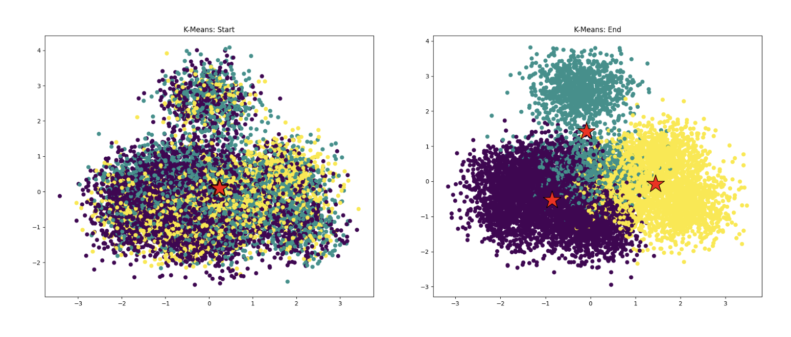

In the starter code you have been given a correct implementation of the K-means algorithm, however in its current state it is not quite as fast as we would like it to be. This is where you come in! Your job will be to figure out **where** the implementation needs to be improved and **how** to improve it. The key skill you will practice in this problem is __isolating a performance hotspot__(定位性能瓶颈).  We aren't going to tell you where to look in the code.  You need to figure it out. Your first thought should be... where is the code spending the most time and you should insert timing code into the source to make measurements.  Based on these measurements, you should focus in on the part of the code that is taking a significant portion of the runtime, and then understand it more carefully to determine if there is a way to speed it up.

**What you need to do:**

1. Use the command `ln -s /afs/ir.stanford.edu/class/cs149/data/data.dat ./data.dat` to create a symbolic(符号) link to the dataset in your current directory (make sure you're in the `prog6_kmeans` directory). This is a large file (~800MB), so this is the preferred(首选) way to access it. However, if you'd like a local copy, you can run this command on your personal machine `scp [Your SUNetID]@myth[51-66].stanford.edu:/afs/ir.stanford.edu/class/cs149/data/data.dat ./data.dat`. Once you have the data, compile and run `kmeans` (it may take longer than usual for the program to load the data on your first try). The program will report the total runtime of the algorithm on the data.

   main.cpp中附带生成数据集的实现

   ```bash
   # ./kmeans
   Running K-means with: M=1000000, N=100, K=3, epsilon=0.100000
   [Total Time]: 10449.361 ms
   ```

2. Run `pip install -r requirements.txt` to download the necessary plotting packages. Next, try running `python3 plot.py` which will generate the files "start.png" and "end.png" from the logs ("start.log" and "end.log") generated from running `kmeans`. These files will be in the current directory and should look similar to the above images. __Warning: You might notice that not all points are assigned to the "closest" centroid. This is okay.__ (For those that want to understand why: We project 100-dimensional datapoints down to 2-D using [PCA](https://en.wikipedia.org/wiki/Principal_component_analysis) to produce these visualizations. Therefore, while the 100-D datapoint is near the appropriate centroid in high dimensional space, the projects of the datapoint and the centroid may not be close to each other in 2-D.). As long as the clustering looks "reasonable" (use the images produced by the starter code in step 2 as a reference) and most points appear to be assigned to the clostest centroid, the code remains correct.

   ```bash
   # 创建虚拟环境
   python3 -m venv venv
   # 激活虚拟环境
   source venv/bin/activate
   pip install -r requirements.txt
   python3 plot.py
   # 退出虚拟环境（完成后）
   deactivate
   ```

   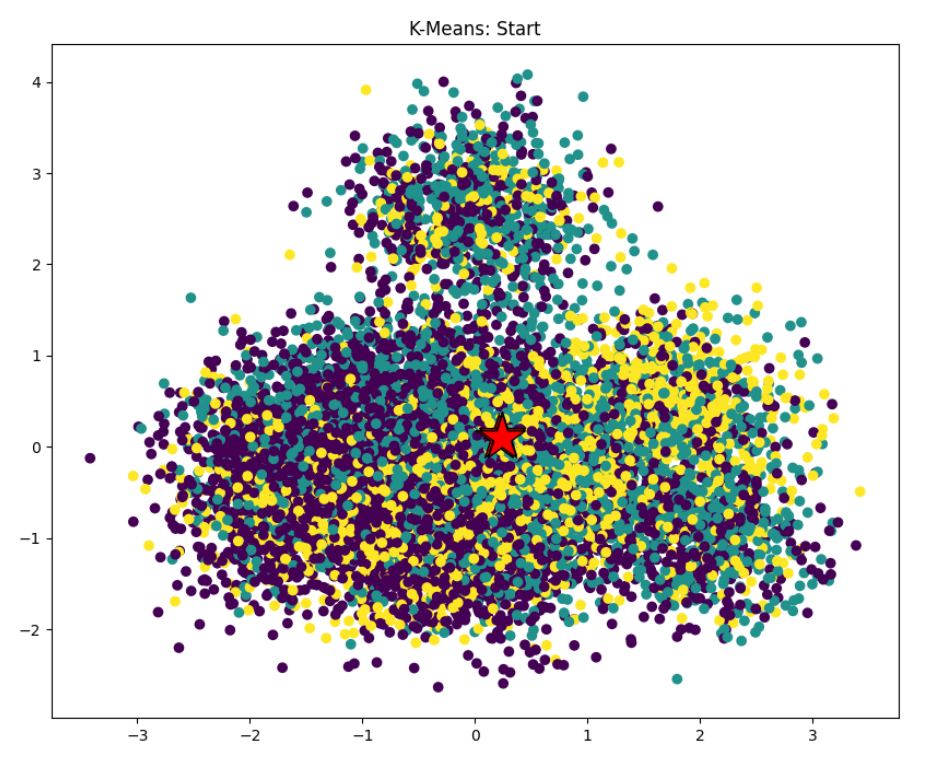

   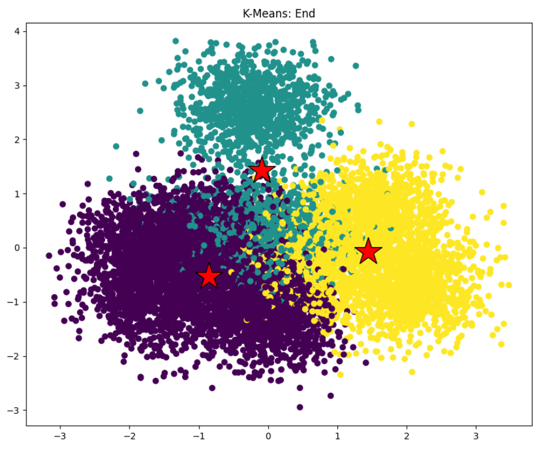

3. Utilize the timing function in `common/CycleTimer.h` to determine where in the code there are performance bottlenecks. You will need to call `CycleTimer::currentSeconds()`, which returns the current time (in seconds) as a floating point number. Where is most of the time being spent in the code?

   ```C++
   // kmeansThread.cpp
   double startTime = CycleTimer::currentSeconds();
   computeAssignments(&args);
   double endTime = CycleTimer::currentSeconds();
   printf("[computeAssignments]:\t\t[%.3f] ms\n", (endTime - startTime) * 1000);
   startTime = CycleTimer::currentSeconds();
   computeCentroids(&args);
   endTime = CycleTimer::currentSeconds();
   printf("[computeCentroids]:\t\t[%.3f] ms\n", (endTime - startTime) * 1000);
   startTime = CycleTimer::currentSeconds();
   computeCost(&args);
   endTime = CycleTimer::currentSeconds();
   printf("[computeCost]:\t\t[%.3f] ms\n", (endTime - startTime) * 1000);
   ```

   ```bash
   # ./kmeans
   Reading data.dat...
   Running K-means with: M=1000000, N=100, K=3, epsilon=0.100000
   [computeAssignments]:           [307.828] ms
   [computeCentroids]:             [46.273] ms
   [computeCost]:          [86.726] ms
   [computeAssignments]:           [309.465] ms
   [computeCentroids]:             [44.306] ms
   [computeCost]:          [87.491] ms
   [computeAssignments]:           [294.352] ms
   [computeCentroids]:             [44.601] ms
   [computeCost]:          [87.864] ms
   [computeAssignments]:           [296.358] ms
   [computeCentroids]:             [46.246] ms
   [computeCost]:          [89.471] ms
   [computeAssignments]:           [299.243] ms
   [computeCentroids]:             [45.263] ms
   [computeCost]:          [87.734] ms
   [computeAssignments]:           [298.316] ms
   [computeCentroids]:             [46.080] ms
   [computeCost]:          [86.999] ms
   [computeAssignments]:           [299.805] ms
   [computeCentroids]:             [46.733] ms
   [computeCost]:          [85.363] ms
   [computeAssignments]:           [293.400] ms
   [computeCentroids]:             [45.483] ms
   [computeCost]:          [86.650] ms
   [computeAssignments]:           [296.636] ms
   [computeCentroids]:             [47.892] ms
   [computeCost]:          [88.723] ms
   [computeAssignments]:           [294.569] ms
   [computeCentroids]:             [46.698] ms
   [computeCost]:          [90.036] ms
   [computeAssignments]:           [295.507] ms
   [computeCentroids]:             [49.106] ms
   [computeCost]:          [90.799] ms
   [computeAssignments]:           [307.842] ms
   [computeCentroids]:             [48.166] ms
   [computeCost]:          [92.925] ms
   [computeAssignments]:           [305.260] ms
   [computeCentroids]:             [51.046] ms
   [computeCost]:          [92.255] ms
   [computeAssignments]:           [311.169] ms
   [computeCentroids]:             [48.605] ms
   [computeCost]:          [91.347] ms
   [computeAssignments]:           [302.989] ms
   [computeCentroids]:             [48.991] ms
   [computeCost]:          [91.740] ms
   [computeAssignments]:           [302.759] ms
   [computeCentroids]:             [47.507] ms
   [computeCost]:          [94.960] ms
   [computeAssignments]:           [294.022] ms
   [computeCentroids]:             [46.440] ms
   [computeCost]:          [92.789] ms
   [computeAssignments]:           [289.311] ms
   [computeCentroids]:             [52.871] ms
   [computeCost]:          [92.930] ms
   [computeAssignments]:           [290.432] ms
   [computeCentroids]:             [46.036] ms
   [computeCost]:          [87.065] ms
   [computeAssignments]:           [296.590] ms
   [computeCentroids]:             [46.338] ms
   [computeCost]:          [87.787] ms
   [computeAssignments]:           [296.646] ms
   [computeCentroids]:             [44.514] ms
   [computeCost]:          [88.453] ms
   [computeAssignments]:           [300.540] ms
   [computeCentroids]:             [45.051] ms
   [computeCost]:          [87.840] ms
   [computeAssignments]:           [295.934] ms
   [computeCentroids]:             [47.807] ms
   [computeCost]:          [87.659] ms
   [computeAssignments]:           [299.554] ms
   [computeCentroids]:             [47.035] ms
   [computeCost]:          [87.440] ms
   [Total Time]: 10453.474 ms
   ```

   大部分时间（约 70%）消耗在 **computeAssignments** 函数中

4. Based on your findings from the previous step, improve the implementation. We are looking for a speedup of about 2.1x or more (i.e $\frac{oldRuntime}{newRuntime} >= 2.1$). Please explain how you arrived at your solution, as well as what your final solution is and the associated speedup. The writeup of this process should describe a sequence of steps. We expect something of the form "I measured ... which let me to believe X. So to improve things I tried ... resulting in a speedup/slowdown of ...".

   **使用 ISPC**
   
   ```makefile
   # 修改 Makefile
   CXX=g++ -m64 -march=native
   CXXFLAGS=-I../common -Iobjs/ -O3 -Wall
   # --- ISPC 编译器配置 --- #
   ISPC=ispc
   # 这里的 target 建议与你之前的实验一致，通常是 avx2
   ISPCFLAGS=-O3 --target=avx2-i32x8 --arch=x86-64 --pic # <--- 新增
   
   APP_NAME=kmeans
   OBJDIR=objs
   COMMONDIR=../common
   
   PPM_CXX=$(COMMONDIR)/ppm.cpp
   PPM_OBJ=$(addprefix $(OBJDIR)/, $(subst $(COMMONDIR)/,, $(PPM_CXX:.cpp=.o)))
   
   TASKSYS_CXX=$(COMMONDIR)/tasksys.cpp
   TASKSYS_LIB=-lpthread
   TASKSYS_OBJ=$(addprefix $(OBJDIR)/, $(subst $(COMMONDIR)/,, $(TASKSYS_CXX:.cpp=.o)))
   
   default: $(APP_NAME)
   
   .PHONY: dirs clean
   
   dirs:
   		/bin/mkdir -p $(OBJDIR)/
   
   clean:
   		/bin/rm -rf $(OBJDIR) *.ppm *.log *.png *~ $(APP_NAME)
   
   # --- 在 OBJS 中加入 ISPC 编译生成的 .o 文件 --- #
   OBJS=$(OBJDIR)/main.o $(OBJDIR)/kmeansThread.o $(OBJDIR)/utils.o $(OBJDIR)/compute_assignments_ispc.o $(PPM_OBJ) $(TASKSYS_OBJ)
   
   $(APP_NAME): dirs $(OBJS)
   		$(CXX) $(CXXFLAGS) -o $@ $(OBJS) -lm $(TASKSYS_LIB)
   
   # --- 新增：ISPC 文件的编译规则 --- #
   # 它会根据 %.ispc 自动在 objs 目录下生成 %_ispc.h 和 %_ispc.o
   $(OBJDIR)/%_ispc.h $(OBJDIR)/%_ispc.o: %.ispc
   		$(ISPC) $(ISPCFLAGS) $< -o $(OBJDIR)/$*_ispc.o -h $(OBJDIR)/$*_ispc.h
   
   # 确保 kmeansThread.o 编译前，ISPC 的头文件已经生成
   $(OBJDIR)/kmeansThread.o: $(OBJDIR)/compute_assignments_ispc.h
   
   $(OBJDIR)/%.o: %.cpp
   		$(CXX) $< $(CXXFLAGS) -c -o $@
   
   $(OBJDIR)/%.o: $(COMMONDIR)/%.cpp
   	$(CXX) $< $(CXXFLAGS) -c -o $@
   
$(OBJDIR)/main.o: $(COMMONDIR)/CycleTimer.h
   ```
   
   ```C++
   // compute_assignments.ispc
   typedef struct {
     // Control work assignments
     int start, end;
   
     // Shared by all functions
     double *data;
     double *clusterCentroids;
     int *clusterAssignments;
     double *currCost;
     int M, N, K;
   } WorkerArgs;
   
   task void compute_assignments_ispc_task(uniform WorkerArgs* uniform args,
                                               uniform int span,
                                               uniform double* uniform minDist){
     uniform int indexStart = taskIndex * span;
     uniform int indexEnd = min(args->M, indexStart + span);
     
     uniform int D = args->N; // 维度
   
     foreach (m = indexStart ... indexEnd) {
       // Initialize arrays
       double m_minDist = 1e30;
       int m_assignment = -1;
   
       // Assign datapoints to closest centroids
       for(uniform int k = args->start; k < args->end; k++) {
         double d2 = 0;
   
         // 遍历所有维度 D
         for(uniform int i = 0; i < D; i++) {
           double diff = args->data[m * D + i] - args->clusterCentroids[k * D + i];
           d2 += diff * diff;
         }
         d2 = sqrt(d2);
         if(d2 < m_minDist) {
           m_minDist = d2;
           m_assignment = k;
         }
       }
       minDist[m] = m_minDist;
       args->clusterAssignments[m] = m_assignment;
     }
   }
   
   export void compute_assignments_ispc_withtasks(uniform WorkerArgs* uniform args,
                                                   uniform double* uniform minDist) {
      
     uniform int numTasks = 64;    // 64 tasks
     uniform int span = (args->M + numTasks - 1) / numTasks;
   
     launch[args->M/span] compute_assignments_ispc_task(args, span, minDist);
   
}
   ```
   
   ```C++
   // 修改 kmeansThread.cpp
   /**
    * Assigns each data point to its "closest" cluster centroid.
    */
   void computeAssignments(WorkerArgs *const args) {
     double *minDist = new double[args->M];
   
     ispc::compute_assignments_ispc_withtasks((ispc::WorkerArgs*)args, minDist);
   
     delete[] minDist;
   }
   ```
   
   ```bash
   # ./kmeans
   Reading data.dat...
   Running K-means with: M=1000000, N=100, K=3, epsilon=0.100000
   [computeAssignments]:           [38.468] ms
   [computeCentroids]:             [49.320] ms
   [computeCost]:          [89.739] ms
   [computeAssignments]:           [37.042] ms
   [computeCentroids]:             [50.252] ms
   [computeCost]:          [91.672] ms
   [computeAssignments]:           [37.012] ms
   [computeCentroids]:             [47.052] ms
   [computeCost]:          [87.577] ms
   [computeAssignments]:           [36.259] ms
   [computeCentroids]:             [47.891] ms
[computeCost]:          [92.386] ms
   [computeAssignments]:           [38.401] ms
   [computeCentroids]:             [46.693] ms
   [computeCost]:          [90.943] ms
   [computeAssignments]:           [37.185] ms
   [computeCentroids]:             [49.150] ms
   [computeCost]:          [90.446] ms
   [computeAssignments]:           [39.608] ms
   [computeCentroids]:             [48.935] ms
   [computeCost]:          [90.245] ms
   [computeAssignments]:           [36.111] ms
   [computeCentroids]:             [47.110] ms
   [computeCost]:          [88.302] ms
   [computeAssignments]:           [37.016] ms
   [computeCentroids]:             [46.493] ms
   [computeCost]:          [89.820] ms
   [computeAssignments]:           [36.936] ms
   [computeCentroids]:             [50.210] ms
   [computeCost]:          [90.944] ms
   [computeAssignments]:           [38.356] ms
   [computeCentroids]:             [49.488] ms
   [computeCost]:          [88.929] ms
   [computeAssignments]:           [36.628] ms
   [computeCentroids]:             [49.504] ms
   [computeCost]:          [90.448] ms
   [computeAssignments]:           [41.194] ms
   [computeCentroids]:             [46.271] ms
   [computeCost]:          [88.443] ms
   [computeAssignments]:           [36.290] ms
   [computeCentroids]:             [49.611] ms
   [computeCost]:          [89.010] ms
   [computeAssignments]:           [36.726] ms
   [computeCentroids]:             [50.261] ms
   [computeCost]:          [91.989] ms
   [computeAssignments]:           [37.992] ms
   [computeCentroids]:             [49.468] ms
   [computeCost]:          [89.612] ms
   [computeAssignments]:           [36.416] ms
   [computeCentroids]:             [51.463] ms
   [computeCost]:          [94.135] ms
   [computeAssignments]:           [36.549] ms
   [computeCentroids]:             [46.726] ms
   [computeCost]:          [90.349] ms
   [computeAssignments]:           [37.902] ms
   [computeCentroids]:             [48.353] ms
   [computeCost]:          [88.039] ms
   [computeAssignments]:           [37.415] ms
   [computeCentroids]:             [50.906] ms
   [computeCost]:          [90.851] ms
   [computeAssignments]:           [38.284] ms
   [computeCentroids]:             [48.256] ms
   [computeCost]:          [90.710] ms
   [computeAssignments]:           [36.252] ms
   [computeCentroids]:             [50.675] ms
   [computeCost]:          [88.582] ms
   [computeAssignments]:           [39.319] ms
   [computeCentroids]:             [50.403] ms
   [computeCost]:          [90.815] ms
   [computeAssignments]:           [36.438] ms
   [computeCentroids]:             [46.958] ms
   [computeCost]:          [91.749] ms
   [Total Time]: 4239.797 ms
   ```
   
   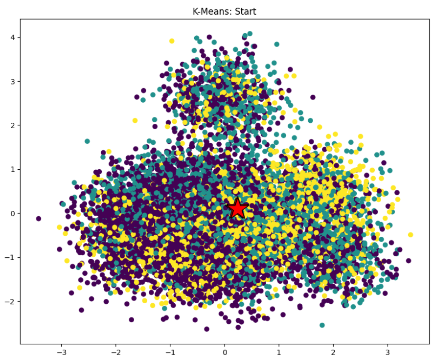
   
   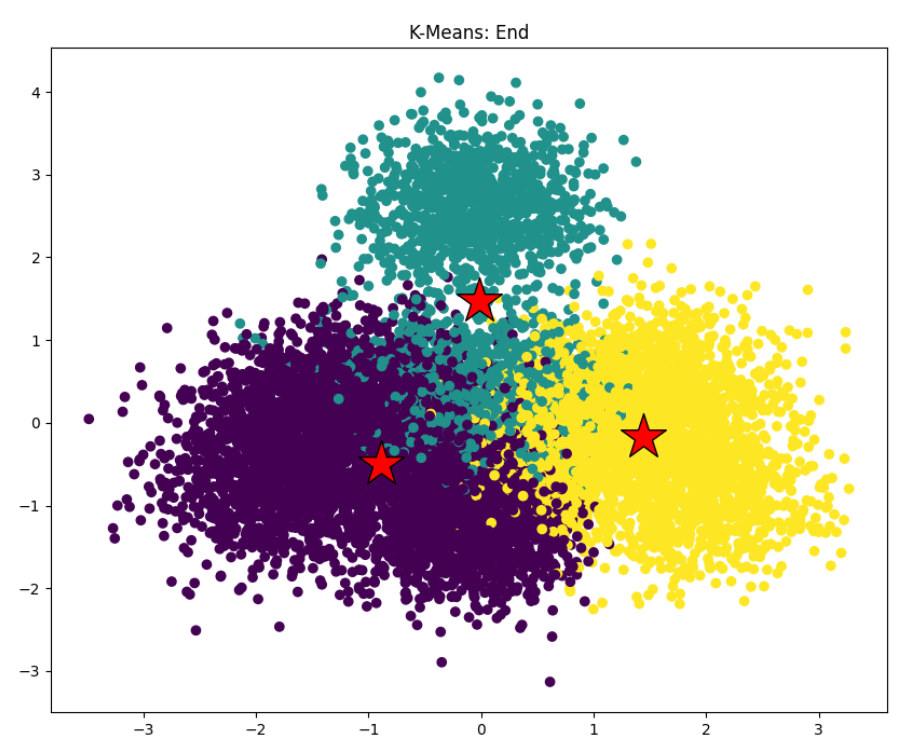
   
   我测量了computeAssignments，这让我相信 computeAssignments 是性能瓶颈。 因此，为了改进性能，我尝试了优化computeAssignments，使其在多核上的SIMD并发执行每个点的分配，最终实现了2.46x 的加速/减速效果
   
   ```bash
   # 系统警告CPU 必须从内存中“四处搜集”不连续的数据来填充向量寄存器，继续优化
   compute_assignments.ispc:32:23: Performance Warning: Gather required to load value.
           double diff = args->data[m * D + i] - args->clusterCentroids[k * D + i];
   ```
   
   ```C++
   // 修改 compute_assignments.ispc
   typedef struct {
  // Control work assignments
     int start, end;

     // Shared by all functions
  double *data;
     double *clusterCentroids;
  int *clusterAssignments;
     double *currCost;
     int M, N, K;
   } WorkerArgs;
   
   task void compute_assignments_ispc_task(uniform WorkerArgs* uniform args,
                                            uniform int span,
                                               uniform double* uniform minDist){
     uniform int indexStart = taskIndex * span;
     uniform int indexEnd = min(args->M, indexStart + span);
     
     uniform int D = args->N; // 维度
     
     for(uniform int m = indexStart; m < indexEnd; m++)
     {
       uniform double m_minDist = 1e30;
       uniform int m_assignment = -1;
   
       for(uniform int k = args->start; k < args->end; k++){
         // 在维度 D 上使用 foreach
         // 这会让 8 个通道读取内存中连续的 [d, d+1, ... d+7]
         // 从而触发硬件的 L1 Cache 预取和连续 Load 指令
         double d2 = 0;
         // 遍历所有维度 D
         foreach(i = 0 ... D) {
           double diff = args->data[m * D + i] - args->clusterCentroids[k * D + i];
           d2 += diff * diff;
         }
         
         // 将 8 个通道的局部和汇总
         uniform double total_d2 = sqrt(reduce_add(d2));
   
         if(total_d2 < m_minDist) {
           m_minDist = total_d2;
           m_assignment = k;
         }
       }
       minDist[m] = m_minDist;
       args->clusterAssignments[m] = m_assignment;
     }
     
   }
   
   export void compute_assignments_ispc_withtasks(uniform WorkerArgs* uniform args,
                                                   uniform double* uniform minDist) {
      
     uniform int numTasks = 64;    // 64 tasks
     uniform int span = (args->M + numTasks - 1) / numTasks;
   
     launch[args->M/span] compute_assignments_ispc_task(args, span, minDist);
   
   }
   ```
   
   ```bash
   # ./kmeans
   Reading data.dat...
   Running K-means with: M=1000000, N=100, K=3, epsilon=0.100000
   [computeAssignments]:           [33.199] ms
   [computeCentroids]:             [48.496] ms
   [computeCost]:          [93.109] ms
   [computeAssignments]:           [33.346] ms
   [computeCentroids]:             [46.593] ms
   [computeCost]:          [90.230] ms
   [computeAssignments]:           [30.953] ms
   [computeCentroids]:             [48.315] ms
   [computeCost]:          [89.218] ms
   [computeAssignments]:           [31.649] ms
   [computeCentroids]:             [48.496] ms
   [computeCost]:          [90.469] ms
   [computeAssignments]:           [29.441] ms
   [computeCentroids]:             [49.092] ms
   [computeCost]:          [88.415] ms
   [computeAssignments]:           [33.105] ms
   [computeCentroids]:             [50.451] ms
   [computeCost]:          [89.655] ms
   [computeAssignments]:           [30.495] ms
   [computeCentroids]:             [47.284] ms
   [computeCost]:          [90.069] ms
   [computeAssignments]:           [30.731] ms
   [computeCentroids]:             [46.747] ms
   [computeCost]:          [88.122] ms
   [computeAssignments]:           [32.962] ms
   [computeCentroids]:             [48.907] ms
   [computeCost]:          [93.605] ms
   [computeAssignments]:           [30.302] ms
   [computeCentroids]:             [48.967] ms
   [computeCost]:          [87.098] ms
   [computeAssignments]:           [31.247] ms
   [computeCentroids]:             [47.563] ms
   [computeCost]:          [90.701] ms
   [computeAssignments]:           [31.945] ms
   [computeCentroids]:             [48.014] ms
   [computeCost]:          [87.343] ms
[computeAssignments]:           [29.839] ms
   [computeCentroids]:             [49.684] ms
   [computeCost]:          [92.560] ms
   [computeAssignments]:           [31.001] ms
   [computeCentroids]:             [47.665] ms
   [computeCost]:          [90.483] ms
   [computeAssignments]:           [31.159] ms
   [computeCentroids]:             [48.959] ms
   [computeCost]:          [88.003] ms
   [computeAssignments]:           [31.043] ms
   [computeCentroids]:             [47.928] ms
   [computeCost]:          [90.479] ms
   [computeAssignments]:           [29.921] ms
   [computeCentroids]:             [49.005] ms
   [computeCost]:          [93.874] ms
   [computeAssignments]:           [33.125] ms
   [computeCentroids]:             [46.355] ms
   [computeCost]:          [93.434] ms
   [computeAssignments]:           [30.654] ms
   [computeCentroids]:             [47.336] ms
   [computeCost]:          [88.161] ms
   [computeAssignments]:           [29.901] ms
   [computeCentroids]:             [48.163] ms
   [computeCost]:          [88.404] ms
   [computeAssignments]:           [29.888] ms
   [computeCentroids]:             [49.055] ms
   [computeCost]:          [89.769] ms
   [computeAssignments]:           [30.189] ms
   [computeCentroids]:             [47.953] ms
   [computeCost]:          [92.944] ms
   [computeAssignments]:           [29.981] ms
   [computeCentroids]:             [46.887] ms
   [computeCost]:          [89.984] ms
   [computeAssignments]:           [31.163] ms
   [computeCentroids]:             [48.780] ms
   [computeCost]:          [91.953] ms
   [Total Time]: 4075.095 ms
   ```
   
   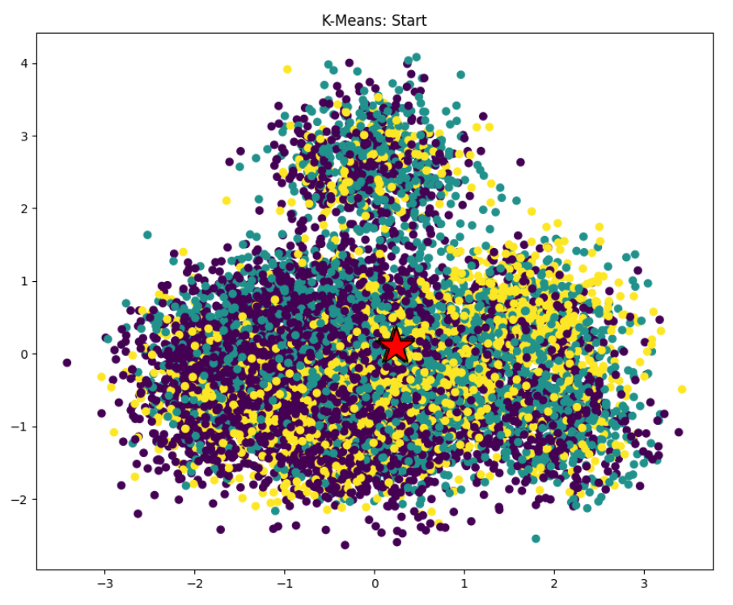
   
   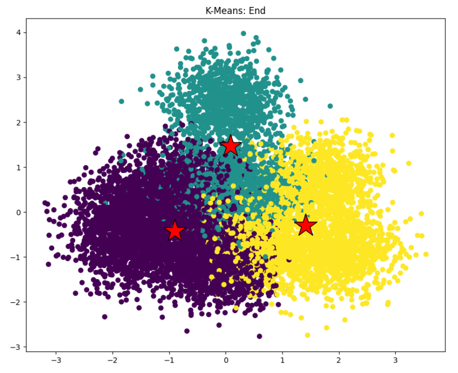
   
   由于系统警告CPU 必须从内存中“四处搜集”不连续的数据来填充向量寄存器，继续优化，从在SIMD计算每个点的分配，改为在SIMD计算每个点的各个维度的平方距离，实现了2.56x 的加速/减速效果
   
   
   
   **使用`std::thread`**
   
   ```C++
   // 修改 kmeansThread.cpp
   void workerThreadStart(WorkerArgs *const args, int index, int numThreads, double *minDist)
   {
     int index_start = index * (args->M / numThreads);
     int index_end = min((index + 1) * (args->M / numThreads), args->M);
   
     for(int m = index_start; m < index_end; m++){
       minDist[m] = 1e30;
       args->clusterAssignments[m] = -1;
       for(int k = args->start; k < args->end; k++){
         double d = dist(&args->data[m * args->N],
                         &args->clusterCentroids[k * args->N], args->N);
         if(d < minDist[m]){
           minDist[m] = d;
           args->clusterAssignments[m] = k;
         }
       }
     }
   }
   
   /**
    * Assigns each data point to its "closest" cluster centroid.
    */
   void computeAssignments(WorkerArgs *const args) {
     double *minDist = new double[args->M];
   
     int numThreads = 8;
   
     // Creates thread objects that do not yet represent a thread.
  std::thread workers[numThreads];
   
  for(int i=1; i<numThreads; i++) {
       workers[i] = std::thread(workerThreadStart, args, i, numThreads, minDist);
  }
   
     workerThreadStart(args, 0, numThreads, minDist);
   
     // join worker threads
     for(int i=1; i<numThreads; i++){
       workers[i].join();
     }
   
     delete[] minDist;
   }
   ```
   
   ```bash
   # ./kmeans
   Reading data.dat...
   Running K-means with: M=1000000, N=100, K=3, epsilon=0.100000
   [computeAssignments]:           [70.443] ms
   [computeCentroids]:             [47.479] ms
   [computeCost]:          [87.082] ms
   [computeAssignments]:           [52.925] ms
   [computeCentroids]:             [48.742] ms
   [computeCost]:          [89.368] ms
   [computeAssignments]:           [54.654] ms
   [computeCentroids]:             [48.742] ms
   [computeCost]:          [88.549] ms
   [computeAssignments]:           [55.047] ms
   [computeCentroids]:             [51.062] ms
   [computeCost]:          [94.195] ms
   [computeAssignments]:           [55.977] ms
   [computeCentroids]:             [47.957] ms
   [computeCost]:          [90.482] ms
   [computeAssignments]:           [57.474] ms
   [computeCentroids]:             [50.716] ms
   [computeCost]:          [86.874] ms
   [computeAssignments]:           [55.343] ms
   [computeCentroids]:             [50.716] ms
   [computeCost]:          [96.359] ms
   [computeAssignments]:           [59.909] ms
   [computeCentroids]:             [51.164] ms
   [computeCost]:          [90.683] ms
   [computeAssignments]:           [53.118] ms
   [computeCentroids]:             [49.535] ms
   [computeCost]:          [89.859] ms
   [computeAssignments]:           [57.433] ms
   [computeCentroids]:             [50.298] ms
   [computeCost]:          [92.175] ms
   [computeAssignments]:           [57.221] ms
   [computeCentroids]:             [47.544] ms
   [computeCost]:          [96.425] ms
   [computeAssignments]:           [65.070] ms
   [computeCentroids]:             [53.555] ms
   [computeCost]:          [94.045] ms
   [computeAssignments]:           [61.593] ms
   [computeCentroids]:             [51.613] ms
   [computeCost]:          [94.668] ms
   [computeAssignments]:           [59.956] ms
   [computeCentroids]:             [49.735] ms
   [computeCost]:          [92.281] ms
   [computeAssignments]:           [54.848] ms
   [computeCentroids]:             [49.857] ms
   [computeCost]:          [91.637] ms
   [computeAssignments]:           [53.689] ms
   [computeCentroids]:             [49.023] ms
   [computeCost]:          [88.894] ms
   [computeAssignments]:           [63.444] ms
   [computeCentroids]:             [49.495] ms
   [computeCost]:          [96.971] ms
   [computeAssignments]:           [57.237] ms
   [computeCentroids]:             [49.290] ms
   [computeCost]:          [92.624] ms
   [computeAssignments]:           [56.690] ms
   [computeCentroids]:             [51.304] ms
   [computeCost]:          [92.224] ms
   [computeAssignments]:           [53.061] ms
   [computeCentroids]:             [48.407] ms
   [computeCost]:          [94.620] ms
   [computeAssignments]:           [58.850] ms
   [computeCentroids]:             [49.579] ms
   [computeCost]:          [88.311] ms
   [computeAssignments]:           [52.549] ms
   [computeCentroids]:             [49.330] ms
   [computeCost]:          [93.599] ms
   [computeAssignments]:           [64.678] ms
   [computeCentroids]:             [50.930] ms
   [computeCost]:          [91.698] ms
   [computeAssignments]:           [59.677] ms
   [computeCentroids]:             [47.222] ms
   [computeCost]:          [87.968] ms
   [Total Time]: 4788.625 ms
   ```
   
   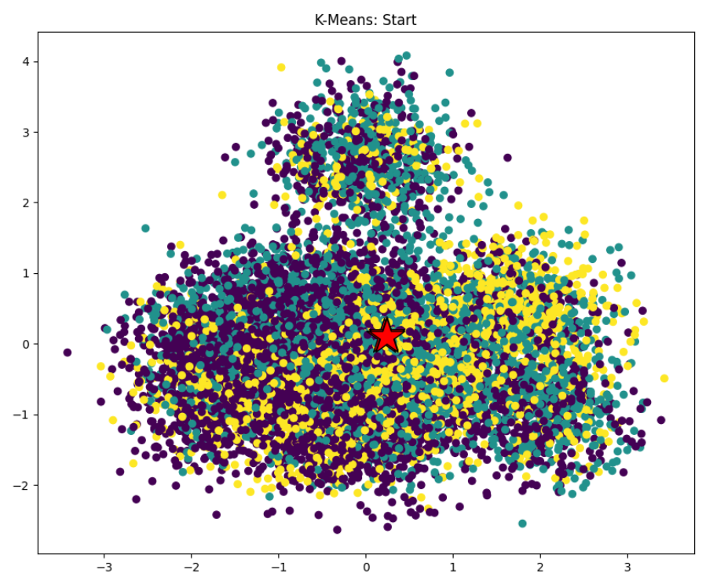
   
   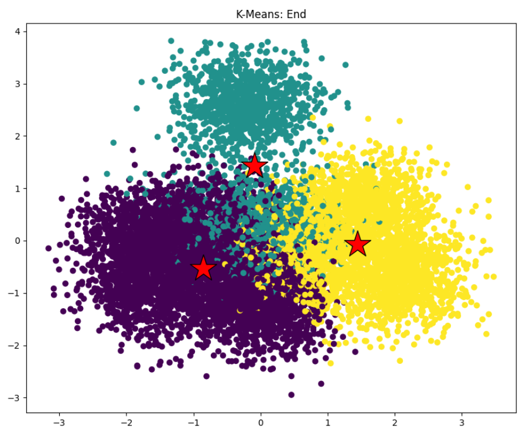
   
   我测量了computeAssignments，这让我相信 computeAssignments 是性能瓶颈。 因此，为了改进性能，我尝试了优化computeAssignments，使其在多线程上并发执行每个点的分配，最终实现了2.18x 的加速/减速效果
   
   **使用std::thread的最终图像和顺序的最终图像一致，但是使用ispc的最终图像和顺序的最终图像不一致**
   可能原因
   **浮点数计算的非结合律 (Floating-point Non-associativity)**
   在计算机中，**`(a+b)+c` 并不严格等于 `a+(b+c)`**。因为浮点数的精度有限，改变加法的顺序会导致极其微小的舍入误差（Rounding Error）
   
   ```C++
   // 在 kmeansThread.cpp 加入下面内容计算 Final Cost 和 Total Cost
   double totalCost = 0;
   for (int k = 0; k < K; k++) {
     totalCost += currCost[k];
     printf("[Final Cost]: %.52lf\n", currCost[k]);
   }
   printf("[Total Cost]: %.52lf\n", totalCost);
   ```
   
   ```bash
   # std::thread version
   # ./kmeans
   [Final Cost]: 2722798.0981844048947095870971679687500000000000000000000000
   [Final Cost]: 1089465.2293389539700001478195190429687500000000000000000000
   [Final Cost]: 1672740.0318241922650486230850219726562500000000000000000000
   [Total Cost]: 5485003.3593475511297583580017089843750000000000000000000000
   [Total Time]: 4911.091 ms
   ```
   
   ```bash
   # original version
   # ./kmeans
   [Final Cost]: 2722798.0981844048947095870971679687500000000000000000000000
   [Final Cost]: 1089465.2293389539700001478195190429687500000000000000000000
   [Final Cost]: 1672740.0318241922650486230850219726562500000000000000000000
   [Total Cost]: 5485003.3593475511297583580017089843750000000000000000000000
   [Total Time]: 10873.643 ms
   ```
   
   ```bash
   # ispc version
   # ./kmeans
   [Final Cost]: 2722798.0981844048947095870971679687500000000000000000000000
   [Final Cost]: 1089465.2293389539700001478195190429687500000000000000000000
   [Final Cost]: 1672740.0318241922650486230850219726562500000000000000000000
   [Total Cost]: 5485003.3593475511297583580017089843750000000000000000000000
   [Total Time]: 4342.020 ms
   ```
   
   **ISPC 版本的 Total Cost 与顺序版本完全一致**。这证明了并行化没有引入逻辑错误

Constraints:
- You may only modify code in `kmeansThread.cpp`. You are not allowed to modify the `stoppingConditionMet` function and you cannot change the interface to `kMeansThread`, but anything is fair game (e.g. you can add new members to the `WorkerArgs` struct, rewrite functions, allocate new arrays, etc.). However...
- **Make sure you do not change the functionality of the implementation! If the algorithm doesn't converge or the result from running `python3 plot.py` does not look like what's produced by the starter code, something is wrong!** For example, you cannot simply remove the main "while" loop or change the semantics of the `dist` function, since this would yield incorrect results.
- __Important:__ you may only parallelize __one__ of the following functions: `dist`, `computeAssignments`, `computeCentroids`, `computeCost`. For an example of how to write parallel code using `std::thread`, see `prog1_mandelbrot_threads/mandelbrotThread.cpp`.
  

Tips / Notes: 
- This problem should not require a significant amount of coding. Our solution modified/added around 20-25 lines of code.
- Once you've used timers to isolate hotspots, to improve the code make sure you understand the relative sizes of K, M, and N.
- Try to prioritize(优先考虑) code improvements with the potential for high returns and think about the different axes of parallelism available in the problem and how you may take advantage of them.
- **The objective of this program is to give you more practice with learning how to profile(分析) and debug performance oriented programs. Even if you don't hit the performance target, if you demonstrate(展现) good/thoughtful debugging skills in the writeup you'll still get most of the points.**

## What About ARM-Based Macs? ##

For those with access to a new Apple ARM-based laptop, check out the handout(讲义) [here](README_aarch64.md). Produce a report of performance of the various programs on a new Apple ARM-based laptop. The staff is curious about what you will find.  What speedups are you observing from SIMD execution? Those without access to a modern Macbook could try to use ARM-based servers that are available on a cloud provider like AWS, although it has not been tested by the staff. Please do not submit any code from running on ARM based machines to Gradescope.  

## For the Curious (highly recommended) ##

Want to know about ISPC and how it was created? One of the two creators of ISPC, Matt Pharr, wrote an __amazing blog post__ on the history of its development called [The story of ispc](https://pharr.org/matt/blog/2018/04/30/ispc-all).  It really touches on many issues of parallel system design -- in particular the value of limiting the scope of programming languages vs general purpose programming languages.  And it gets at real-world answers to common questions like... "why can't the compiler just automatically parallelize my program for me?" IMHO it's a must read for CS149 students!

## Hand-in Instructions ##

Handin(作业) will be performed via [Gradescope](https://www.gradescope.com). Only one handin per group is required. However, please make sure that you add your partner's name to the gradescope submission. There are two places you will need to turn in(交出) the files on Gradescope: `Assignment 1 (Write-Up)` and `Assignment 1 (Code)`. 

Please place the following in `Assignment 1 (Write-Up)`:
* Your writeup, in a file called `writeup.pdf`. Please make sure both group members' names and SUNet id's are in the document. (if you are a group of two)

Please place the following in `Assignment 1 (Code)`:
* Your implementation of `main.cpp` in Program 2, in a file called `prob2.cpp`
* Your implementation of `kmeansThread.cpp` in Program 6, in a file called `prob6.cpp`
* Any additional code, for example, because you attempted an extra credit

Please tell the CAs to look for your extra credit in your write-up. When handed in, all code must be compilable and runnable out of the box(直接) on the myth machines!

## Resources and Notes ##

-  Extensive ISPC documentation and examples can be found at
  <http://ispc.github.io/>
-  Zooming(放大) into different locations of the mandelbrot image can be quite
  fascinating
-  Intel provides a lot of supporting material about AVX2 vector instructions at
  <http://software.intel.com/en-us/avx/>.  
-  The [Intel Intrinsics Guide](https://software.intel.com/sites/landingpage/IntrinsicsGuide/) is very useful.
