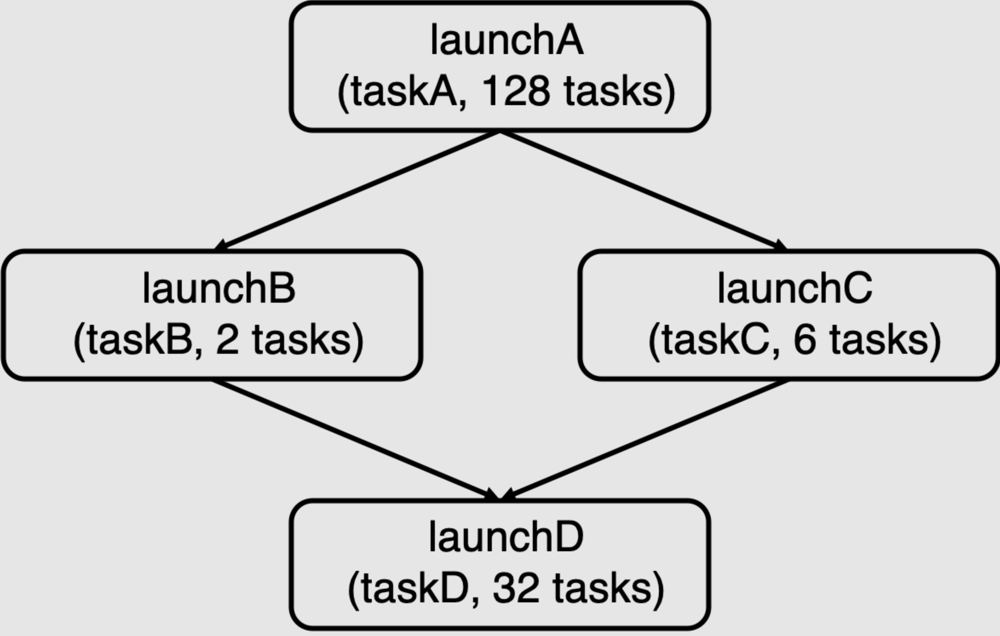

# Assignment 2: Building A Task Execution Library from the Ground Up #

**作业原址**：[stanford-cs149/asst2: Stanford CS149 -- Assignment 2](https://github.com/stanford-cs149/asst2)
非常感谢老师的付出和开源，以下是作业介绍和我的实现(特别感谢 Google AI Studio 提供远程指导😝)

## Overview ##

Everyone likes to complete tasks quickly, and in this assignment we are asking you to do just that! You will implement a C++ library that executes tasks provided by an application as efficiently as possible on a multi-core CPU.

In the first part of the assignment, you will implement a version of the task execution library that supports bulk(批量) (data-parallel) launch of many instances of the same task. This functionality is similar to the [ISPC task launch behavior](http://ispc.github.io/ispc.html#task-parallelism-launch-and-sync-statements) you used to parallelize code across cores in Assignment 1.

In the second part of the assignment, you will extend your task runtime system to execute more complex _task graphs_, where the execution of tasks may depend on the results produced by other tasks. These dependencies constrain which tasks can be safely run in parallel by your task scheduling system.  Scheduling execution of data-parallel task graphs on a parallel machine is a feature of many popular parallel runtime systems ranging from the popular [Thread Building Blocks](https://github.com/intel/tbb) library, to [Apache Spark](https://spark.apache.org/), to modern deep learning frameworks such as [PyTorch](https://pytorch.org/) and [TensorFlow](https://www.tensorflow.org/).

This assignment will require you to:

* Manage task execution using a thread pool
* Orchestrate worker thread execution using synchronization primitives such as mutexes and condition variables
* Implement a task scheduler that reflects dependencies defined by a task graph
* Understand workload characteristics to make efficient task scheduling decisions

We recommend reviewing our [C++ synchronization tutorial](tutorial/README.md) for more information on the synchronization primitives in the C++ standard library. Additionally, it may be helpful to look over the [test case descriptions](tests/) to understand the types of workloads your library will support.

### Wait, I Think I've Done This Before? ###

You may have already created thread pools and task execution libraries in classes such as CS107 or CS111.
However, the current assignment is a unique opportunity to better understand these systems.
You will implement multiple task execution libraries, some without thread pools and some with different types of thread pools.
By implementing multiple task scheduling strategies and comparing their performance on difference workloads, you will better understand the implications(影响) of key design choices when creating a parallel system.

## Environment Setup ##

**We will be grading this assignment on an Amazon AWS `c7g.4xlarge` instance - we provide instructions for setting up your VM [here](cloud_readme.md). Please ensure your code works on this VM as we will be using this for performance testing and grading.**

The assignment starter code is available on [Github](https://github.com/stanford-cs149/asst2). Please download the Assignment 2 starter code at:

    https://github.com/stanford-cs149/asst2/archive/refs/heads/master.zip

**IMPORTANT:** DO NOT modify the provided `Makefile`. Doing so may break our grading script.

myth machines(斯坦福大学计算机科学系（Stanford CS）提供的专供学生使用的公共 Linux 计算集群)
由于用不了 myth machines，只能在自己电脑跑
电脑配置：
处理器	Intel(R) Core(TM) i5-10300H CPU @ 2.50GHz   2.50 GHz	内核：4	逻辑处理器：8
显卡	NVIDIA GeForce GTX 1660 Ti (6 GB)

## Part A: Synchronous Bulk Task Launch

In Assignment 1, you used ISPC's task launch primitive to launch N instances of an ISPC task (`launch[N] myISPCFunction()`).  In the first part of this assignment, you will implement similar functionality in your task execution library.

To get started, get acquainted(熟悉) with the definition of `ITaskSystem` in `itasksys.h`. This [abstract class](https://www.tutorialspoint.com/cplusplus/cpp_interfaces.htm) defines the interface(接口) to your task execution system.  The interface features a method `run()`, which has the following signature:

```C++
virtual void run(IRunnable* runnable, int num_total_tasks) = 0;
```

`run()` executes `num_total_tasks` instances of the specified task.  Since this single function call results in the execution of many tasks, we refer to each call to `run()` as a _bulk task launch_.

The starter code in `tasksys.cpp` contains a correct, but serial, implementation of `TaskSystemSerial::run()` which serves as(用作) an example of how the task system uses the `IRunnable` interface to execute a bulk task launch. (The definition of `IRunnable` is in `itasksys.h`) Notice how in each call to `IRunnable::runTask()` the task system provides the task a current task identifier (an integer between 0 and `num_total_tasks`), as well as the total number of tasks in the bulk task launch.  The task's implementation will use these parameters to determine what work the task should do.

One important detail of `run()` is that it must execute tasks synchronously with respect to(相对于) the calling thread.  In other words, when the call to `run()` returns, the application is guaranteed that the task system has completed execution of ****all tasks**** in the bulk task launch.  The serial implementation of `run()` provided in the starter code executes all tasks on the calling thread and thus meets this requirement.

### Running Tests ###

The starter code contains a suite of test applications that use your task system. For a description of the test harness(框架) tests, see `tests/README.md`, and for the test definitions themselves, see `tests/tests.h`. To run a test, use the `runtasks` script. For example, to run the test called `mandelbrot_chunked`, which computes an image of a Mandelbrot fractal using a bulk launch of tasks that each process a continuous chunk of the image, type:

```bash
./runtasks -n 16 mandelbrot_chunked
```


The different tests have different performance characteristics -- some do little work per task, others perform significant amounts of processing.  Some tests create large numbers of tasks per launch, others very few.  Sometimes the tasks in a launch all have similar compute cost.  In others, the cost of tasks in a single bulk launch is variable. We have described most of the tests in `tests/README.md`, but we encourage you to inspect the code in `tests/tests.h` to understand the behavior of all tests in more detail.

> [!TIP]
> One test that may be helpful to debug correctness while implementing your solution is `simple_test_sync`, which is a very small test that should not be used to measure performance but is small enough to be debuggable with print statements or debugger. See function `simpleTest` in `tests/tests.h`.


We encourage you to create your own tests. Take a look at the existing tests in `tests/tests.h` for inspiration(灵感). We have also included a skeleton test composed of `class YourTask` and function `yourTest()` for you to build on if you so choose. For the tests you do create, make sure to add them to the list of tests and test names in `tests/main.cpp`, and adjust the variable `n_tests` accordingly. Please note that while you will be able to run your own tests with your solution, you will not be able to compile the reference solution to run your tests.

The `-n` command-line option specifies the maximum number of threads the task system implementation can use.  In the example above, we chose `-n 16` because the CPU in the AWS instance features sixteen execution contexts.  The full list of tests available to run is available via command line help  (`-h` command line option).

The `-i` command-line options specifies the number of times to run the tests during performance measurement. To get an accurate measure of performance, `./runtasks` runs the test multiple times and records the _minimum_ runtime of several runs; In general, the default value is sufficient---Larger values might yield more accurate measurements, at the cost of greater test runtime.

In addition, we also provide you the test harness(工具) that we will use for grading performance:

```bash
>>> python3 ../tests/run_test_harness.py
```

The harness has the following command line arguments,

```bash
>>> python3 run_test_harness.py -h
usage: run_test_harness.py [-h] [-n NUM_THREADS]
                           [-t TEST_NAMES [TEST_NAMES ...]] [-a]

Run task system performance tests

optional arguments:
  -h, --help            show this help message and exit
  -n NUM_THREADS, --num_threads NUM_THREADS
                        Max number of threads that the task system can use. (16
                        by default)
  -t TEST_NAMES [TEST_NAMES ...], --test_names TEST_NAMES [TEST_NAMES ...]
                        List of tests to run
  -a, --run_async       Run async tests
```

It produces a detailed performance report that looks like this:

```bash
>>> python3 ../tests/run_test_harness.py -t super_light super_super_light
python3 ../tests/run_test_harness.py -t super_light super_super_light
================================================================================
Running task system grading harness... (2 total tests)
  - Detected CPU with 16 execution contexts
  - Task system configured to use at most 16 threads
================================================================================
================================================================================
Executing test: super_super_light...
Reference binary: ./runtasks_ref_linux
Results for: super_super_light
                                        STUDENT   REFERENCE   PERF?
[Serial]                                9.053     9.022       1.00  (OK)
[Parallel + Always Spawn]               8.982     33.953      0.26  (OK)
[Parallel + Thread Pool + Spin]         8.942     12.095      0.74  (OK)
[Parallel + Thread Pool + Sleep]        8.97      8.849       1.01  (OK)
================================================================================
Executing test: super_light...
Reference binary: ./runtasks_ref_linux
Results for: super_light
                                        STUDENT   REFERENCE   PERF?
[Serial]                                68.525    68.03       1.01  (OK)
[Parallel + Always Spawn]               68.178    40.677      1.68  (NOT OK)
[Parallel + Thread Pool + Spin]         67.676    25.244      2.68  (NOT OK)
[Parallel + Thread Pool + Sleep]        68.464    20.588      3.33  (NOT OK)
================================================================================
Overall performance results
[Serial]                                : All passed Perf
[Parallel + Always Spawn]               : Perf did not pass all tests
[Parallel + Thread Pool + Spin]         : Perf did not pass all tests
[Parallel + Thread Pool + Sleep]        : Perf did not pass all tests
```

In the above output `PERF` is the ratio of your implementation's runtime to the reference solution's runtime. So values less than one indicate that your task system implementation is faster than the reference implementation.

**Error**

```bash
/bin/sh: 1: ./runtasks_ref_linux: Permission denied
Command './runtasks_ref_linux -n 8 mandelbrot_chunked' returned non-zero exit status 126.
REFERENCE solution failed correctness check!
```

原因：`runtasks_ref_linux`这个脚本没有执行权限
解决方法： `chmod +x runtasks_ref_linux`

> [!TIP]
> Mac users: While we provided reference solution binaries for both part a and part b, we will be testing your code using the linux binaries. Therefore, we recommend you check your implementation in the AWS instance before submitting. If you are using a newer Mac with an M1 chip, use the `runtasks_ref_osx_arm` binary when testing locally. Otherwise, use the `runtasks_ref_osx_x86` binary.

> [!IMPORTANT]
We'll be grading your solution on AWS with `runtasks_ref_linux_arm` version of the reference solution. Please make sure your solution works correctly on the AWS ARM instance.

### What You Need To Do ###

Your job is to implement a task execution engine that efficiently uses your multi-core CPU. You will be graded on both the correctness of your implementation (it must run all the tasks correctly) as well as on its performance.  This should be a fun coding challenge, but it is a non-trivial piece of work. To help you stay on the right track, to complete Part A of the assignment, we will have you implement multiple versions of the task system, slowly increasing in complexity and performance of your implementation.  Your three implementations will be in the classes defined in `tasksys.cpp/.h`.

* `TaskSystemParallelSpawn`
* `TaskSystemParallelThreadPoolSpinning`
* `TaskSystemParallelThreadPoolSleeping`

__Implement your part A implementation in the `part_a/` sub-directory to compare to the correct reference implementation (`part_a/runtasks_ref_*`).__

_Pro tip: Notice how the instructions(说明) below take the approach of "try the simplest improvement first". Each step increases the complexity of the task execution system's implementation, but on each step along the way(每一步之后) you should have a working (fully correct) task runtime system._

We also expect you to create at least one test, which can test either correctness or performance. See the Running Tests section above for more information.

#### Step 1: Move to a Parallel Task System ####

__In this step please implement the class `TaskSystemParallelSpawn`.__

The starter code provides you a working serial implementation of the task system in `TaskSystemSerial`.  In this step of the assignment you will extend the starter code to execute a bulk task launch in parallel.

* You will need to create additional threads of control to perform the work of a bulk task launch.  Notice that `TaskSystem`'s constructor is provided a parameter `num_threads` which is the ****maximum number of worker threads**** your implementation may use to run tasks.
* In the spirit(原则) of "do the simplest thing first", we recommend that you spawn worker threads at the beginning of `run()` and join these threads from the main thread before `run()` returns.  This will be a correct implementation, but it will incur significant overhead from frequent thread creation.
* How will you assign tasks to your worker threads?  Should you consider static or dynamic assignment of tasks to threads?
* Are there shared variables (internal state of your task execution system) that you need to protect from simultaneous access from multiple threads?

```C++
// 修改 itasksys.h，添加 num_threads
class ITaskSystem {
    public:
        int num_threads;
};
// 修改 itasksys.h，修改构造函数
ITaskSystem::ITaskSystem(int num_threads) { this->num_threads = num_threads; }
```

```C++
// static assignment of tasks to threads
// tasksys.cpp
void TaskSystemParallelSpawn::run(IRunnable* runnable, int num_total_tasks) {
    std::thread* threads = new std::thread[num_threads-1];

    // static assignment of tasks to threads
    for (int i = 0; i < num_threads-1; i++) {
        threads[i] = std::thread([&](int task_begin, int task_end){
            for(int j = task_begin; j < task_end; j++)
            {
                runnable->runTask(j, num_total_tasks);
            }
        }, i * (num_total_tasks / num_threads), (i + 1) * (num_total_tasks / num_threads));
    }
    
    for(int j = (num_threads - 1) * (num_total_tasks / num_threads); j < std::min(num_threads * (num_total_tasks / num_threads), num_total_tasks); j++)
    {
        runnable->runTask(j, num_total_tasks);
    }

    for (int i = 0; i < num_threads-1; i++) {
        threads[i].join();
    }

    delete[] threads;
}
```

```bash
# ./runtasks -n 8 mandelbrot_chunked
===================================================================================
Test name: mandelbrot_chunked
===================================================================================
[Serial]:               [419.647] ms
[Parallel + Always Spawn]:              [60.878] ms
===================================================================================
```

```C++
// dynamic assignment of tasks to threads
// tasksys.cpp
void TaskSystemParallelSpawn::run(IRunnable* runnable, int num_total_tasks) {
    std::thread* threads = new std::thread[num_threads-1];

    // dynamic assignment of tasks to threads
    std::mutex* mutex = new std::mutex();
    int counter = 0;
    for(int i = 0; i < num_threads-1; i++) {
        threads[i] = std::thread([&](){
            int local_i = 0;
            while(true)
            {
                {
                    std::unique_lock<std::mutex> lk(*mutex);
                    if(counter>=num_total_tasks) return;
                    local_i = counter++;
                }
                runnable->runTask(local_i, num_total_tasks);
            }
        });
    }

    int local_i = 0;
    while(true)
    {
        {
            std::unique_lock<std::mutex> lk(*mutex);
            if(counter>=num_total_tasks) break;
            local_i = counter++;
        }
        runnable->runTask(local_i, num_total_tasks);
    }

    for (int i = 0; i < num_threads-1; i++) {
        threads[i].join();
    }

    delete mutex;
    delete[] threads;
}
```

```bash
# ./runtasks -n 8 mandelbrot_chunked
===================================================================================
Test name: mandelbrot_chunked
===================================================================================
[Serial]:               [419.045] ms
[Parallel + Always Spawn]:              [60.905] ms
===================================================================================
```

**静态分配 (Static)**：
	在程序启动前预先分好每个线程负责的范围
	没有需要保护的共享变量（内部状态）

**动态分配 (Dynamic**)：
	线程竞争一个全局计数器，谁闲着谁就去取下一个任务
	counter（任务计数器）是需要保护的共享变量（内部状态）

#### Step 2: Avoid Frequent Thread Creation Using a Thread Pool ####

__In this step please implement the class `TaskSystemParallelThreadPoolSpinning`.__

Your implementation in step 1 will incur overhead due to creating threads in each call to `run()`.  This overhead is particularly noticeable when tasks are cheap to compute.  At this point, we recommend you move to a "thread pool" implementation where your task execution system creates all worker threads up front (e.g., during `TaskSystem` construction, or upon the first call to `run()`).

* As a starting implementation we recommend that you design your worker threads to continuously loop, always checking if there is more work to them to perform. (A thread entering a while loop until a condition is true is typically referred to as "spinning".)  How might a worker thread determine there is work to do?
* It is now non-trivial to ensure that `run()` implements the required synchronous behavior.  How do you need to change the implementation of `run()` to determine that all tasks in the bulk task launch have completed?

```C++
// tasksys.h
class TaskSystemParallelThreadPoolSpinning: public ITaskSystem {
    public:
        TaskSystemParallelThreadPoolSpinning(int num_threads);
        ~TaskSystemParallelThreadPoolSpinning();
        const char* name();
        void run(IRunnable* runnable, int num_total_tasks);
        TaskID runAsyncWithDeps(IRunnable* runnable, int num_total_tasks,
                                const std::vector<TaskID>& deps);
        void sync();
    private:
        std::vector<std::thread> threadPool;
        std::atomic<bool> done{false};

        // 当前批次任务的状态
        IRunnable* current_runnable = nullptr;
        std::atomic<int> total_tasks{0};
        std::atomic<int> next_task_idx{0};
        std::atomic<int> completed_tasks{0};
};
```

```cpp
// tasksys.cpp
TaskSystemParallelThreadPoolSpinning::TaskSystemParallelThreadPoolSpinning(int num_threads): ITaskSystem(num_threads) {
    for(int i = 0; i < num_threads-1; i++)
    {
        threadPool.emplace_back(std::thread([this](){
            while (!done.load()) {
                int total = total_tasks.load();

                if (next_task_idx.load() < total) {
                    int local_task = next_task_idx.fetch_add(1);
                    if (local_task < total) {
                        current_runnable->runTask(local_task, total);
                        completed_tasks.fetch_add(1);
                    }
                }
            }
        }));
    }
}

TaskSystemParallelThreadPoolSpinning::~TaskSystemParallelThreadPoolSpinning() {
    done.store(true);
    for(int i = 0; i < num_threads-1; i++) threadPool[i].join();
}

void TaskSystemParallelThreadPoolSpinning::run(IRunnable* runnable, int num_total_tasks) {
    current_runnable = runnable;
    next_task_idx.store(0);
    completed_tasks.store(0);
    total_tasks.store(num_total_tasks);

    int local_task;
    while((local_task = next_task_idx.fetch_add(1)) < num_total_tasks)
    {
        runnable->runTask(local_task, num_total_tasks);
        completed_tasks.fetch_add(1);
    }

    while(completed_tasks.load() < num_total_tasks){ }

    total_tasks.store(0);
}
```

```C++
# ./runtasks -n 8 mandelbrot_chunked
===================================================================================
Test name: mandelbrot_chunked
===================================================================================
[Serial]:               [421.005] ms
[Parallel + Always Spawn]:              [66.793] ms
[Parallel + Thread Pool + Spin]:                [65.978] ms
===================================================================================
```

子线程通过轮询检查`next_task_idx`是否小于`total_tasks`来确定是否有活干

使用一个额外的原子计数器`completed_tasks`来确定任务是否完成

#### Step 3: Put Threads to Sleep When There is Nothing to Do ####

__In this step please implement the class `TaskSystemParallelThreadPoolSleeping`.__

One of the drawbacks(缺点) of the step 2 implementation is that threads utilize a CPU core's execution resources as they "spin" waiting for something to do.  For example, worker threads might loop waiting for new tasks to arrive.  As another example, the main thread might loop waiting for the worker threads to complete all tasks so it can return from a call to `run()`.  This can hurt performance since CPU resources are used to run these threads even though the threads are not doing useful work.

In this part of the assignment, we want you to improve the efficiency of your task system by putting threads to sleep until the condition they are waiting for is met.

* Your implementation may choose to use condition variables to implement this behavior.  Condition variables are a synchronization primitive that enables threads to sleep (and occupy no CPU processing resources) while they are waiting for a condition to exist. Other threads "signal" waiting threads to wake up to see if the condition they were waiting for has been met. For example, your worker threads could be put to sleep if there is no work to be done (so they don't take CPU resources away from threads trying to do useful work).  As another example, your main application thread that calls `run()` might want to sleep while it waits for all the tasks in a bulk task launch to be completed by the worker threads. (Otherwise a spinning main thread would take CPU resources away from the worker threads!) 
* Your implementation in this part of the assignment may have tricky race conditions to think about.  You'll need to consider many possible interleavings of thread behavior.
* You might want to consider writing additional test cases to exercise your system.  __The assignment starter code includes the workloads that the grading script will use to grade the performance of your code, but we will also test the correctness of your implementation using a wider set of workloads that we are not providing in the starter code!__

```c++
// tasksys.h
class TaskSystemParallelThreadPoolSleeping: public ITaskSystem {
    public:
        TaskSystemParallelThreadPoolSleeping(int num_threads);
        ~TaskSystemParallelThreadPoolSleeping();
        const char* name();
        void run(IRunnable* runnable, int num_total_tasks);
        TaskID runAsyncWithDeps(IRunnable* runnable, int num_total_tasks,
                                const std::vector<TaskID>& deps);
        void sync();
    private:
        std::vector<std::thread> thread_pool;
        std::atomic<bool> done{false};

        // 当前批次任务的状态
        IRunnable* current_runnable = nullptr;
        std::atomic<int> total_tasks{0};
        std::atomic<int> next_task_idx{0};
        std::atomic<int> completed_tasks{0};

        // 同步原语
        std::mutex mtx;
        std::condition_variable cv_worker; // 唤醒工作线程
        std::condition_variable cv_main;   // 唤醒主线程
};
```

```C++
// tasksys.cpp
TaskSystemParallelThreadPoolSleeping::TaskSystemParallelThreadPoolSleeping(int num_threads): ITaskSystem(num_threads) {
    for(int i = 0; i < num_threads-1; i++)
    {
        thread_pool.emplace_back(std::thread([this](){
            while (true) {
                {
                    std::unique_lock<std::mutex> lk(mtx);
                    cv_worker.wait(lk,[&]{
                        return (next_task_idx.load() < total_tasks.load()) || done.load();
                    });
                    if(done.load()) return;
                }
                int t_total = total_tasks.load();
                int i;
                while ((i = next_task_idx.fetch_add(1)) < t_total) {
                    current_runnable->runTask(i, t_total);
                    
                    if (completed_tasks.fetch_add(1) + 1 == t_total) {
                        std::lock_guard<std::mutex> lk(mtx);
                        cv_main.notify_all();
                    }
                }
            }
        }));
    }
}

TaskSystemParallelThreadPoolSleeping::~TaskSystemParallelThreadPoolSleeping() {
    done.store(true);
    cv_worker.notify_all();
    for(int i = 0; i < num_threads-1; i++) thread_pool[i].join();
}

void TaskSystemParallelThreadPoolSleeping::run(IRunnable* runnable, int num_total_tasks) {
    current_runnable = runnable;
    next_task_idx.store(0);
    completed_tasks.store(0);
    total_tasks.store(num_total_tasks);

    cv_worker.notify_all();
    int local_task;
    while((local_task = next_task_idx.fetch_add(1)) < num_total_tasks)
    {
        runnable->runTask(local_task, num_total_tasks);
        completed_tasks.fetch_add(1);
    }

    {
        std::unique_lock<std::mutex> lk(mtx);
        cv_main.wait(lk, [&] {
            return completed_tasks.load() >= num_total_tasks;
        });
    }

    total_tasks.store(0);
}
```

```bash
# ./runtasks -n 8 mandelbrot_chunked
===================================================================================
Test name: mandelbrot_chunked
===================================================================================
[Serial]:               [414.934] ms
[Parallel + Always Spawn]:              [63.794] ms
[Parallel + Thread Pool + Spin]:                [65.108] ms
[Parallel + Thread Pool + Sleep]:               [63.370] ms
===================================================================================
```

```bash
# python3 ../tests/run_test_harness.py -t simple_test_sync ping_pong_equal ping_pong_unequal super_light super_super_light recursive_fibonacci math_operations_in_tight_for_loop math_operations_in_tight_for_loop_fewer_tasks math_operations_in_tight_for_loop_fan_in math_operations_in_tight_for_loop_reduction_tree spin_between_run_calls mandelbrot_chunked
runtasks_ref
Linux x86_64
================================================================================
Running task system grading harness... (11 total tests)
  - Detected CPU with 8 execution contexts
  - Task system configured to use at most 8 threads
================================================================================
================================================================================
Executing test: super_super_light...
Reference binary: ./runtasks_ref_linux
Results for: super_super_light
                                        STUDENT   REFERENCE   PERF?
[Serial]                                7.379     7.002       1.05  (OK)
[Parallel + Always Spawn]               100.653   114.279     0.88  (OK)
[Parallel + Thread Pool + Spin]         2.386     22.748      0.10  (OK)
[Parallel + Thread Pool + Sleep]        41.318    45.009      0.92  (OK)
================================================================================
Executing test: super_light...
Reference binary: ./runtasks_ref_linux
Results for: super_light
                                        STUDENT   REFERENCE   PERF?
[Serial]                                71.886    74.019      0.97  (OK)
[Parallel + Always Spawn]               133.715   131.42      1.02  (OK)
[Parallel + Thread Pool + Spin]         34.85     47.66       0.73  (OK)
[Parallel + Thread Pool + Sleep]        49.162    62.527      0.79  (OK)
================================================================================
Executing test: ping_pong_equal...
Reference binary: ./runtasks_ref_linux
Results for: ping_pong_equal
                                        STUDENT   REFERENCE   PERF?
[Serial]                                1109.051  1165.822    0.95  (OK)
[Parallel + Always Spawn]               425.284   441.243     0.96  (OK)
[Parallel + Thread Pool + Spin]         365.342   460.071     0.79  (OK)
[Parallel + Thread Pool + Sleep]        390.593   404.927     0.96  (OK)
================================================================================
Executing test: ping_pong_unequal...
Reference binary: ./runtasks_ref_linux
Results for: ping_pong_unequal
                                        STUDENT   REFERENCE   PERF?
[Serial]                                2029.187  2018.544    1.01  (OK)
[Parallel + Always Spawn]               672.403   662.832     1.01  (OK)
[Parallel + Thread Pool + Spin]         625.462   699.953     0.89  (OK)
[Parallel + Thread Pool + Sleep]        619.394   645.95      0.96  (OK)
================================================================================
Executing test: recursive_fibonacci...
Reference binary: ./runtasks_ref_linux
Results for: recursive_fibonacci
                                        STUDENT   REFERENCE   PERF?
[Serial]                                1105.483  1564.922    0.71  (OK)
[Parallel + Always Spawn]               352.126   387.142     0.91  (OK)
[Parallel + Thread Pool + Spin]         364.592   453.144     0.80  (OK)
[Parallel + Thread Pool + Sleep]        363.004   383.692     0.95  (OK)
================================================================================
Executing test: math_operations_in_tight_for_loop...
Reference binary: ./runtasks_ref_linux
Results for: math_operations_in_tight_for_loop
                                        STUDENT   REFERENCE   PERF?
[Serial]                                700.543   727.868     0.96  (OK)
[Parallel + Always Spawn]               649.342   737.533     0.88  (OK)
[Parallel + Thread Pool + Spin]         231.516   358.447     0.65  (OK)
[Parallel + Thread Pool + Sleep]        401.279   415.637     0.97  (OK)
================================================================================
Executing test: math_operations_in_tight_for_loop_fewer_tasks...
Reference binary: ./runtasks_ref_linux
Results for: math_operations_in_tight_for_loop_fewer_tasks
                                        STUDENT   REFERENCE   PERF?
[Serial]                                697.614   717.967     0.97  (OK)
[Parallel + Always Spawn]               630.398   716.489     0.88  (OK)
[Parallel + Thread Pool + Spin]         364.825   400.643     0.91  (OK)
[Parallel + Thread Pool + Sleep]        389.726   419.095     0.93  (OK)
================================================================================
Executing test: math_operations_in_tight_for_loop_fan_in...
Reference binary: ./runtasks_ref_linux
Results for: math_operations_in_tight_for_loop_fan_in
                                        STUDENT   REFERENCE   PERF?
[Serial]                                351.304   364.728     0.96  (OK)
[Parallel + Always Spawn]               145.521   156.12      0.93  (OK)
[Parallel + Thread Pool + Spin]         111.523   131.802     0.85  (OK)
[Parallel + Thread Pool + Sleep]        124.547   130.1       0.96  (OK)
================================================================================
Executing test: math_operations_in_tight_for_loop_reduction_tree...
Reference binary: ./runtasks_ref_linux
Results for: math_operations_in_tight_for_loop_reduction_tree
                                        STUDENT   REFERENCE   PERF?
[Serial]                                354.604   360.599     0.98  (OK)
[Parallel + Always Spawn]               105.315   108.861     0.97  (OK)
[Parallel + Thread Pool + Spin]         104.352   116.713     0.89  (OK)
[Parallel + Thread Pool + Sleep]        107.411   110.512     0.97  (OK)
================================================================================
Executing test: spin_between_run_calls...
Reference binary: ./runtasks_ref_linux
Results for: spin_between_run_calls
                                        STUDENT   REFERENCE   PERF?
[Serial]                                380.024   537.315     0.71  (OK)
[Parallel + Always Spawn]               205.151   286.078     0.72  (OK)
[Parallel + Thread Pool + Spin]         444.812   443.258     1.00  (OK)
[Parallel + Thread Pool + Sleep]        204.289   292.847     0.70  (OK)
================================================================================
Executing test: mandelbrot_chunked...
Reference binary: ./runtasks_ref_linux
Results for: mandelbrot_chunked
                                        STUDENT   REFERENCE   PERF?
[Serial]                                415.774   423.195     0.98  (OK)
[Parallel + Always Spawn]               63.725    63.977      1.00  (OK)
[Parallel + Thread Pool + Spin]         67.084    75.262      0.89  (OK)
[Parallel + Thread Pool + Sleep]        64.954    66.212      0.98  (OK)
================================================================================
Overall performance results
[Serial]                                : All passed Perf
[Parallel + Always Spawn]               : All passed Perf
[Parallel + Thread Pool + Spin]         : All passed Perf
[Parallel + Thread Pool + Sleep]        : All passed Perf
```

## Part B: Supporting Execution of Task Graphs

In part B of the assignment you will extend your part A task system implementation to support the asynchronous launch of tasks that may have dependencies on previous tasks.  These inter-task dependencies create scheduling constraints that your task execution library must respect.

The `ITaskSystem` interface has an additional method:

```C++
virtual TaskID runAsyncWithDeps(IRunnable* runnable, int num_total_tasks,
                                const std::vector<TaskID>& deps) = 0;
```

`runAsyncWithDeps()` is similar to `run()` in that it also is used to perform a bulk launch of `num_total_tasks` tasks. However, it differs from `run()` in a number of ways...

#### Asynchronous Task Launch ####

First, tasks created using `runAsyncWithDeps()` are executed by the task system _asynchronously_ with the calling thread. This means that `runAsyncWithDeps()`, should return to the caller _immediately_, even if the tasks have not completed execution. The method returns a unique identifier associated with this bulk task launch.

The calling thread can determine when the bulk task launch has actually completed by calling `sync()`.

```C++
virtual void sync() = 0;
```

`sync()` returns to the caller __only when the tasks associated with all prior bulk task launches have completed.__  For example, consider the following code:

```C++
// assume taskA and taskB are valid instances of IRunnable...

std::vector<TaskID> noDeps;  // empty vector

ITaskSystem *t = new TaskSystem(num_threads);

// bulk launch of 4 tasks
TaskID launchA = t->runAsyncWithDeps(taskA, 4, noDeps);

// bulk launch of 8 tasks
TaskID launchB = t->runAsyncWithDeps(taskB, 8, noDeps);

// at this point tasks associated with launchA and launchB
// may still be running

t->sync();

// at this point all 12 tasks associated with launchA and launchB
// are guaranteed to have terminated
```

As described in the comments(评论) above, the calling thread is not guaranteed tasks from previous calls to `runAsyncWithDeps()` have completed until the thread calls `sync()`.  To be precise, `runAsyncWithDeps()` tells your task system to perform a new bulk task launch, but your implementation has the flexibility to execute these tasks at any time prior to the next call to `sync()`.  Note that this specification means there is no guarantee that your implementation performs tasks from launchA prior to starting tasks from launchB!

#### Support for Explicit Dependencies ####

The second key detail of `runAsyncWithDeps()` is its third argument: a vector of TaskID identifiers that must refer to previous bulk task launches using `runAsyncWithDeps()`.  This vector specifies what prior tasks the tasks in the current bulk task launch depend on. __Therefore, your task runtime cannot begin execution of any task in the current bulk task launch until all tasks from the launches given in the dependency vector are complete!__  For example, consider the following example:

```C++
std::vector<TaskID> noDeps;  // empty vector
std::vector<TaskID> depOnA;
std::vector<TaskID> depOnBC;

ITaskSystem *t = new TaskSystem(num_threads);

TaskID launchA = t->runAsyncWithDeps(taskA, 128, noDeps);
depOnA.push_back(launchA);

TaskID launchB = t->runAsyncWithDeps(taskB, 2, depOnA);
TaskID launchC = t->runAsyncWithDeps(taskC, 6, depOnA);
depOnBC.push_back(launchB);
depOnBC.push_back(launchC);

TaskID launchD = t->runAsyncWithDeps(taskD, 32, depOnBC);
t->sync();
```

The code above features four bulk task launches (taskA: 128 tasks, taskB: 2 tasks, taskC: 6 tasks, taskD: 32 tasks).  Notice that the launch of taskB and of taskC depend on taskA. The bulk launch of taskD (`launchD`) depends on the results of both `launchB` and `launchC`.  Therefore, while your task runtime is allowed to process tasks associated with `launchB` and `launchC` in any order (including in parallel), all tasks from these launches must begin executing after the completion of tasks from `launchA`, and they must complete before your runtime can begin executing any task from `launchD`.

We can illustrate these dependencies visually as a __task graph__. A task graph is a directed acyclic graph (DAG), where nodes in the graph correspond to bulk task launches, and an edge from node X to node Y indicates a dependency of Y on the output of X.  The task graph for the code above is:

<p align="center">
    
</p>

Notice that if you were running the example above on a Myth machine with eight execution contexts, the ability to schedule the tasks from `launchB` and `launchC` in parallel might be quite useful, since neither bulk task launch on its own is sufficient to use all the execution resources of the machine.

### Testing ###
All of the tests with postfix(后缀) `Async` should be used to test part B. The subset of tests included in the grading harness are described in `tests/README.md`, and all tests can be found in `tests/tests.h` and are listed in `tests/main.cpp`. To debug correctness, we've provided a small test `simple_test_async`. Take a look at the `simpleTest` function in `tests/tests.h`. `simple_test_async` should be small enough to debug using print statements or breakpoints inside `simpleTest`.

We encourage you to create your own tests. Take a look at the existing tests in `tests/tests.h` for inspiration. We have also included a skeleton test composed of `class YourTask` and function `yourTest()` for you to build on if you so choose. For the tests you do create, make sure to add them to the list of tests and test names in `tests/main.cpp`, and adjust the variable `n_tests` accordingly. Please note that while you will be able to run your own tests with your solution, you will not be able to compile the reference solution to run your tests.

### What You Need to Do ###

You must extend your task system implementation that uses a thread pool (and sleeps) from part A to correctly implement `TaskSystemParallelThreadPoolSleeping::runAsyncWithDeps()` and `TaskSystemParallelThreadPoolSleeping::sync()`. We also expect you to create at least one test, which can test either correctness or performance. See the `Testing` section above for more information. As a clarification, you will *need* to describe your own tests in the writeup, but our autograder will *NOT* test your test.
**You do not need to implement the other `TaskSystem` classes in Part B.**

As with Part A, we offer you the following tips to get started:
* It may be helpful to think about the behavior of `runAsyncWithDeps()` as pushing a record corresponding to the bulk task launch, or perhaps records corresponding to each of the tasks in the bulk task launch onto a "work queue".  Once the record to work to do is in the queue, `runAsyncWithDeps()` can return to the caller.

* The trick in this part of the assignment is performing the appropriate bookkeeping(记录) to track dependencies. What must be done when all the tasks in a bulk task launch complete? (This is the point when new tasks may become available to run.)

* It can be helpful to have two data structures in your implementation: (1) a structure representing tasks that have been added to the system via a call to `runAsyncWithDeps()`, but are not yet ready to execute because they depend on tasks that are still running (these tasks are "waiting" for others to finish) and (2) a "ready queue" of tasks that are not waiting on any prior tasks to finish and can safely be run as soon as a worker thread is available to process them.

* You need not worry about integer wrap around(溢出) when generating unique task launch ids. We will not hit your task system with over 2^31 bulk task launches.

* You can assume all programs will either call only `run()` or only `runAsyncWithDeps()`; that is, you do not need to handle the case where a `run()` call needs to wait for all proceeding calls to `runAsyncWithDeps()` to finish. Note that this assumption means you can implement `run()` using appropriate calls to `runAsyncWithDeps()` and `sync()`.

* You can assume the only multithreading going on is the multiple threads created by/used by your implementation. That is, we won't be spawning additional threads and calling your implementation from those threads.

__Implement your part B implementation in the `part_b/` sub-directory to compare to the correct reference implementation (`part_b/runtasks_ref_*`).__

```c++
class TaskSystemParallelThreadPoolSleeping: public ITaskSystem {
    public:
        TaskSystemParallelThreadPoolSleeping(int num_threads);
        ~TaskSystemParallelThreadPoolSleeping();
        const char* name();
        void run(IRunnable* runnable, int num_total_tasks);
        TaskID runAsyncWithDeps(IRunnable* runnable, int num_total_tasks,
                                const std::vector<TaskID>& deps);
        void sync();
    private:
        // 线程数量
        int num_threads;
        // 线程池
        std::vector<std::thread> thread_pool;
        // 是否完成
        std::atomic<bool> done{false};

        // 批次任务的状态
        class task{
            public:
                IRunnable* runnable;
                // 当前批次任务ID
                TaskID task_id;
                // 当前批次任务数量
                int total_tasks;
                // 下一个任务下标
                std::atomic<int> next_task_idx{0};
                // 已经完成的任务数量
                std::atomic<int> completed_tasks{0};
                task(IRunnable* runnable_, TaskID task_id_, int total_tasks_)
                    : runnable(runnable_), task_id(task_id_), total_tasks(total_tasks_){}
        };

        // 同步原语
        std::mutex mtx;
        std::condition_variable cv_worker; // 唤醒工作线程
        std::condition_variable cv_main;   // 唤醒主线程

        TaskID total_task_id{0};    // 总共批次数量
        std::unordered_map<TaskID,std::vector<TaskID>> deps;                   // 依赖关系<A,B>，只有完成A后，才能执行B
        std::unordered_map<TaskID,int> deps_total;             // task_id的依赖数量
        std::unordered_map<TaskID,std::shared_ptr<task>> id_task;               // task_id对应的任务，目前不可以运行的任务
        std::queue<std::shared_ptr<task>> run_queue;    // 当前可以执行的任务队列
        std::unordered_set<TaskID> id_finished;    // task_id对应的任务已经完成

};
```

```C++
TaskSystemParallelThreadPoolSleeping::TaskSystemParallelThreadPoolSleeping(int num_threads): ITaskSystem(num_threads) {
    //
    // TODO: CS149 student implementations may decide to perform setup
    // operations (such as thread pool construction) here.
    // Implementations are free to add new class member variables
    // (requiring changes to tasksys.h).
    //
    this->num_threads = num_threads;
    for(int i = 0; i < num_threads; i++)
    {
        thread_pool.emplace_back(std::thread([this](){
            while (true) {
                std::shared_ptr<task> curr = nullptr;
                int i = 0;
                {
                    std::unique_lock<std::mutex> lk(mtx);
                    // 当可运行队列非空或者通知结束的时候，唤醒线程
                    cv_worker.wait(lk,[&]{
                        return !run_queue.empty() || done.load();
                    });
                    // 通知结束时，线程退出
                    if(done.load()) return;
                    // std::cout<< std::this_thread::get_id() <<std::endl;
                    curr = run_queue.front();
                    // 当当前线程拿的是当前批次最后一个任务时，pop可运行队列
                    if((i = curr->next_task_idx.fetch_add(1)) == curr->total_tasks-1){
                        run_queue.pop();
                    }
                    if(i >= curr->total_tasks) continue; 
                }
                int total_tasks = curr->total_tasks;
                // std::cout<< i << " " << curr->total_tasks << " " << curr->task_id << " " << std::this_thread::get_id() << std::endl<<std::endl;
                curr->runnable->runTask(i, total_tasks);
                
                // 当当前线程完成的是目前批次最后一个任务时，处理依赖关系
                if(curr->completed_tasks.fetch_add(1) + 1 == total_tasks) {
                    std::unique_lock<std::mutex> lk(mtx);
                    // std::cout<< i << " " << curr->completed_tasks << " " << curr->total_tasks << " " << curr->task_id << " " << std::this_thread::get_id() << std::endl<<std::endl;
                    id_finished.insert(curr->task_id);
                    // std::cout << "id_finished: " << curr->task_id << std::endl;
                    auto it = deps.find(curr->task_id);
                    if(it != deps.end())
                    {
                        for(auto dep:it->second)
                        {
                            if(--deps_total[dep] == 0)
                            {
                                run_queue.push(std::move(id_task[dep]));
                                deps_total.erase(dep);
                                id_task.erase(dep);
                            }
                        }
                        deps.erase(it);
                    }
                    // 当当前完成批次任务等于总批次任务时，唤醒主线程，即sync
                    if((int)id_finished.size() == total_task_id)
                    {
                        // std::cout<<"aaa"<<std::endl;
                        lk.unlock();
                        cv_main.notify_all();
                        lk.lock();
                    }
                    lk.unlock();
                    cv_worker.notify_all();
                    lk.lock();
                }
            }
        }));
    }
}

TaskSystemParallelThreadPoolSleeping::~TaskSystemParallelThreadPoolSleeping() {
    //
    // TODO: CS149 student implementations may decide to perform cleanup
    // operations (such as thread pool shutdown construction) here.
    // Implementations are free to add new class member variables
    // (requiring changes to tasksys.h).
    //
    // 修改done结束标志，停止线程池运行
    done.store(true);
    // 通知工作线程结束
    cv_worker.notify_all();
    for(int i = 0; i < num_threads; i++) thread_pool[i].join();
}

void TaskSystemParallelThreadPoolSleeping::run(IRunnable* runnable, int num_total_tasks) {


    //
    // TODO: CS149 students will modify the implementation of this
    // method in Parts A and B.  The implementation provided below runs all
    // tasks sequentially on the calling thread.
    //

    runAsyncWithDeps(runnable, num_total_tasks, std::vector<TaskID>());
    sync();
}

TaskID TaskSystemParallelThreadPoolSleeping::runAsyncWithDeps(IRunnable* runnable, int num_total_tasks,
                                                    const std::vector<TaskID>& deps) {


    //
    // TODO: CS149 students will implement this method in Part B.
    //
    std::unique_lock<std::mutex> lk(mtx);
    // std::cout << "now_task_id: " << total_task_id << std::endl;
    // 如果没有依赖关系，直接加入可以执行队列
    if(deps.empty())
    {
        run_queue.push(std::make_shared<task>(runnable, total_task_id, num_total_tasks));
    }else{
        // 记录依赖
        for(auto i:deps)
        {
            // 若当前任务已经完成，则不记录依赖
            if(id_finished.find(i) == id_finished.end()){
                // std::cout << "deps: " << i << " " << total_task_id << std::endl;
                this->deps[i].push_back(total_task_id);
                deps_total[total_task_id]++;
            }
        }
        // 若存在依赖，加入目前不能运行的任务，否则加入可以运行的队列
        if(deps_total.find(total_task_id) != deps_total.end())
            id_task[total_task_id] = std::make_shared<task>(runnable, total_task_id, num_total_tasks);
        else run_queue.push(std::make_shared<task>(runnable, total_task_id, num_total_tasks));
    }
    int curr_task_id = total_task_id++;
    lk.unlock();
    // 通知工作线程运行
    cv_worker.notify_all();
    lk.lock();
    return curr_task_id;
}

void TaskSystemParallelThreadPoolSleeping::sync() {

    //
    // TODO: CS149 students will modify the implementation of this method in Part B.
    //
    {
        std::unique_lock<std::mutex> lk(mtx);
        // 等待所有批次任务完成被唤醒
        cv_main.wait(lk, [&] {
            return total_task_id == (int)id_finished.size();
        });
    }
    return;
}
```

```bash
# ./runtasks -n 8 mandelbrot_chunked_async
===================================================================================
Test name: mandelbrot_chunked_async
===================================================================================
[Serial]:               [448.763] ms
[Parallel + Always Spawn]:              [427.717] ms
[Parallel + Thread Pool + Spin]:                [451.670] ms
[Parallel + Thread Pool + Sleep]:               [72.550] ms
===================================================================================
```

```bash
# python3 ../tests/run_test_harness.py -a -t simple_test_sync simple_test_async ping_pong_equal ping_pong_unequal super_light super_super_light recursive_fibonacci math_operations_in_tight_for_loop math_operations_in_tight_for_loop_fewer_tasks math_operations_in_tight_for_loop_fan_in math_operations_in_tight_for_loop_reduction_tree spin_between_run_calls mandelbrot_chunked ping_pong_equal_async ping_pong_unequal_async super_light_async super_super_light_async recursive_fibonacci_async math_operations_in_tight_for_loop_async math_operations_in_tight_for_loop_fewer_tasks_async math_operations_in_tight_for_loop_fan_in_async math_operations_in_tight_for_loop_reduction_tree_async mandelbrot_chunked_async spin_between_run_calls_async simple_run_deps_test strict_diamond_deps_async strict_graph_deps_small_async strict_graph_deps_med_async strict_graph_deps_large_async
runtasks_ref
Linux x86_64
================================================================================
Running task system grading harness... (22 total tests)
  - Detected CPU with 8 execution contexts
  - Task system configured to use at most 8 threads
================================================================================
================================================================================
Executing test: super_super_light...
Reference binary: ./runtasks_ref_linux
Results for: super_super_light
                                        STUDENT   REFERENCE   PERF?
[Serial]                                6.985     6.792       1.03  (OK)
[Parallel + Always Spawn]               7.124     142.979     0.05  (OK)
[Parallel + Thread Pool + Spin]         7.081     24.133      0.29  (OK)
[Parallel + Thread Pool + Sleep]        45.451    40.341      1.13  (OK)
================================================================================
Executing test: super_super_light_async...
Reference binary: ./runtasks_ref_linux
Results for: super_super_light_async
                                        STUDENT   REFERENCE   PERF?
[Serial]                                7.498     6.824       1.10  (OK)
[Parallel + Always Spawn]               7.289     149.885     0.05  (OK)
[Parallel + Thread Pool + Spin]         6.474     18.332      0.35  (OK)
[Parallel + Thread Pool + Sleep]        13.413    22.311      0.60  (OK)
================================================================================
Executing test: super_light...
Reference binary: ./runtasks_ref_linux
Results for: super_light
                                        STUDENT   REFERENCE   PERF?
[Serial]                                69.901    68.175      1.03  (OK)
[Parallel + Always Spawn]               67.368    159.66      0.42  (OK)
[Parallel + Thread Pool + Spin]         67.052    39.363      1.70  (NOT OK)
[Parallel + Thread Pool + Sleep]        47.295    54.515      0.87  (OK)
================================================================================
Executing test: super_light_async...
Reference binary: ./runtasks_ref_linux
Results for: super_light_async
                                        STUDENT   REFERENCE   PERF?
[Serial]                                68.438    68.549      1.00  (OK)
[Parallel + Always Spawn]               67.331    161.375     0.42  (OK)
[Parallel + Thread Pool + Spin]         71.226    36.57       1.95  (NOT OK)
[Parallel + Thread Pool + Sleep]        44.258    43.714      1.01  (OK)
================================================================================
Executing test: ping_pong_equal...
Reference binary: ./runtasks_ref_linux
Results for: ping_pong_equal
                                        STUDENT   REFERENCE   PERF?
[Serial]                                1117.573  1126.291    0.99  (OK)
[Parallel + Always Spawn]               1118.621  474.158     2.36  (NOT OK)
[Parallel + Thread Pool + Spin]         1113.38   439.971     2.53  (NOT OK)
[Parallel + Thread Pool + Sleep]        383.505   404.14      0.95  (OK)
================================================================================
Executing test: ping_pong_equal_async...
Reference binary: ./runtasks_ref_linux
Results for: ping_pong_equal_async
                                        STUDENT   REFERENCE   PERF?
[Serial]                                1116.94   1121.764    1.00  (OK)
[Parallel + Always Spawn]               1115.525  472.94      2.36  (NOT OK)
[Parallel + Thread Pool + Spin]         1114.754  444.192     2.51  (NOT OK)
[Parallel + Thread Pool + Sleep]        375.989   378.023     0.99  (OK)
================================================================================
Executing test: ping_pong_unequal...
Reference binary: ./runtasks_ref_linux
Results for: ping_pong_unequal
                                        STUDENT   REFERENCE   PERF?
[Serial]                                1979.771  1973.703    1.00  (OK)
[Parallel + Always Spawn]               1964.907  677.847     2.90  (NOT OK)
[Parallel + Thread Pool + Spin]         1956.189  685.096     2.86  (NOT OK)
[Parallel + Thread Pool + Sleep]        587.123   609.444     0.96  (OK)
================================================================================
Executing test: ping_pong_unequal_async...
Reference binary: ./runtasks_ref_linux
Results for: ping_pong_unequal_async
                                        STUDENT   REFERENCE   PERF?
[Serial]                                1947.924  1960.075    0.99  (OK)
[Parallel + Always Spawn]               1958.545  678.948     2.88  (NOT OK)
[Parallel + Thread Pool + Spin]         1955.197  708.472     2.76  (NOT OK)
[Parallel + Thread Pool + Sleep]        579.423   585.657     0.99  (OK)
================================================================================
Executing test: recursive_fibonacci...
Reference binary: ./runtasks_ref_linux
Results for: recursive_fibonacci
                                        STUDENT   REFERENCE   PERF?
[Serial]                                1073.475  1508.288    0.71  (OK)
[Parallel + Always Spawn]               1072.287  357.268     3.00  (NOT OK)
[Parallel + Thread Pool + Spin]         1066.975  405.514     2.63  (NOT OK)
[Parallel + Thread Pool + Sleep]        329.713   363.134     0.91  (OK)
================================================================================
Executing test: recursive_fibonacci_async...
Reference binary: ./runtasks_ref_linux
Results for: recursive_fibonacci_async
                                        STUDENT   REFERENCE   PERF?
[Serial]                                1072.845  1500.935    0.71  (OK)
[Parallel + Always Spawn]               1066.533  362.155     2.94  (NOT OK)
[Parallel + Thread Pool + Spin]         1069.386  384.733     2.78  (NOT OK)
[Parallel + Thread Pool + Sleep]        324.61    356.778     0.91  (OK)
================================================================================
Executing test: math_operations_in_tight_for_loop...
Reference binary: ./runtasks_ref_linux
Results for: math_operations_in_tight_for_loop
                                        STUDENT   REFERENCE   PERF?
[Serial]                                686.385   705.753     0.97  (OK)
[Parallel + Always Spawn]               688.776   901.182     0.76  (OK)
[Parallel + Thread Pool + Spin]         695.086   351.61      1.98  (NOT OK)
[Parallel + Thread Pool + Sleep]        364.692   404.986     0.90  (OK)
================================================================================
Executing test: math_operations_in_tight_for_loop_async...
Reference binary: ./runtasks_ref_linux
Results for: math_operations_in_tight_for_loop_async
                                        STUDENT   REFERENCE   PERF?
[Serial]                                696.526   706.59      0.99  (OK)
[Parallel + Always Spawn]               701.561   899.104     0.78  (OK)
[Parallel + Thread Pool + Spin]         691.727   314.309     2.20  (NOT OK)
[Parallel + Thread Pool + Sleep]        340.913   355.453     0.96  (OK)
================================================================================
Executing test: math_operations_in_tight_for_loop_fewer_tasks...
Reference binary: ./runtasks_ref_linux
Results for: math_operations_in_tight_for_loop_fewer_tasks
                                        STUDENT   REFERENCE   PERF?
[Serial]                                695.65    708.144     0.98  (OK)
[Parallel + Always Spawn]               703.269   880.502     0.80  (OK)
[Parallel + Thread Pool + Spin]         693.163   409.761     1.69  (NOT OK)
[Parallel + Thread Pool + Sleep]        376.194   419.271     0.90  (OK)
================================================================================
Executing test: math_operations_in_tight_for_loop_fewer_tasks_async...
Reference binary: ./runtasks_ref_linux
Results for: math_operations_in_tight_for_loop_fewer_tasks_async
                                        STUDENT   REFERENCE   PERF?
[Serial]                                703.709   714.166     0.99  (OK)
[Parallel + Always Spawn]               702.053   892.216     0.79  (OK)
[Parallel + Thread Pool + Spin]         695.782   219.789     3.17  (NOT OK)
[Parallel + Thread Pool + Sleep]        182.292   205.077     0.89  (OK)
================================================================================
Executing test: math_operations_in_tight_for_loop_fan_in...
Reference binary: ./runtasks_ref_linux
Results for: math_operations_in_tight_for_loop_fan_in
                                        STUDENT   REFERENCE   PERF?
[Serial]                                354.518   363.979     0.97  (OK)
[Parallel + Always Spawn]               355.752   163.572     2.17  (NOT OK)
[Parallel + Thread Pool + Spin]         355.05    137.537     2.58  (NOT OK)
[Parallel + Thread Pool + Sleep]        117.838   130.164     0.91  (OK)
================================================================================
Executing test: math_operations_in_tight_for_loop_fan_in_async...
Reference binary: ./runtasks_ref_linux
Results for: math_operations_in_tight_for_loop_fan_in_async
                                        STUDENT   REFERENCE   PERF?
[Serial]                                357.659   358.325     1.00  (OK)
[Parallel + Always Spawn]               353.241   168.933     2.09  (NOT OK)
[Parallel + Thread Pool + Spin]         353.52    113.842     3.11  (NOT OK)
[Parallel + Thread Pool + Sleep]        91.989    104.144     0.88  (OK)
================================================================================
Executing test: math_operations_in_tight_for_loop_reduction_tree...
Reference binary: ./runtasks_ref_linux
Results for: math_operations_in_tight_for_loop_reduction_tree
                                        STUDENT   REFERENCE   PERF?
[Serial]                                352.92    366.895     0.96  (OK)
[Parallel + Always Spawn]               353.25    121.019     2.92  (NOT OK)
[Parallel + Thread Pool + Spin]         350.271   124.913     2.80  (NOT OK)
[Parallel + Thread Pool + Sleep]        95.914    113.239     0.85  (OK)
================================================================================
Executing test: math_operations_in_tight_for_loop_reduction_tree_async...
Reference binary: ./runtasks_ref_linux
Results for: math_operations_in_tight_for_loop_reduction_tree_async
                                        STUDENT   REFERENCE   PERF?
[Serial]                                353.97    364.485     0.97  (OK)
[Parallel + Always Spawn]               350.665   116.505     3.01  (NOT OK)
[Parallel + Thread Pool + Spin]         353.348   109.547     3.23  (NOT OK)
[Parallel + Thread Pool + Sleep]        88.627    103.618     0.86  (OK)
================================================================================
Executing test: spin_between_run_calls...
Reference binary: ./runtasks_ref_linux
Results for: spin_between_run_calls
                                        STUDENT   REFERENCE   PERF?
[Serial]                                379.455   536.325     0.71  (OK)
[Parallel + Always Spawn]               376.174   292.397     1.29  (OK)
[Parallel + Thread Pool + Spin]         373.227   442.281     0.84  (OK)
[Parallel + Thread Pool + Sleep]        209.403   306.158     0.68  (OK)
================================================================================
Executing test: spin_between_run_calls_async...
Reference binary: ./runtasks_ref_linux
Results for: spin_between_run_calls_async
                                        STUDENT   REFERENCE   PERF?
[Serial]                                377.473   535.077     0.71  (OK)
[Parallel + Always Spawn]               375.701   296.489     1.27  (OK)
[Parallel + Thread Pool + Spin]         372.126   439.524     0.85  (OK)
[Parallel + Thread Pool + Sleep]        199.607   301.073     0.66  (OK)
================================================================================
Executing test: mandelbrot_chunked...
Reference binary: ./runtasks_ref_linux
Results for: mandelbrot_chunked
                                        STUDENT   REFERENCE   PERF?
[Serial]                                411.536   417.018     0.99  (OK)
[Parallel + Always Spawn]               414.405   63.778      6.50  (NOT OK)
[Parallel + Thread Pool + Spin]         410.834   73.124      5.62  (NOT OK)
[Parallel + Thread Pool + Sleep]        62.929    66.053      0.95  (OK)
================================================================================
Executing test: mandelbrot_chunked_async...
Reference binary: ./runtasks_ref_linux
Results for: mandelbrot_chunked_async
                                        STUDENT   REFERENCE   PERF?
[Serial]                                416.2     422.145     0.99  (OK)
[Parallel + Always Spawn]               413.64    65.478      6.32  (NOT OK)
[Parallel + Thread Pool + Spin]         414.266   74.164      5.59  (NOT OK)
[Parallel + Thread Pool + Sleep]        66.118    67.448      0.98  (OK)
================================================================================
Overall performance results
[Serial]                                : All passed Perf
[Parallel + Always Spawn]               : Perf did not pass all tests
[Parallel + Thread Pool + Spin]         : Perf did not pass all tests
[Parallel + Thread Pool + Sleep]        : All passed Perf
```

## Grading ##

Points in this assignment will be assigned as follows,

**Part A (50 points)**
- 5 points for correctness of `TaskSystemParallelSpawn::run()` + 5 points for its performance.  (10 points total)
- 10 points each for correctness `TaskSystemParallelThreadPoolSpinning::run()` and `TaskSystemParallelThreadPoolSleeping::run()` + 10 points each for the performance of these methods. (40 points total)

**Part B (40 points)**
- 30 points for correctness of `TaskSystemParallelThreadPoolSleeping::runAsyncWithDeps()`, `TaskSystemParallelThreadPoolSleeping::run()`, and `TaskSystemParallelThreadPoolSleeping::sync()`
- 10 points for performance of `TaskSystemParallelThreadPoolSleeping::runAsyncWithDeps()`, `TaskSystemParallelThreadPoolSleeping::run()`, and `TaskSystemParallelThreadPoolSleeping::sync()`. For part B, you can ignore results for `Parallel + Always Spawn` and `Parallel + Thread Pool + Spin`. That is, you only need to pass `Parallel + Thread Pool + Sleep` for each test case. 

**Writeup (10 points)**
- Please refer to the "Handin" section for more details.

For each test, full performance points will be awarded for implementations within 20% (part A) and 50% (part B) of the provided reference implementation. Performance points are only awarded for implementations that return correct answers. As stated before, we may also test the _correctness_ of your implementation using a wider set of workloads that we are not providing in the starter code.

## Handin ##

Please submit your work using [Gradescope](https://www.gradescope.com/).  Your submission should include both your task system code, and a writeup describing your implementation.  We are expecting the following five files in the handin:

 * part_a/tasksys.cpp
 * part_a/tasksys.h
 * part_b/tasksys.cpp
 * part_b/tasksys.h
 * Your write-up PDF (submit to gradescope write-up assignment)

#### Code Handin ####

We ask you to submit source files `part_a/tasksys.cpp|.h` and `part_b/tasksys.cpp|.h` in a compressed file. You can create a directory (e.g named `asst2_submission`) with sub-directories `part_a` and `part_b`, drop the relevant files in, compress the directory by running `tar -czvf asst2.tar.gz asst2_submission`, and upload it. Please submit the **compressed file** `asst2.tar.gz` to assignment *Assignment 2 (Code)* on Gradescope.

Before submitting the source files, make sure that all code is compilable and runnable! We should be able to drop these files into a clean starter code tree, type `make`, and then execute your program without manual intervention.

Our grading scripts will run the checker code provided to you in the starter code to determine performance points.  _We will also run your code on other applications that are not provided in the starter code to further test its correctness!_ The grading script will be run *after* the assignment is due.

#### Writeup Handin ####

Please submit a brief writeup to the assignment *Assignment 2 (Write-up)* on Gradescope, addressing the following:

 1. Describe your task system implementation (1 page is fine).  In additional to a general description of how it works, please make sure you address the following questions:
  * How did you decide to manage threads? (e.g., did you implement a thread pool?)
    线程池
  * How does your system assign tasks to worker threads? Did you use static or dynamic assignment?
    在 Part A 中，第一步既实现静态分配也实现了动态分配，静态分配中，系统把总任务数平均分配给各个线程，动态分配中工作线程不再领取固定的数据块，各个线程完成当前任务后，原子化取下一个可以执行的任务并执行，这种方式确保了即使不同任务块的计算量不均，系统也能实现自动的负载均衡，后续第二步和第三步以及Part B也采取动态分配
  * How did you track dependencies in Part B to ensure correct execution of task graphs?
    **引入了任务记录类 task 和多个哈希表进行追踪：**
    	依赖计数：deps_total 记录每个 TaskID 还有多少个前置依赖未完成
    	后继查找：deps 记录一个任务完成后需要尝试解锁的所有后续任务 ID
    	状态维护：id_finished 集合记录已彻底完成的任务。在 runAsyncWithDeps 时，系统会检查依赖项是否已在 id_finished 中。若所有依赖都已完成，任务直接进入 run_queue，否则进入 id_task 等待。当某个任务的最后一个子任务执行完毕时，会递减其后继任务的计数，并在计数归零时将后继任务推入就绪队列

 2. In Part A, you may have noticed that simpler task system implementations (e.g., a completely serial implementation, or the spawn threads every launch implementation), perform as well as or sometimes better than the more advanced implementations.  Please explain why this is the case, citing certain tests as examples.  For example, in what situations did the sequential task system implementation perform best? Why?  In what situations did the spawn-every-launch implementation perform as well as the more advanced parallel implementations that use a thread pool?  When does it not?
    **串行实现最优的场景**：
    	如下面自己实现的`your_test_sync`这种任务负载极轻（payload 仅为一次加法）的场景下，串行版本表现最好
    	因为在轻量任务中，同步开销（Synchronization Overhead）占主导地位。线程唤醒的延迟、互斥锁的竞争以及上下文切换的耗时，远超任务本身的计算耗时
    **Always Spawn 的表现**：
    	在任务量中等且不频繁调用的情况下，Always Spawn 表现尚可。但当任务极短时，它比线程池更高效的原因在于它没有复杂的条件变量等待队列管理。然而，一旦任务规模增大，频繁创建销毁线程的系统调用将显著拖慢性能

 3. Describe one test that you implemented for this assignment. What does the test do, what is it meant to check, and how did you verify that your solution to the assignment did well on your test? Did the result of the test you added cause you to change your assignment implementation?
    **测试内容**：
    	实现了一个“异步依赖链压力测试”（`your_test_async`）。该测试提交了 1000 个任务块，每 5 个任务构成一个线性依赖链（A→B→C→D→E），共 200 条链。每个任务必须读取前一个任务修改后的数组元素并执行加 1 操作
    **检查目的**：
    	该测试旨在检查两个核心逻辑：依赖触发的正确性(A，B，C，D，E顺序执行)和异步压力下的稳定性(检查系统在大量小任务频繁解锁依赖时，是否会因为 notify 丢失或 run_queue 的并发操作导致死锁)。特别是检查 runAsyncWithDeps 是否能正确处理“即时完成”的依赖（即任务 B 提交时，它依赖的任务 A 可能已经跑完并销毁了）
    **验证与改进**：
    	通过该测试，发现最初的系统在处理已完成任务的依赖时会发生死锁。为此，增加了 id_finished 集合来追踪历史任务。测试结果显示，系统在 8 线程下成功通过了所有 1000 个任务的顺序验证，虽然由于同步开销在耗时上（116.537 ms）高于串行，但验证了在高频异步提交下的正确性和线程安全性

    ```C++
    /*
     * Implement your task here
    */
    class YourTask : public IRunnable {
        public:
            int num_elements_;
            unsigned int* array_;
            int num_loop_;
            YourTask(int num_elements, unsigned int* array, int num_loop)
                : num_elements_(num_elements), array_(array), num_loop_(num_loop){}
            ~YourTask() {}
            void runTask(int num_elements, int num_total_tasks){
                // 受框架限制，虽然会遍历每个任务，但每个任务只修改自己下标元素
                if(num_elements+1 !=num_total_tasks) return;
                // 任务依赖次数第一个没有依赖，不修改元素
                if(num_elements%num_loop_ == 0) return;
                // 任务依赖次数内，除第一个外，每个任务都修改为前一个任务值加1
                array_[num_elements] = array_[num_elements-1] + 1;
            }
    };
    /*
     * Implement your test here. Call this function from a wrapper that passes in
     * do_async and num_elements. See `simpleTest`, `simpleTestSync`, and
     * `simpleTestAsync` as an example.
     */
    // num_loop 为任务依赖次数，num_bulk_task_lanches 为总共任务数
    TestResults yourTest(ITaskSystem* t, bool do_async, int num_loop, int num_bulk_task_launches) {
        // TODO: initialize your input and output buffers
        unsigned int* output = new unsigned int[num_bulk_task_launches];
    
        // TODO: instantiate your bulk task launches
        for(int i = 0; i < num_bulk_task_launches; i++) output[i] = i;
    
        YourTask task = YourTask(num_bulk_task_launches, output, num_loop);
    
        // Run the test
        double start_time = CycleTimer::currentSeconds();
        TaskID pre_task_id = 0;
        for(int i = 0; i < num_bulk_task_launches; i++)
        {
            if (do_async) {
                // TODO:
                // initialize dependency vector
                // make calls to t->runAsyncWithDeps and push TaskID to dependency vector
                // t->sync() at end
                std::vector<TaskID> deps;
                // 位于同一依赖次数的任务形成一对一依赖
                if(i%num_loop) deps.push_back(pre_task_id);
                pre_task_id = t->runAsyncWithDeps(&task, i+1, deps);
                if(i+1 == num_bulk_task_launches) t->sync();
            } else {
                // TODO: make calls to t->run
                t->run(&task, i+1);
            }
        }
        double end_time = CycleTimer::currentSeconds();
    
        // Correctness validation
        TestResults results;
        results.passed = true;
    
        int prevalue = 0;
        for (int i = 0; i < num_bulk_task_launches; i++) {
            unsigned int value = 0; // TODO: initialize value
            if(i%num_loop == 0)
            {
                value = i;
            }else{
                value = prevalue + 1;
            }
            prevalue = value;
    
            unsigned int expected = value;
            if (output[i] != expected) {
                results.passed = false;
                printf("%d: %d expected=%d\n", i, output[i], expected);
                break;
            }
        }
        results.time = end_time - start_time;
    
        delete [] output;
    
        return results;
    }
    
    TestResults yourTestSync(ITaskSystem* t) {
        return yourTest(t, false, 5, 1000);
    }
    
    TestResults yourTestAsync(ITaskSystem* t) {
        return yourTest(t, true, 5, 1000);
    }
    ```

    ```bash
    # ./runtasks -n 8 your_test_sync
    ===================================================================================
    Test name: your_test_sync
    ===================================================================================
    [Serial]:               [0.732] ms
    [Parallel + Always Spawn]:              [0.731] ms
    [Parallel + Thread Pool + Spin]:                [0.730] ms
    [Parallel + Thread Pool + Sleep]:               [111.899] ms
    ===================================================================================
    # ./runtasks -n 8 your_test_async
    ===================================================================================
    Test name: your_test_async
    ===================================================================================
    [Serial]:               [0.793] ms
    [Parallel + Always Spawn]:              [0.752] ms
    [Parallel + Thread Pool + Spin]:                [0.859] ms
    [Parallel + Thread Pool + Sleep]:               [116.537] ms
    ===================================================================================
    ```

    ​	

    

